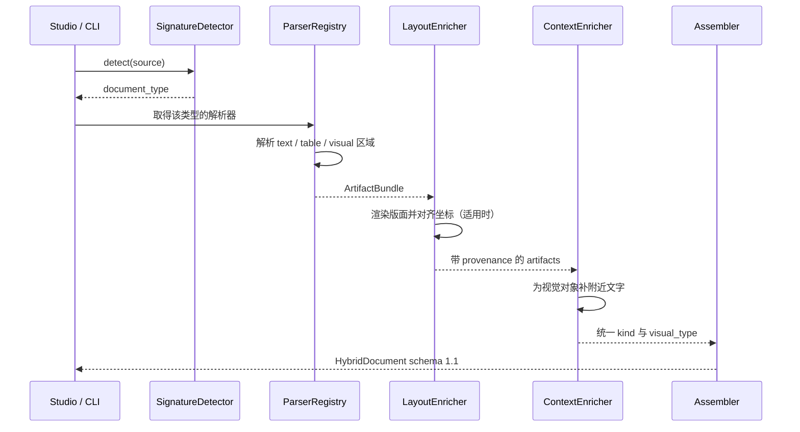
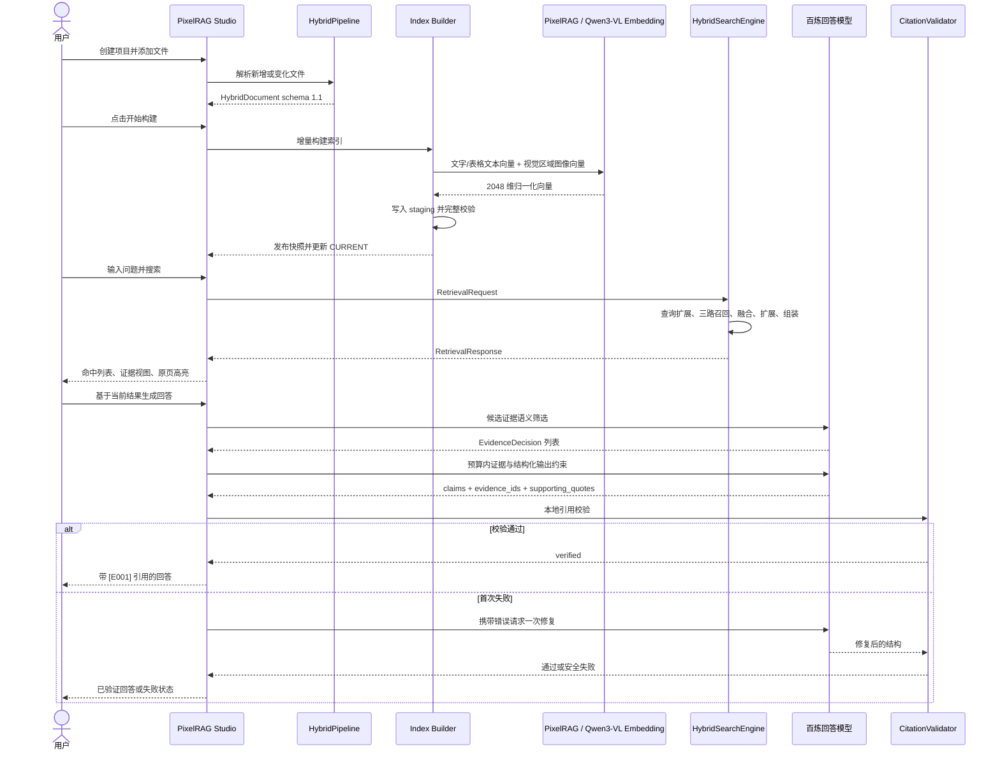

# PixelRAG Studio RAG 系统架构与运行逻辑

## 1. 系统目标

本项目把 PDF、Word、PowerPoint、Excel、文本和图片统一接入同一套本地多模态 RAG 流程：

- 文字和表格直接解析，不把整页截图交给视觉模型；
- 图片、图表、图标、SmartArt 等视觉对象单独定位并在索引阶段物化；
- PixelRAG 只处理视觉区域，文字和表格走文本向量接口；
- 每个内容块始终保留来源文件、页码/幻灯片/工作表、单元格范围和 `bbox` 坐标；
- 检索后不仅返回相似块，还组装相邻文字和同页视觉/表格证据；
- 回答模型只能基于选中的证据生成主张，每条主张必须绑定可核验的原文引用；
- 解析器、渲染器、图片处理器、向量模型、检索器和回答模型通过数据契约解耦。

系统主链路是：

```text
原始文件
  → HybridDocument（统一识别结果）
  → schema 2.0 索引快照
  → RetrievalResponse（可追溯证据包）
  → AnswerResponse（带强制引用的回答）
```

## 2. 总体架构图

```mermaid
flowchart TD
    USER["用户 / PixelRAG Studio"] --> PROJECT["项目调度器<br/>管理 sources、artifacts、index、logs"]

    PROJECT --> INPUT

    subgraph INPUT["第一层：Hybrid 输入层"]
        DETECT["文件签名与类型检测"] --> ROUTE{"按类型选择解析器"}
        ROUTE -->|PDF| PDF["OpenDataLoader<br/>失败回退 PyMuPDF"]
        ROUTE -->|DOC / DOCX / PPT / PPTX| OFFICEPARSE["Docling worker"]
        ROUTE -->|XLSX| XLSX["openpyxl 原生解析<br/>失败回退 Docling"]
        ROUTE -->|TXT / MD / HTML| TEXT["PlainTextParser"]
        ROUTE -->|PNG / JPG / WebP| IMAGE["ImageFileParser"]
        PDF --> LAYOUT["版面与坐标对齐"]
        OFFICEPARSE --> LAYOUT
        XLSX --> LAYOUT
        TEXT --> CONTEXT["附近文字上下文"]
        IMAGE --> CONTEXT
        LAYOUT --> CONTEXT
        CONTEXT --> CONTRACT1["HybridDocument schema 1.1<br/>text / table / visual + provenance"]
    end

    CONTRACT1 --> INDEX

    subgraph INDEX["第二层：索引层"]
        VALIDATE["校验输入契约"] --> SPLIT{"按模态分流"}
        SPLIT --> TEXTCHUNK["文字结构感知分块"]
        SPLIT --> TABLECHUNK["表格结构化分块"]
        SPLIT --> VISUALSELECT["选择可索引 visual"]
        VISUALSELECT --> MATERIALIZE["Office 原生导出 / PDF bbox 裁切 / 原图复用"]
        MATERIALIZE --> QUALITY["图片标准化、质量门、去重"]
        TEXTCHUNK --> TEXTEMBED["Qwen3-VL 文本接口"]
        TABLECHUNK --> TABLEEMBED["Qwen3-VL 文本接口"]
        QUALITY --> PIXEL["PixelRAG 图像接口"]
        TEXTEMBED --> SNAPSHOT["三模态不可变快照"]
        TABLEEMBED --> SNAPSHOT
        PIXEL --> SNAPSHOT
        SNAPSHOT --> CONTRACT2["text / table / visual FAISS<br/>metadata + visual-assets + manifest"]
    end

    CONTRACT2 --> RETRIEVAL

    subgraph RETRIEVAL["第三层：检索层"]
        QUERY["用户问题"] --> LOCAL["本地确定性查询拆分"]
        LOCAL --> REMOTE["可选百炼翻译与查询增强"]
        REMOTE --> VARIANTS["去重后的查询集合<br/>最多 8 条"]
        VARIANTS --> QEMBED["查询向量化"]
        QEMBED --> VECTOR["text / table / visual<br/>向量召回"]
        VARIANTS --> LEXICAL["BM25 + 完整短语匹配"]
        VECTOR --> FUSION["加权 RRF 融合、门槛、去重"]
        LEXICAL --> FUSION
        FUSION --> COVERAGE["多查询高位结果交错合并"]
        COVERAGE --> EXPAND["扩展前后文字上下文"]
        EXPAND --> ASSEMBLE["按 page / slide / sheet + bbox<br/>组装表格与视觉证据"]
        ASSEMBLE --> CONTRACT3["RetrievalResponse<br/>hits + evidence_blocks + 坐标"]
    end

    CONTRACT3 --> ANSWER

    subgraph ANSWER["第四层：回答与引用约束"]
        NORMALIZE["证据去重与稳定编号<br/>E001、E002……"] --> SELECTOR["可替换证据选择器"]
        SELECTOR --> BUDGET["自适应数量与字符预算"]
        BUDGET --> GENERATE["百炼生成结构化 claims<br/>evidence_ids + supporting_quotes"]
        GENERATE --> CHECK{"本地引用校验"}
        CHECK -->|通过| RENDER["应用渲染回答与引用"]
        CHECK -->|首次失败| REPAIR["模型只修复一次"]
        REPAIR --> CHECK2{"再次校验"}
        CHECK2 -->|通过| RENDER
        CHECK2 -->|仍失败| FAIL["安全失败<br/>不展示未验证草稿"]
        RENDER --> CONTRACT4["AnswerResponse<br/>answered / partial_answer / insufficient_evidence / failed"]
    end

    CONTRACT4 --> STUDIO["Studio 展示<br/>回答、引用、证据视图、原页高亮"]
```



## 3. Studio 与项目调度器

`pixelrag_studio.py` 是桌面应用和主调度入口。它不承担解析、向量化或回答算法，而是负责：

1. 创建和打开项目；
2. 把用户文件保存到项目 `sources`；
3. 启动独立输入 worker 生成 `artifacts`；
4. 启动独立索引 worker 构建 `index`；
5. 在后台线程初始化检索器、执行搜索和生成回答；
6. 展示命中、证据块、视觉资产和原始页面；
7. 保存构建日志及 metadata-only 回答诊断。

耗时任务放在子进程或后台线程中，因此不会把解析器、模型和 UI 强耦合在一起。

一个 Studio 项目的主要目录逻辑如下：

```text
project\
├── sources\                 # 用户原始文件
├── artifacts\               # HybridDocument 与版面缓存
├── index\
│   ├── CURRENT               # 当前有效快照 ID
│   └── snapshots\<build-id>\
└── logs\                    # 输入、构建、回答诊断日志
```

## 4. 第一层：Hybrid 输入层

### 4.1 作用

输入层只回答三个问题：

1. 文件中有哪些文字、表格和视觉对象？
2. 它们在原文件的什么位置？
3. 它们之间有什么阅读顺序、父子关系和附近文字？

输入层不建立向量索引，也不调用 PixelRAG。视觉对象在这里仅登记为 `kind=visual` 的任务区域。

### 4.2 实际运行顺序



### 4.3 各格式处理方式

| 文件类型 | 当前解析方式 | 主要输出 |
|---|---|---|
| PDF | OpenDataLoader，失败回退 PyMuPDF | 标题、段落、列表、表格、视觉区域、页码与 bbox |
| Word | Docling + Microsoft Office 版面对齐 | 段落、表格、原生图片/形状任务、页码与 bbox |
| PowerPoint | Docling + Office 原生对象信息 | 文本、表格、图片、图表、形状、幻灯片与 bbox |
| Excel | XLSX 优先 openpyxl，失败回退 Docling | 单元格、区域表格、公式、合并范围、图片/图表锚点 |
| TXT/MD/HTML | PlainTextParser | 文字块和行号 |
| 图片 | ImageFileParser | 单个视觉对象与原图路径 |

### 4.4 统一契约

每个 `Artifact` 至少包含：

- `block_id`：文档内稳定块编号；
- `kind`：`text`、`table` 或 `visual`；
- `visual_type`：`image`、`chart`、`icon`、`diagram` 等；
- `text` 或视觉任务信息；
- `reading_order` 和 `parent_block_id`；
- `provenance`：来源文件、页码、幻灯片、工作表、单元格范围、段落、行号和 `bbox`；
- `context`：视觉对象附近的文字；
- `metadata`：解析器提供的扩展结构信息。

`bbox` 是 bounding box，即对象在原页面中的矩形坐标，通常表示为 `[left, top, right, bottom]`。它用于视觉裁切、邻近关系判断、原页高亮和最终引用回链。

### 4.5 缓存逻辑

输入结果写入：

```text
artifacts\<文件名>-<document_id前12位>\hybrid-document.json
```

再次运行时，只有 schema、来源路径和 `document_id` 全部匹配的结果才会复用；新增或修改的文件会重新解析。

## 5. 第二层：索引层

### 5.1 作用

索引层把 `HybridDocument schema 1.1` 转成可搜索的 `IndexRecord`，并生成 schema 2.0 不可变索引快照。

三个模态严格分开：

```text
text   → 文字分块 → 文本 embedding → text.faiss
table  → 表格分块 → 文本 embedding → table.faiss
visual → 图片物化 → PixelRAG embedding → visual.faiss
```

因此 PixelRAG 图像接口不会接收文字或表格。

### 5.2 文字路线

文字按标题、段落、页面/幻灯片/工作表边界和 token 上限进行结构感知分块。分块保留：

- 原始内容；
- 标题路径与上下文；
- `source_block_ids`；
- 前一条和后一条文字记录链接；
- 原始 `provenance`。

这些链接供检索层做有界上下文扩展，不依赖重新读取原文件。

### 5.3 表格路线

表格优先使用原生 cells 或结构化 cells，必要时读取 Markdown 表格。系统识别表头，并按行组/列组切分大表格，同时重复必要表头，使每个表格块能单独理解和检索。

表格内容使用文本 embedding，但其 metadata 仍保留行列、来源块和坐标信息。

### 5.4 视觉路线

视觉对象直到索引阶段才真正变成图片：

- Word：通过 `CopyAsPicture` 等 Office COM 能力导出；
- PowerPoint：优先 `Shape.Export`；
- Excel：通过 `Chart.Export` 或 `Shape.CopyPicture`；
- PDF：依据 `page + bbox` 裁切目标区域；
- 图片文件：直接复用原图。

随后执行图片质量门：

1. 统一颜色和透明背景；
2. 过滤过小区域；
3. 过滤纯白、纯黑或无效占位图；
4. 使用内容哈希去重；
5. 保存安全的相对资产路径和 SHA-256；
6. 只把合格图片送入 PixelRAG。

### 5.5 向量与快照

文字、表格和视觉统一使用 Qwen3-VL-Embedding-2B 系列接口生成 2048 维向量，执行 L2 归一化后写入 `faiss.IndexFlatIP`。

快照结构：

```text
index\
├── CURRENT
└── snapshots\<build-id>\
    ├── manifest.json
    ├── build-report.json
    ├── text.faiss
    ├── text-metadata.jsonl
    ├── table.faiss
    ├── table-metadata.jsonl
    ├── visual.faiss
    ├── visual-metadata.jsonl
    └── visual-assets\
```

所有文件先写入 `.staging-<build-id>`。只有数量、维度、向量范数、邻接链接、资产路径和校验和全部通过后，快照才移动到 `snapshots`，最后原子更新 `CURRENT`。构建失败只删除 staging，不覆盖上一份可用快照。

### 5.6 增量构建

索引层比较当前来源文件和上一份 manifest：

- 未变化文档复用上一快照的记录、向量和视觉资产；
- 新增或修改文档重新分块、物化和向量化；
- 删除文档从新快照中移除；
- `--force` 才会强制全量重建。

## 6. 第三层：检索层

### 6.1 作用

检索层读取当前只读快照，返回“能直接交给回答层使用的证据包”，而不是只返回一个相似度列表。

公共入口是 `HybridSearchEngine.search(RetrievalRequest)`。

### 6.2 查询规划

1. 原问题始终保留；
2. `LocalQueryExpander` 确定性拆分常见的多对象、属性、比较和列表问题；
3. 如果 Studio 已配置百炼模型与 API Key，`LLMEnglishQueryExpander` 可补充英文翻译和更多检索表达；
4. `ResilientQueryExpander` 负责合并与去重，最多保留 8 条；
5. 百炼超时或失败时继续使用本地结果，不阻断搜索。

### 6.3 三模态混合召回

每个查询变体分别执行：

- Qwen3-VL 查询向量编码；
- text、table、visual 三个 FAISS 索引召回；
- BM25 关键词召回；
- 完整问题短语匹配。

默认融合逻辑：

```text
fusion_score
  = 1.0 × modality_weight / (60 + vector_rank)
  + 1.5 / (60 + keyword_rank)
  + 2.0 / 61                         # exact_match 时
```

模态权重为 text `1.00`、table `1.00`、visual `1.10`。纯向量候选需要满足原始相似度 `>= 0.40`；明确关键词或完整短语命中可以绕过该门槛。

候选随后按记录 ID、内容哈希和文字来源重叠去重。复合问题按查询变体交错取高位结果，再用全局排名补足 Top K，防止某个对象的重复证据占满结果。

### 6.4 证据扩展与组装

对每个核心命中：

1. 文字命中直接作为锚点；
2. 表格/视觉命中在同文档同页寻找文字锚点；
3. 默认扩展前 1 条、后 2 条文字，可跨页但不能跨文档；
4. 按 page、slide 或 sheet 收集同一容器；
5. 使用完整问题命中和 `bbox` 距离寻找相关表格与视觉对象；
6. 每个容器最多 2 条 related，总 related 最多 8 条；
7. 按容器、坐标、模态和记录 ID 稳定排序。

输出 `RetrievalResponse`，其中每个 `RetrievalHit` 包含：

- 核心内容与检索分数；
- `adjacent_context`；
- `context_pages`；
- `evidence_blocks`，每块标记 `core`、`neighbor` 或 `related`；
- 来源文件、原始坐标与安全解析后的视觉资产路径。

## 7. 第四层：回答与引用约束

### 7.1 作用

回答层只读取 `RetrievalResponse`，不修改索引，也不改变检索排名。入口是 `AnswerEngine.answer(AnswerRequest)`。

### 7.2 证据规范化

`EvidenceNormalizer` 将检索证据去重、稳定排序，并分配本次回答内部的 `E001`、`E002` 等编号。编号由程序生成，模型不能创造。

每个 `EvidenceItem` 保留：

- record、document 和 source block ID；
- modality、role 和 relation；
- 内容、上下文和视觉资产；
- 来源文件、页/幻灯片/工作表、单元格范围和 bbox；
- 检索排名、原始分和融合分。

### 7.3 证据选择器插槽

当前代码保留三种可替换实现：

| 选择器 | 作用 |
|---|---|
| `RetrievalEvidenceSelector` | 信任混合检索召回，本地做覆盖排序，不增加一次模型筛选 |
| `CoverageEvidenceSelector` | 本地按问题要求、文档和模态覆盖排序 |
| `LLMEvidenceSelector` | 调用生成模型判断 direct/context/conflict，并核验支持原文 |

`AnswerEngine` 只依赖统一的 `EvidenceSelector` 接口，因此可以更换选择策略而不改生成器、引用校验器和 Studio 输出契约。

> 当前代码状态：Studio 通过 `AnswerEngine.for_bailian()` 创建回答引擎，该工厂当前装配 `LLMEvidenceSelector`。`RetrievalEvidenceSelector` 已实现并用于独立组合与测试，但若要让 Studio 默认采用“本地直通、只调用一次百炼生成”，还需要把工厂中的 selector 切换为该实现。

### 7.4 自适应证据预算

- 最多先保留 48 条候选用于覆盖排序；
- 简单问题默认最多 6 条、10,000 字符；
- 复合、比较和列表问题可扩到 10 条、16,000 字符；
- 单条证据按最多实际发送的 4,000 字符计费；
- 按文档交错选取，防止单一文档占满预算；
- 精确分类表格问题只向模型提供命中分类行，避免相邻类别串入回答。

### 7.5 结构化生成与引用硬约束

回答模型返回结构化对象，而不是自由 Markdown：

```json
{
  "answerable": true,
  "claims": [
    {
      "text": "独立事实主张",
      "evidence_ids": ["E001"],
      "supporting_quotes": [
        {"evidence_id": "E001", "quote": "证据中的连续原文"}
      ]
    }
  ],
  "limitations": []
}
```

本地 `CitationValidator` 检查：

1. `answerable=true` 时至少有一个 claim；
2. 每个 claim 至少引用一条有效证据；
3. 所有 evidence ID 必须来自当前预算内证据；
4. 每个引用都必须有对应的连续原文摘录；
5. 摘录必须逐字存在于对应证据中；
6. 不能只引用 context 证据支撑事实；
7. 模型不能在 claim 文本中手写 `[E001]`；
8. 列表回答不能重复项目或用空泛文字冒充具体条目。

第一次校验失败时允许模型修复一次。第二次仍失败则返回 `failed`，不展示未经验证的草稿。最终 `[E001]` 标记由 `AnswerRenderer` 添加，不信任模型自行排版。

### 7.6 回答状态

| 状态 | 含义 |
|---|---|
| `answered` | 有足够证据，全部主张通过引用校验 |
| `partial_answer` | 复合问题只有部分要求有证据，已回答部分通过校验，缺失项写入 limitations |
| `insufficient_evidence` | 没有足够的直接证据，安全拒答 |
| `failed` | 生成或引用修复后仍不满足契约 |

## 8. 一次完整运行的时序



## 9. 原页回链逻辑

Studio 的“原页视图”读取证据中的 provenance：

- PDF：直接渲染原 PDF 对应页；
- Word、PowerPoint、Excel：读取输入阶段生成的版面 PDF 缓存；
- 图片：直接显示原图；
- `bbox` 按页面尺寸换算后绘制矩形；
- `core` 使用红框，关联证据使用橙框。

因此最终回答可以沿着以下链路回到原文件位置：

```text
claim → E001 → EvidenceItem → IndexRecord
      → source_block_ids → Artifact → provenance → 原页 + bbox
```

## 10. 模块解耦与替换边界

| 模块插槽 | 当前实现 | 可替换方式 | 必须保持的边界 |
|---|---|---|---|
| 文件检测 | `SignatureDetector` | MIME/魔数服务 | 输出统一 document type |
| PDF 解析 | OpenDataLoader + PyMuPDF fallback | MinerU、Docling 等 | 输出 `ArtifactBundle` |
| Office 解析 | Docling/openpyxl | 其他 Office SDK | 输出同一 Artifact 契约 |
| 版面渲染 | Microsoft Office COM | LibreOffice、远端渲染服务 | 返回页面资产与坐标关系 |
| 图片处理 | Pillow | OpenCV 或其他处理器 | 输出可读图片、哈希和质量状态 |
| 视觉向量 | PixelRAG / Qwen3-VL | 其他视觉 embedding | 输出固定维度向量；更换后重建快照 |
| 文本向量 | Qwen3-VL 文本接口 | 其他文本 embedding | 查询和文档使用同一向量空间 |
| 向量存储 | FAISS `IndexFlatIP` | Qdrant、Milvus、pgvector 等 | 保持记录与 metadata 一一对应 |
| 查询扩展 | 本地规则 + 可选百炼 | 其他 LLM/规则 | 输出去重查询字符串集合 |
| 排序策略 | BM25 + exact + 加权 RRF + reranker | cross-encoder、学习排序 | 输出稳定 `RankedCandidate` |
| 证据扩展 | `EvidenceExpander` | 语义邻接图 | 不跨文档，保留来源关系 |
| 证据组装 | `EvidenceAssembler` | 其他空间/结构策略 | 输出 `evidence_blocks` |
| 证据选择 | Retrieval/Coverage/LLM selector | 其他筛选器 | 输出 `EvidenceDecision` |
| 回答模型 | 百炼；Ollama 适配器保留 | 其他结构化生成模型 | 输出 AnswerDraft 契约 |
| 引用校验 | `CitationValidator` | 更强蕴含校验器 | 返回错误，不直接篡改 claim |
| 展示 | Tkinter Studio | Web、API、插件 | 消费 Retrieval/AnswerResponse |

更换某个实现时，只要输入输出契约不变，其他层不需要跟着修改。更换 embedding 模型或维度属于索引语义变化，必须重建快照，但不要求重写输入和回答层。

## 11. 失败保护与安全边界

- 解析器 fallback 只发生在同一输入层插槽内；
- Office 版面失败可按配置警告或严格失败；
- 不合格视觉对象在送入 PixelRAG 前过滤；
- 索引完整校验通过后才发布 `CURRENT`；
- 检索器只读取已发布快照，并重新校验 manifest 和资产校验和；
- 视觉资产路径必须位于快照目录内，拒绝绝对路径和 `..` 越界；
- 百炼查询增强失败不阻断本地检索；
- 429、断连、超时和 5xx 最多自动重试两次，鉴权/参数错误不重试；
- 证据内容在提示词中被标记为不可信数据，不能作为系统指令执行；
- API Key 不写入回答诊断日志；
- 回答日志默认只保存 metadata，不重复保存全文、原文摘录和模型完整原始响应；
- 引用失败时不展示未经验证的回答草稿。

## 12. 对外数据契约

| 阶段 | 输入 | 输出 | schema/核心对象 |
|---|---|---|---|
| 输入层 | 原始文件 | 统一文档 | `HybridDocument 1.1` |
| 索引层 | HybridDocument | 不可变索引快照 | `IndexRecord / schema 2.0` |
| 检索层 | `RetrievalRequest` | 可追溯证据包 | `RetrievalResponse` |
| 回答层 | `AnswerRequest + RetrievalResponse` | 结构化回答 | `AnswerResponse` |
| 引用模块 | `AnswerDraft + EvidenceItem` | 错误列表或通过 | `CitationValidator` |

这四个边界是系统解耦的核心。模块之间通过 JSON、JSONL、FAISS 文件、图片资产和 Python 数据对象通信，而不是相互读取内部变量。

## 13. 如何运行

### 13.1 Studio 主流程

1. 首次使用运行 `setup.cmd`，安装完成后运行 `start-studio.cmd`；开发者也可在 VS Code“运行和调试”中选择 `Studio：启动桌面应用`；
2. 创建项目；
3. 添加支持的文件；
4. 运行 Hybrid 输入解析；
5. 点击“开始构建”生成或增量更新索引；
6. 在“检索检查器”中输入问题并搜索；
7. 查看证据视图或原页视图；
8. 配置百炼 API Key 与模型；
9. 基于当前检索结果生成回答；
10. 检查 `[E001]` 引用及来源位置。

### 13.2 输入层独立调用

```powershell
.\.venv\Scripts\python.exe -m hybrid_input capabilities
.\.venv\Scripts\python.exe -m hybrid_input detect 文档.docx
.\.venv\Scripts\python.exe -m hybrid_input parse 文档.docx --output 解析结果
.\.venv\Scripts\python.exe -m hybrid_input render 文档.docx --output 渲染结果
.\.venv\Scripts\python.exe -m hybrid_input ingest 文档.docx --output artifacts
```

这些入口证明输入步骤可以单独测试和替换，不需要启动完整 RAG。

## 14. 当前完成度与边界

截至 2026-09-28，全项目自动化测试为 **174/174 PASS**。当前已完成：

- 多格式输入与统一坐标契约；
- 延迟视觉物化和 PixelRAG 视觉向量；
- 文字、表格、视觉三模态独立索引；
- 不可变快照、完整校验和增量复用；
- 本地优先、远端可选的韧性查询规划；
- 向量、BM25、exact 混合召回与覆盖合并；
- 相邻文字、同页表格和视觉证据组装；
- 结构化回答、部分回答、原文引用和失败保护；
- 证据视图和原页坐标高亮。

“RAG 基本完成”表示从文件输入到带引用回答的工程链路已经闭环。仍需长期迭代的是效果层面：更大真实测试集的 Recall/MRR、不同文档的人工验收、回答正确率评估、GPU 加速，以及更多解析器、向量库和证据选择策略的适配。当前 Studio 默认使用 `LLMEvidenceSelector`；如果未来改为本地直通策略，必须同步修改测试、README 和本架构文档。

