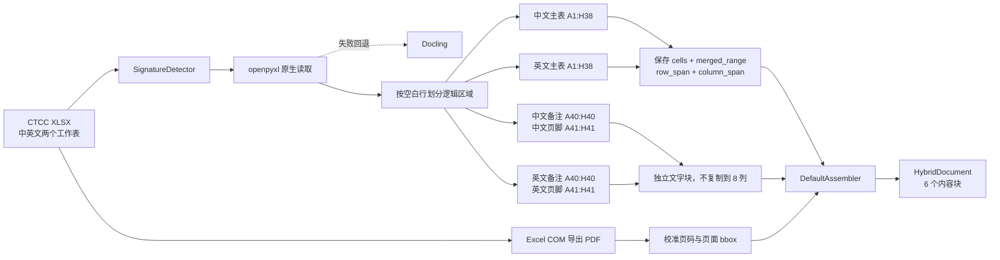

# CTCC 2026-2027 Bosch Partner Benefits 实际识别结果

[返回总览](./输入结果总览_20260814.md)

> 实际源文件为 `.xlsx`。2026-08-17 使用 openpyxl 原生结构解析器重新测试，替代此前的 Docling Excel 表格结果。

## 结果摘要

| 项目 | 旧方法：Docling | 当前方法：openpyxl |
|---|---:|---:|
| 工作表 | 2 | 2 |
| 文字块 | 2 | 4 |
| 表格块 | 4 | 2 |
| 图片块 | 0 | 0 |
| 坐标完整 | 6/6 | 6/6 |
| 警告 | 0 | 0 |
| 中文主表字符数 | 16,765 | 7,414 |
| 英文主表字符数 | 42,893 | 9,721 |
| 英文备注重复次数 | 8 | 1 |

字符数下降不是内容丢失，而是取消了合并单元格的重复展开。两个工作表的原始结构均为 `A1:H41`，各含 32 个合并范围。

## 本次测试实际方法流程



本文件没有普通图片或 Excel 原生图表，因此本次没有进入 Pillow、Pixel 或视觉向量化通道。

## 当前内容块

| block_id | 类型 | 工作表 | 单元格范围 | 内容 |
|---|---|---|---|---|
| `f0d17defce225931:000000` | 表格 | 合作伙伴权益 | `A1:H38` | 中文标题、两层表头、32 项权益、价格与结束标记 |
| `f0d17defce225931:000001` | 文字 | 合作伙伴权益 | `A40:H40` | 中文备注，保存一次 |
| `f0d17defce225931:000002` | 文字 | 合作伙伴权益 | `A41:H41` | 中文页脚 |
| `f0d17defce225931:000003` | 表格 | Partnership Rights and Benefits | `A1:H38` | 英文标题、两层表头、32 项权益、价格与结束标记 |
| `f0d17defce225931:000004` | 文字 | Partnership Rights and Benefits | `A40:H40` | 英文备注，保存一次 |
| `f0d17defce225931:000005` | 文字 | Partnership Rights and Benefits | `A41:H41` | 英文页脚 |

## 合并单元格保存方式

例如英文表头 `D2:F2` 不再把 “2026 Season” 复制三次，而是保存为：

```json
{
  "cell": "D2",
  "value": "2026 Season",
  "row_span": 1,
  "column_span": 3,
  "merged_range": "D2:F2"
}
```

英文备注 `A40:H40` 同样只保存一次：

```json
{
  "cell": "A40",
  "row_span": 1,
  "column_span": 8,
  "merged_range": "A40:H40"
}
```

## 英文表格抽查

原始单元格 `C34` 被完整读取为：

> Button advertisement on the CTCC official website homepage (button links to the brand's official website)

对应的结构记录为：

```json
{
  "cell": "C34",
  "row": 34,
  "column": 3,
  "row_span": 1,
  "column_span": 1
}
```

这说明之前的问题不是英文 OCR，而是 Docling 将合并单元格重复展开后造成的 Markdown 表格膨胀和显示错位。

## 结论

- 中英文原始单元格内容均可无损读取。
- 两个主表分别保留为一个结构化表格块。
- 备注和页脚从主表中分离，不再作为八列重复表格。
- 32 个合并范围通过跨度元数据保留，不再复制内容。
- 6 个内容块全部保留工作表、`cell_range`、页码和 bbox。
- 无图片、无视觉任务、无警告。

<!-- GENERATED_ARTIFACTS_START -->

## 完整识别结果（由最终 HybridDocument 生成）

> 以下内容按 `reading_order` 逐块打印；表格正文就是解析器实际输出的 Markdown，不是人工重写。

- 最终解析器：`openpyxl-subprocess`
- 内容块总数：6
- 警告数：0

### 内容块 1：表格（worksheet_region）

- `block_id`：`f0d17defce225931:000000`
- `reading_order`：0
- 页码：1；幻灯片：—；工作表：`合作伙伴权益`
- 单元格范围：`A1:H38`
- `bbox`：`[0.000000, 0.000000, 1.000000, 0.926829]`
- `bbox_original`：`[0.000000, 0.000000, 8.000000, 38.000000]`
- `locator`：`sheet:合作伙伴权益/range:A1:H38`
- 表格规模：38 行 × 8 列
- 合并范围（30）：`A1:H1`, `A2:A3`, `A36:C36`, `A37:C37`, `A38:H38`, `B10:B16`, `B17:B18`, `B19:B23`, `B27:B29`, `B2:B3`, `B31:B35`, `B4:B7`, `B8:B9`, `C2:C3`, `D13:D15`, `D26:G26`, `D2:F2`, `D36:G36`, `D37:G37`, `D4:D7`, `E13:E15`, `E4:E7`, `F13:F15`, `F4:F7`, `G13:G15`, `G2:G3`, `G4:G7`, `H17:H18`, `H2:H3`, `H4:H7`

#### 实际表格输出

| 2026-2027赛季 CTCC中国汽车场地职业联赛 指定合作伙伴权益 - 博世 |  |  |  |  |  |  |  |
| --- | --- | --- | --- | --- | --- | --- | --- |
| 编号 | 分类 | 权益说明 | 2026赛季 |  |  | 2027赛季<br>共6站 | 备注 |
|  |  |  | 第四分站 | 第五分站 | 第六分站 |  |  |
| 1 | 品牌宣传形象授权 | 授予品牌“CTCC中国场地汽车职业联赛合作伙伴 指定合作伙伴”称号 | √ | √ | √ | 2027赛季 | 合作伙伴权益，不单独出售 |
| 2 |  | 授权品牌使用“CTCC中国汽车场地职业联赛 上海站”赛事名称 |  |  |  |  |  |
| 3 |  | 授权品牌使用“CTCC中国汽车场地职业联赛 上海站”赛事LOGO |  |  |  |  |  |
| 4 |  | 授权品牌使用“CTCC中国汽车场地职业联赛 上海站”赛事图片/视频素材 |  |  |  |  |  |
| 5 | 无形资产使用 | CTCC围场内品牌产品销售 |  |  |  |  |  |
| 6 |  | CTCC车辆数据支持 |  |  |  |  |  |
| 7 | 赛事现场广告露出 | CTCC发车区防撞墙广告（品牌独立画面）<br>位于赛事发车大直道两侧，看台现场观众、观赛包厢VIP嘉宾、参赛车队可见 | 1组 | 1组 | 1组 | 1组/站 | 1)面积尺寸：1米*10米/块，1组为2块，广告画面由品牌方提供，赛事方负责制作，发布内容需符合相关法规政策<br>2)露出时间为赛事周周六-周日2天 |
| 8 |  | CTCC参赛车车身品牌LOGO露出<br>不少于30台参赛车，位于车辆两侧车身位置 | √ | √ | √ | √ | 车身左右各1块，面积不超过35cm*15cm |
| 9 |  | CTCC参赛车车后牌照品牌LOGO露出<br>不少于30台参赛车，位于车辆后牌照位置 | √ | √ | √ | √ | 车后牌照1块，面积根据赛车牌照尺寸制作 |
| 10 |  | CTCC新闻发布会背景板品牌LOGO体现<br>位于赛场新闻中心，品牌LOGO随赛事新闻稿件照片传播，LOGO占比不低于10% | √ | √ | √ | √ | 合作伙伴权益，不单独销售 |
| 11 |  | CTCC采访背景板品牌LOGO体现<br>位于赛场冠军收车区，品牌LOGO随赛事直播露出，LOGO占比不低于10% |  |  |  |  | 合作伙伴权益，不单独销售 |
| 12 |  | CTCC颁奖背景板品牌LOGO体现<br>位于赛场颁奖台，看台现场观众、赛事直播、赛事新闻稿件传播可见，LOGO占比不低于10% |  |  |  |  | 合作伙伴权益，不单独销售 |
| 13 |  | CTCC观赛手册品牌LOGO露出及赛事联合硬广露出<br>露出渠道：赛事线上渠道传播、赛事现场观众及VIP嘉宾 | √ | √ | √ | √ | 品牌LOGO及广告设计文件由品牌方提供<br>硬广内容需结合CTCC赛事进行设计，不可露出非CTCC合作伙伴品牌 |
| 14 | 品牌领导活动 | 邀请品牌领导参加CTCC发车仪式 | √ | √ | √ | √ | 合作伙伴权益，不单独销售<br>1人/站，由品牌于分站前3日提出需求，否则视为自愿放弃当站权益 |
| 15 |  | 邀请品牌领导参加CTCC赛事颁奖 | √ | √ | √ | √ |  |
| 16 | 贵宾包厢及证件 | 为品牌提供赛事现场VIP包厢用于重要嘉宾及品牌用户观赛体验<br>1)使用时间为赛事周周六至周日2天，可提前2天进场搭建<br>2)每单元面积为7米*24米，仅提供空房间，不含家具及用餐等<br>3)包厢费用不含电费、网络费及押金，需根据场地方实际收费结算 | 2单元 | X | X | X | 报价不含搭建 |
| 17 |  | 贵宾证<br>为品牌提供CTCC参观证件（不含自助午餐，在品牌VIP包厢内观赛） | 10张 | 10张 | 10张 | 10张/站 | 通行区域：围场（不含车队pit房内）、品牌包厢、CTCC官方包厢、指定时间可上发车区 |
| 18 |  | 参观证<br>为品牌提供CTCC贵宾证件（含自助午餐，在CTCC官方包厢内用餐） | 20张 | X | X | X | 通行区域：围场（不含车队pit房内）、品牌包厢、指定时间可上发车区 |
| 19 |  | 工作证件<br>为品牌围场及观众活动区展台工作人员提供工作证件 | 10张 | 10张 | 10张 | 10张/站 |  |
| 20 |  | 停车证件<br>为品牌提供CTCC内场停车证 | 2张 | 2张 | 2张 | 2张/站 |  |
| 21 | 赛事导览 | 为品牌贵宾提供赛事期间围场及商贸区导览服务<br>1)在赛事期间指定时间带领品牌贵宾参观围场及商贸区，专人导览讲解，包含商贸区展台、空中走廊、围场及发车仪式<br>2)参观时间需赛前协商确认，不可影响正常比赛进程，如遇天气或赛事事故导致的比赛推迟或取消，可能会现场临时调整参观行程 | 20人 | X | X | X |  |
| 22 | 观众活动展示区<br>品牌展台-特装类 | 品牌在CTCC观众活动区搭建快闪展台，进行产品展示体验<br>1)使用时间为赛事周周日1天，可提前1天进场搭建，搭建及活动方案需至少提前15个工作日提供并符合相关申报要求<br>2)仅提供展示区空地供品牌进行展位搭建，展位搭建押金及水电费等根据场地方实际收费结算 | 50平米 | X | X | X | 展台仅用于品牌展示，不可免费提供或销售酒水烟草、药品、饮料、食品 |
| 23 | 赛道使用时间 | 品牌专属赛道时段<br>1)合作期间内共有360分钟时段，每站最多可使用90分钟；<br>2)仅提供完整赛道，不含计时、裁判、控制中心服务;<br>3)品牌应于分站前15个工作日提出需求并沟通赛道活动方案，否则视为自动放弃权益<br>4)不能指定具体时间段，所使用的时间段不应影响竞赛流程，由双方协商确认 | 共360分钟 |  |  |  |  |
| 24 | 新闻素材服务 | 赛事新闻稿撰写（*品牌信息植入） | 1篇 | 1篇 | 1篇 | 1篇/站 | 核心资料/信息素材由品牌方提供 |
| 25 |  | 视频制作（以品牌内容为主题的赛事集锦，品牌现场露出植入）<br>视频发布在抖音、小红书等官方账号，并与博世官方账号进行互动 | 1条 | 1条 | 2条 | 7条 | 每站赛事结束后提供以品牌露出画面为主的赛事集锦视频1条，全年比赛结束后提供以品牌露出画面为主的赛事集锦视频1条，每条视频集锦时长30秒 |
| 26 |  | 赛事新闻图片（*品牌广告露出及品牌活动现场照片） | √ | √ | √ | √ | 每站不少于20张精选图 |
| 27 | 赛事直播信号 | 直播信号推流<br>1)提供CTCC赛事决赛直播信号推流服务<br>2)仅供不超过3个平台信号推流播出，平台播出申报备案需由品牌方负责 | √ | √ | √ | √ |  |
| 28 | 官方平台露出 | CTCC官方公共信号字幕标版品牌LOGO体现<br>1)位于赛事直播计时栏下方，随赛事决赛露出<br>2)每次露出不少于5秒，每回合决赛露出不少于10次 | √ | √ | √ | √ | 合作伙伴权益，不单独销售 |
| 29 |  | CTCC官方自媒体与品牌自媒体互动 | √ | √ | √ | √ | 合作伙伴权益，不单独销售 |
| 30 |  | CTCC官方自媒体品牌LOGO露出 | √ | √ | √ | √ | 合作伙伴权益，不单独销售 |
| 31 |  | CTCC官方网站首页按钮广告（按钮链接至品牌官网） | √ | √ | √ | √ | 合作伙伴权益，不单独销售 |
| 32 |  | CTCC官方网站合作伙伴栏品牌LOGO露出 | √ | √ | √ | √ | 合作伙伴权益，不单独销售 |
| 权益总价 |  |  | 1,680,000 |  |  |  |  |
| 2026-2027赛季合作优惠价（含6%增值税） |  |  | 1,200,000 |  |  |  |  |
| *END |  |  |  |  |  |  |  |


### 内容块 2：文字（worksheet_text）

- `block_id`：`f0d17defce225931:000001`
- `reading_order`：1
- 页码：1；幻灯片：—；工作表：`合作伙伴权益`
- 单元格范围：`A40:H40`
- `bbox`：`[0.023236, 0.907915, 0.260290, 0.924917]`
- `bbox_original`：`[19.559999, 540.391235, 219.111710, 545.110840]`
- `locator`：`sheet:合作伙伴权益/range:A40:H40|page:1`

#### 实际文字输出

备注：1.赛事赛历以中汽摩联和赛事举办地相关主管部门批准公布为准，可能会有调整，如有赛历调整需至少提前1个月告知；
2.以上规划可能因赛事现场实际情况有略微调整，最终解释权归力盛体育所有。


### 内容块 3：文字（worksheet_text）

- `block_id`：`f0d17defce225931:000002`
- `reading_order`：2
- 页码：1；幻灯片：—；工作表：`合作伙伴权益`
- 单元格范围：`A41:H41`
- `bbox`：`[0.259646, 0.927270, 0.286152, 0.935200]`
- `bbox_original`：`[218.570007, 551.911255, 240.882843, 556.630859]`
- `locator`：`sheet:合作伙伴权益/range:A41:H41|page:1`

#### 实际文字输出

第1页，共1页


### 内容块 4：表格（worksheet_region）

- `block_id`：`f0d17defce225931:000003`
- `reading_order`：3
- 页码：2；幻灯片：—；工作表：`Partnership Rights and Benefits`
- 单元格范围：`A1:H38`
- `bbox`：`[0.000000, 0.000000, 1.000000, 0.926829]`
- `bbox_original`：`[0.000000, 0.000000, 8.000000, 38.000000]`
- `locator`：`sheet:Partnership Rights and Benefits/range:A1:H38`
- 表格规模：38 行 × 8 列
- 合并范围（30）：`A1:H1`, `A2:A3`, `A36:C36`, `A37:C37`, `A38:H38`, `B10:B16`, `B17:B18`, `B19:B23`, `B27:B29`, `B2:B3`, `B31:B35`, `B4:B7`, `B8:B9`, `C2:C3`, `D13:D15`, `D26:G26`, `D2:F2`, `D36:G36`, `D37:G37`, `D4:D7`, `E13:E15`, `E4:E7`, `F13:F15`, `F4:F7`, `G13:G15`, `G2:G3`, `G4:G7`, `H17:H18`, `H2:H3`, `H4:H7`

#### 实际表格输出

| 2026-2027 Season CTCC China Touring Car Championship Designated Partner Benefits - Bosch |  |  |  |  |  |  |  |
| --- | --- | --- | --- | --- | --- | --- | --- |
| No. | Category | Benefit Description | 2026 Season |  |  | 2027 Season<br>Total 6 Rounds | Remarks |
|  |  |  | Round 4 | Round 5 | Round 6 |  |  |
| 1 | Brand Promotion Image Authorization | Grant the brand the title of "CTCC China Touring Car Championship Partner - Designated Partner" | √ | √ | √ | 2027 Season | Partner benefit; not sold separately |
| 2 |  | Authorize the brand to use the event name "CTCC China Touring Car Championship Shanghai Round" |  |  |  |  |  |
| 3 |  | Authorize the brand to use the event logo of "CTCC China Touring Car Championship Shanghai Round" |  |  |  |  |  |
| 4 |  | Authorize the brand to use photo/video materials from the "CTCC China Touring Car Championship Shanghai Round" |  |  |  |  |  |
| 5 | Use of Intangible Assets | Brand product sales within the CTCC paddock |  |  |  |  |  |
| 6 |  | CTCC vehicle data support |  |  |  |  |  |
| 7 | On-site Event Advertising Exposure | CTCC starting grid safety barrier advertising (brand-exclusive artwork)<br>Located on both sides of the main start/finish straight; visible to grandstand spectators, VIP guests in viewing suites, and participating teams | 1 set | 1 set | 1 set | 1 set/round | 1) Dimensions: 1 m x 10 m per panel; 1 set consists of 2 panels. Advertising artwork to be provided by the brand; event organizer is responsible for production. Published content must comply with applicable laws, regulations, and policies.<br>2) Exposure period: 2 days, Saturday to Sunday of the race week. |
| 8 |  | Brand logo exposure on CTCC race car bodywork<br>No fewer than 30 participating race cars; positioned on both sides of the vehicle body | √ | √ | √ | √ | One placement on each side of the vehicle body; area not exceeding 35 cm x 15 cm |
| 9 |  | Brand logo exposure on the rear license plate area of CTCC race cars<br>No fewer than 30 participating race cars; positioned at the rear license plate area | √ | √ | √ | √ | One placement at the rear license plate area; dimensions based on the race car plate size |
| 10 |  | Brand logo presence on the CTCC press conference backdrop<br>Located in the circuit media center, the brand logo will gain exposure through photos accompanying official event press releases and will occupy no less than 10% of the backdrop area. | √ | √ | √ | √ | Partner benefit; not sold separately |
| 11 |  | Brand logo presence on the CTCC interview backdrop<br>Located in the winners' parc ferme area; the brand logo will be exposed during event livestreams, with logo share no less than 10% |  |  |  |  | Partner benefit; not sold separately |
| 12 |  | Brand logo presence on the CTCC awards backdrop<br>Located at the podium area; visible to grandstand spectators, event livestreams, and event press release distribution, with logo share no less than 10% |  |  |  |  | Partner benefit; not sold separately |
| 13 |  | Brand logo exposure in the CTCC spectator guide and co-branded event advertisement exposure<br>Exposure channels: event online channels, on-site spectators, and VIP guests | √ | √ | √ | √ | Brand logo and advertising design files to be provided by the brand.<br>Advertisement content must be designed in connection with the CTCC event and may not feature brands that are not CTCC partners. |
| 14 | Brand Executive Activities | Invite brand executives to attend the CTCC starting ceremony | √ | √ | √ | √ | Partner benefit; not sold separately<br>1 person/round. The brand must submit the request 3 days before the round; otherwise the benefit for that round will be deemed voluntarily waived. |
| 15 |  | Invite brand executives to participate in CTCC event award presentations | √ | √ | √ | √ |  |
| 16 | VIP Suites and Credentials | Provide the brand with on-site VIP suites for important guests and brand users to enjoy the race-viewing experience<br>1) Usage period: 2 days, Saturday to Sunday of the race week; setup access available 2 days in advance.<br>2) Each unit measures 7 m x 24 m; only an empty room is provided, excluding furniture, catering, etc.<br>3) Suite fees exclude electricity, network fees, and deposits, which shall be settled according to the venue's actual charges. | 2 units | X | X | X | Quotation excludes setup/construction |
| 17 |  | VIP Passes<br>Provide the brand with CTCC visitor credentials (self-service lunch not included; race viewing in the brand VIP suite) | 10 passes | 10 passes | 10 passes | 10 passes/round | Access areas: paddock (excluding team pit garages), brand suite, CTCC official suite, and starting grid during designated times |
| 18 |  | Guest Passes<br>Provide the brand with CTCC VIP credentials (including self-service lunch, dining in the CTCC official suite) | 20 passes | X | X | X | Access areas: paddock (excluding team pit garages), brand suite, and starting grid during designated times |
| 19 |  | Staff Credentials<br>Provide staff credentials for brand booth personnel in the paddock and spectator activity area | 10 passes | 10 passes | 10 passes | 10 passes/round |  |
| 20 |  | Parking Passes<br>Provide CTCC infield parking passes for the brand | 2 passes | 2 passes | 2 passes | 2 passes/round |  |
| 21 | Event Guided Tour | Provide guided tour services in the paddock and commercial area for brand VIP guests during the event<br>1) At designated times during the event, dedicated guides will lead brand VIP guests through the paddock and commercial area, including the commercial booths, overhead walkway, paddock, and starting ceremony.<br>2) Tour time must be discussed and confirmed before the race and must not affect the normal race schedule. In the event of weather or race incidents causing delays or cancellation, the tour itinerary may be adjusted on site. | 20 guests | X | X | X |  |
| 22 | Spectator Activity Display Area<br>Brand Booth - Custom-built | The brand may build a pop-up booth in the CTCC spectator activity area for product display and experience activities.<br>1) Usage period: 1 day, Sunday of the race week; setup access available 1 day in advance. The setup and activity plan must be provided at least 15 working days in advance and comply with relevant filing requirements.<br>2) Only bare display-area space is provided for booth construction. Booth construction deposits, utilities, and other charges shall be settled according to the venue's actual charges. | 50 sqm | X | X | X | The booth is for brand display only. Alcohol, tobacco, pharmaceuticals, beverages, and food may not be provided for free or sold. |
| 23 | Track Usage Time | Brand-exclusive track sessions<br>1) A total of 360 minutes is available during the cooperation period, with a maximum of 90 minutes per round.<br>2) Only the full track is provided; timing, stewarding, and race control center services are not included.<br>3) The brand must submit its request and communicate the track activity plan 15 working days before the round; otherwise the benefit will be deemed automatically waived.<br>4) Specific time slots cannot be designated. The time slots used must not affect the competition schedule and shall be confirmed by both parties through consultation. | Total 360 minutes |  |  |  |  |
| 24 | News Material Services | Event press release writing (*brand information integration) | 1 article | 1 article | 1 article | 1 article/round | Core materials/information to be provided by the brand |
| 25 |  | Video Production (event highlights themed around brand content, including brand on-site exposure)<br>Videos will be published on official accounts such as Douyin and Xiaohongshu, with interaction with Bosch's official accounts. | 1 video | 1 video | 2 videos | 7 videos | After each round, provide one event highlights video primarily featuring brand exposure footage. After the full season concludes, provide one event highlights video primarily featuring brand exposure footage. Each highlights video is 30 seconds long. |
| 26 |  | Event news photos (*brand advertising exposure and on-site brand activity photos) | √ | √ | √ | √ | No fewer than 20 selected photos per round |
| 27 | Event Livestream Signal | Livestream signal distribution<br>1) Provide livestream signal distribution services for CTCC final races.<br>2) Signal distribution is limited to no more than 3 platforms. Platform broadcast filing/registration shall be handled by the brand. | √ | √ | √ | √ |  |
| 28 | Official Platform Exposure | Brand logo presence on CTCC official public signal subtitle graphics<br>1) Positioned below the timing bar during event livestreams and shown during final races.<br>2) Each exposure lasts no less than 5 seconds, with no fewer than 10 exposures per final-race session. | √ | √ | √ | √ | Partner benefit; not sold separately |
| 29 |  | Interaction between CTCC official social media and the brand's social media | √ | √ | √ | √ | Partner benefit; not sold separately |
| 30 |  | Brand logo exposure on CTCC official social media | √ | √ | √ | √ | Partner benefit; not sold separately |
| 31 |  | Button advertisement on the CTCC official website homepage (button links to the brand's official website) | √ | √ | √ | √ | Partner benefit; not sold separately |
| 32 |  | Brand logo exposure in the partner section of the CTCC official website | √ | √ | √ | √ | Partner benefit; not sold separately |
| Total Benefit Price |  |  | 1,680,000 |  |  |  |  |
| 2026-2027 Season Partnership Preferential Price (including 6% VAT) |  |  | 1,200,000 |  |  |  |  |
| *END |  |  |  |  |  |  |  |


### 内容块 5：文字（worksheet_text）

- `block_id`：`f0d17defce225931:000004`
- `reading_order`：4
- 页码：2；幻灯片：—；工作表：`Partnership Rights and Benefits`
- 单元格范围：`A40:H40`
- `bbox`：`[0.022951, 0.891085, 0.358289, 0.909136]`
- `bbox_original`：`[19.320000, 530.373901, 301.607452, 541.117554]`
- `locator`：`sheet:Partnership Rights and Benefits/range:A40:H40|page:2`

#### 实际文字输出

Remarks: 1. The event calendar is subject to approval and publication by the Federation of Automobile and Motorcycle Sports of China and the relevant competent authorities at the event locations, and may be adjusted. Any calendar adjustment shall be notified at least 1 month in advance.
2. The above plan may be slightly adjusted based on actual on-site event conditions. Lisheng Sports reserves the final right of interpretation.


### 内容块 6：文字（worksheet_text）

- `block_id`：`f0d17defce225931:000005`
- `reading_order`：5
- 页码：2；幻灯片：—；工作表：`Partnership Rights and Benefits`
- 单元格范围：`A41:H41`
- `bbox`：`[0.186766, 0.915682, 0.202764, 0.921232]`
- `bbox_original`：`[157.220001, 545.013855, 170.686844, 548.317566]`
- `locator`：`sheet:Partnership Rights and Benefits/range:A41:H41|page:2`

#### 实际文字输出

Page 1 of 1


<!-- GENERATED_ARTIFACTS_END -->
