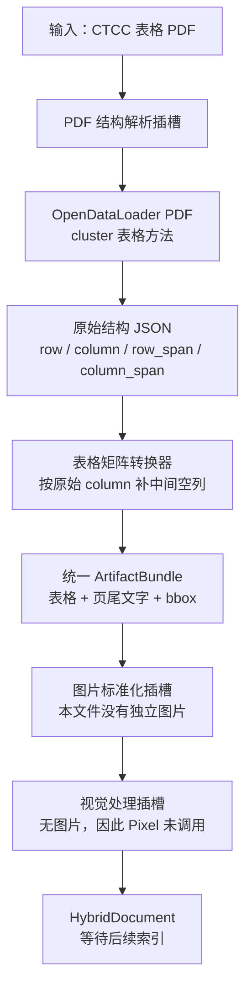

# CTCC 博世合作伙伴权益 PDF 实际识别结果

[返回总览](./输入结果总览_20260814.md)

## 文件

`2026-2027赛季CTCC中国汽车场地职业联赛 合作伙伴权益 - 博世 - 0812.pdf`

## 结果摘要

| 项目 | 结果 |
|---|---:|
| 实际类型 | PDF |
| 页数 | 1 |
| 内容块 | 6 |
| 文字块 | 5 |
| 表格块 | 1 |
| 图片块 | 0 |
| 表格规模 | 36行 × 8列 |
| 坐标完整 | 6/6 |
| 警告 | 0 |
| 解析器 | OpenDataLoader PDF |

## 本次方法流程图

## 问题定位与修正

- OpenDataLoader 正确识别了 36 行、8 列，并为单元格保留了真实 `column` 和跨度。
- 原转换器只按单元格出现顺序拼接；当第 2 列为空时，第 3—8 列被错误左移，最后才在行尾补空列。
- 现已改为按原始列号放置内容，并在缺失的中间列原位补空；该修正适用于后续所有 PDF 表格。
- 当前 Studio 项目中的该 PDF 已于 2026-08-17 重新处理。

## 合并单元格核对

本文件可以与原始 XLSX 逐项对照，因此这里区分“检测到跨度”和“跨度完全准确”：

| 合并区域 | XLSX真实结构 | PDF识别结果 | 判断 |
|---|---|---|---|
| 整表标题 | 横跨8列 | `column_span=8` | 正确 |
| 2026赛季表头 | 横跨第4—6列 | `column_span=3` | 正确 |
| 品牌宣传形象授权 | 纵跨4行 | `row_span=4` | 正确 |
| 无形资产使用 | 纵跨2行 | `row_span=2` | 正确 |
| 赛事现场广告露出 | 纵跨7行 | `row_span=7` | 正确 |
| 第一组第4—8列内容 | Excel纵跨4行 | PDF推断为纵跨6行 | 过度合并2行 |
| 两层表头 | Excel第2—3行分别存在 | PDF压缩为1个逻辑表头行 | 结构简化 |

结论：PDF解析器识别并保存了合并信息，大部分范围正确，但视觉推断不能保证与源Excel完全一致。当前Markdown只在合并起始格显示内容，不会根据`row_span`把值复制到后续行，因此不会把上述过度合并转换成额外的错误文本。

## 修正前错误表格（保留用于问题对照）

- `block_id`：`2bfe292e2f7f59f2:000000`
- 页码：1
- `bbox`：`[0.024571, 0.018575, 0.919429, 0.705843]`
- 语义类型：`table`
- PDF/UA标签：`Table`

以下为解析器实际输出的结构化Markdown表格：

| 2026-2027赛季 CTCC中国汽车场地职业联赛 指定合作伙伴权益 - 博世 |  |  |  |  |  |  |  |
| --- | --- | --- | --- | --- | --- | --- | --- |
| 编号 | 分类 | 权益说明 | 第四分站 第五分站 第六分站 2026赛季 | 2027赛季 共6站 | 备注 |  |  |
| 1 | 品牌宣传形象授权 | 授予品牌“CTCC中国场地汽车职业联赛合作伙伴 指定合作伙伴”称号 | √ | √ | √ | 2027赛季 | 合作伙伴权益，不单独出售 |
| 2 | 授权品牌使用“CTCC中国汽车场地职业联赛 上海站”赛事名称 |  |  |  |  |  |  |
| 3 | 授权品牌使用“CTCC中国汽车场地职业联赛 上海站”赛事LOGO |  |  |  |  |  |  |
| 4 | 授权品牌使用“CTCC中国汽车场地职业联赛 上海站”赛事图片/视频素材 |  |  |  |  |  |  |
| 5 | 无形资产使用 | CTCC围场内品牌产品销售 |  |  |  |  |  |
| 6 | CTCC车辆数据支持 |  |  |  |  |  |  |
| 7 | 赛事现场 广告露出 | CTCC发车区防撞墙广告（品牌独立画面） 位于赛事发车大直道两侧，看台现场观众、观赛包厢VIP嘉宾、参赛车队可见 | 1组 | 1组 | 1组 | 1组/站 | 1)面积尺寸：1米*10米/块，1组为2块，广告画面由品牌方提供，赛事方负责制 作，发布内容需符合相关法规政策 2)露出时间为赛事周周六-周日2天 |
| 8 | CTCC参赛车车身品牌LOGO露出 不少于30台参赛车，位于车辆两侧车身位置 | √ | √ | √ | √ | 车身左右各1块，面积不超过35cm*15cm |  |
| 9 | CTCC参赛车车后牌照品牌LOGO露出 不少于30台参赛车，位于车辆后牌照位置 | √ | √ | √ | √ | 车后牌照1块，面积根据赛车牌照尺寸制作 |  |
| 10 | CTCC新闻发布会背景板品牌LOGO体现 位于赛场新闻中心，品牌LOGO随赛事新闻稿件照片传播，LOGO占比不低于10% | √ | √ | √ | √ | 合作伙伴权益，不单独销售 |  |
| 11 | CTCC采访背景板品牌LOGO体现 位于赛场冠军收车区，品牌LOGO随赛事直播露出，LOGO占比不低于10% | 合作伙伴权益，不单独销售 |  |  |  |  |  |
| 12 | CTCC颁奖背景板品牌LOGO体现 位于赛场颁奖台，看台现场观众、赛事直播、赛事新闻稿件传播可见，LOGO占比不低于10% | 合作伙伴权益，不单独销售 |  |  |  |  |  |
| 13 | CTCC观赛手册品牌LOGO露出及赛事联合硬广露出 露出渠道：赛事线上渠道传播、赛事现场观众及VIP嘉宾 | √ | √ | √ | √ | 品牌LOGO及广告设计文件由品牌方提供 硬广内容需结合CTCC赛事进行设计，不可露出非CTCC合作伙伴品牌 |  |
| 14 | 品牌领导活动 | 邀请品牌领导参加CTCC发车仪式 | √ | √ | √ | √ | 合作伙伴权益，不单独销售 1人/站，由品牌于分站前3日提出需求，否则视为自愿放弃当站权益 |
| 15 | 邀请品牌领导参加CTCC赛事颁奖 | √ | √ | √ | √ |  |  |
| 16 | 贵宾包厢及证件 | 为品牌提供赛事现场VIP包厢用于重要嘉宾及品牌用户观赛体验 1)使用时间为赛事周周六至周日2天，可提前2天进场搭建 2)每单元面积为7米*24米，仅提供空房间，不含家具及用餐等 3)包厢费用不含电费、网络费及押金，需根据场地方实际收费结算 | 2单元 | X | X | X | 报价不含搭建 |
| 17 | 贵宾证 为品牌提供CTCC参观证件（不含自助午餐，在品牌VIP包厢内观赛） | 10张 | 10张 | 10张 | 10张/站 | 通行区域：围场（不含车队pit房内）、品牌包厢、CTCC官方包厢、指定时间可 上发车区 |  |
| 18 | 参观证 为品牌提供CTCC贵宾证件（含自助午餐，在CTCC官方包厢内用餐） | 20张 | X | X | X | 通行区域：围场（不含车队pit房内）、品牌包厢、指定时间可上发车区 |  |
| 19 | 工作证件 为品牌围场及观众活动区展台工作人员提供工作证件 | 10张 | 10张 | 10张 | 10张/站 |  |  |
| 20 | 停车证件 为品牌提供CTCC内场停车证 | 2张 | 2张 | 2张 | 2张/站 |  |  |
| 21 | 赛事导览 | 为品牌贵宾提供赛事期间围场及商贸区导览服务 1)在赛事期间指定时间带领品牌贵宾参观围场及商贸区，专人导览讲解，包含商贸区展台、空中走廊、 围场及发车仪式 2)参观时间需赛前协商确认，不可影响正常比赛进程，如遇天气或赛事事故导致的比赛推迟或取消，可 能会现场临时调整参观行程 | 20人 | X | X | X |  |
| 22 | 观众活动展示区 品牌展台-特装类 | 品牌在CTCC观众活动区搭建快闪展台，进行产品展示体验 1)使用时间为赛事周周日1天，可提前1天进场搭建，搭建及活动方案需至少提前15个工作日提供并符 合相关申报要求 2)仅提供展示区空地供品牌进行展位搭建，展位搭建押金及水电费等根据场地方实际收费结算 | 50平米 | X | X | X | 展台仅用于品牌展示，不可免费提供或销售酒水烟草、药品、饮料、食品 |
| 23 | 赛道使用时间 | 品牌专属赛道时段 1)合作期间内共有360分钟时段，每站最多可使用90分钟； 2)仅提供完整赛道，不含计时、裁判、控制中心服务; 3)品牌应于分站前15个工作日提出需求并沟通赛道活动方案，否则视为自动放弃权益 4)不能指定具体时间段，所使用的时间段不应影响竞赛流程，由双方协商确认 | 共360分钟 |  |  |  |  |
| 24 | 新闻素材服务 | 赛事新闻稿撰写（*品牌信息植入） | 1篇 | 1篇 | 1篇 | 1篇/站 | 核心资料/信息素材由品牌方提供 |
| 25 | 视频制作（以品牌内容为主题的赛事集锦，品牌现场露出植入） 视频发布在抖音、小红书等官方账号，并与博世官方账号进行互动 | 1条 | 1条 | 2条 | 7条 | 每站赛事结束后提供以品牌露出画面为主的赛事集锦视频1条，全年比赛结束后 提供以品牌露出画面为主的赛事集锦视频1条，每条视频集锦时长30秒 |  |
| 26 | 赛事新闻图片（*品牌广告露出及品牌活动现场照片） | √ | √ | √ | √ | 每站不少于20张精选图 |  |
| 27 | 赛事直播信号 | 直播信号推流 1)提供CTCC赛事决赛直播信号推流服务 2)仅供不超过3个平台信号推流播出，平台播出申报备案需由品牌方负责 | √ | √ | √ | √ |  |
| 28 | 官方平台露出 | CTCC官方公共信号字幕标版品牌LOGO体现 1)位于赛事直播计时栏下方，随赛事决赛露出 2)每次露出不少于5秒，每回合决赛露出不少于10次 | √ | √ | √ | √ | 合作伙伴权益，不单独销售 |
| 29 | CTCC官方自媒体与品牌自媒体互动 | √ | √ | √ | √ | 合作伙伴权益，不单独销售 |  |
| 30 | CTCC官方自媒体品牌LOGO露出 | √ | √ | √ | √ | 合作伙伴权益，不单独销售 |  |
| 31 | CTCC官方网站首页按钮广告（按钮链接至品牌官网） | √ | √ | √ | √ | 合作伙伴权益，不单独销售 |  |
| 32 | CTCC官方网站合作伙伴栏品牌LOGO露出 | √ | √ | √ | √ | 合作伙伴权益，不单独销售 |  |
| 权益总价 | 1,680,000 |  |  |  |  |  |  |
| 2026-2027赛季合作优惠价（含6%增值税） | 1,200,000 |  |  |  |  |  |  |

## 其余实际文字块

- **顺序 2**：*END
  - `block_id`：`2bfe292e2f7f59f2:000001`
  - 页码：1；`bbox`：`[0.899429, 0.697082, 0.917998, 0.703477]`；语义类型：`heading`
- **顺序 3**：备注：
  - `block_id`：`2bfe292e2f7f59f2:000002`
  - 页码：1；`bbox`：`[0.038286, 0.712426, 0.058857, 0.718822]`；语义类型：`caption`
- **顺序 4**：1.赛事赛历以中汽摩联和赛事举办地相关主管部门批准公布为准，可能会有调整，如有赛历调整需至少提前1个月告知；
  - `block_id`：`2bfe292e2f7f59f2:000003`
  - 页码：1；`bbox`：`[0.061714, 0.712426, 0.421143, 0.718822]`；语义类型：`paragraph`
- **顺序 5**：2.以上规划可能因赛事现场实际情况有略微调整，最终解释权归力盛体育所有。
  - `block_id`：`2bfe292e2f7f59f2:000004`
  - 页码：1；`bbox`：`[0.061714, 0.718887, 0.300571, 0.725283]`；语义类型：`paragraph`
- **顺序 6**：第1页，共1页
  - `block_id`：`2bfe292e2f7f59f2:000005`
  - 页码：1；`bbox`：`[0.453714, 0.729386, 0.496, 0.735781]`；语义类型：`paragraph`

## 与同内容XLSX对比

| 指标 | XLSX | PDF |
|---|---:|---:|
| 解析器 | openpyxl | OpenDataLoader PDF |
| 内容块 | 6 | 6 |
| 文字块 | 4 | 5 |
| 表格块 | 2 | 1 |
| 图片块 | 0 | 0 |
| 坐标完整 | 6/6 | 6/6 |
| 警告 | 0 | 0 |

## 结果判断

- OpenDataLoader成功把原本复杂的一页权益表恢复为1个结构化表格，而不是拆成大量无结构文字块。
- 表格元数据保留36行、8列以及单元格的`row`、`column`、`row_span`和`column_span`；其中PDF跨度属于视觉推断，大部分正确，但不能视为源文件级精确结构。
- Markdown 展示仍会把合并单元格摊平为“起始格有值、跨度位置留空”，但现在会严格保留原始列号；底层 `table_cells` 同时保留跨度信息。
- 页尾的`*END`、两条备注和页码被单独保留为文字块。
- PDF中没有独立内嵌图片，因此未生成ImageAsset或PixelRAG视觉任务。
- 当前结果完成HYBRID解析与坐标保留，尚未建立索引。

<!-- GENERATED_ARTIFACTS_START -->

## 完整识别结果（由最终 HybridDocument 生成）

> 以下内容按 `reading_order` 逐块打印；表格正文就是解析器实际输出的 Markdown，不是人工重写。

- 最终解析器：`opendataloader-pdf`
- 内容块总数：6
- 警告数：0

### 内容块 1：表格（table）

- `block_id`：`2bfe292e2f7f59f2:000000`
- `reading_order`：0
- 页码：1；幻灯片：—；工作表：`—`
- 单元格范围：`—`
- `bbox`：`[0.024571, 0.018575, 0.919429, 0.705843]`
- `bbox_original`：`[14.620000, 15.640000, 547.060000, 594.320000]`
- `locator`：`opendataloader:1`
- 表格规模：36 行 × 8 列

#### 实际表格输出

| 2026-2027赛季 CTCC中国汽车场地职业联赛 指定合作伙伴权益 - 博世 |  |  |  |  |  |  |  |
| --- | --- | --- | --- | --- | --- | --- | --- |
| 编号 | 分类 | 权益说明 | 第四分站 第五分站 第六分站 2026赛季 |  |  | 2027赛季 共6站 | 备注 |
| 1 | 品牌宣传形象授权 | 授予品牌“CTCC中国场地汽车职业联赛合作伙伴 指定合作伙伴”称号 | √ | √ | √ | 2027赛季 | 合作伙伴权益，不单独出售 |
| 2 |  | 授权品牌使用“CTCC中国汽车场地职业联赛 上海站”赛事名称 |  |  |  |  |  |
| 3 |  | 授权品牌使用“CTCC中国汽车场地职业联赛 上海站”赛事LOGO |  |  |  |  |  |
| 4 |  | 授权品牌使用“CTCC中国汽车场地职业联赛 上海站”赛事图片/视频素材 |  |  |  |  |  |
| 5 | 无形资产使用 | CTCC围场内品牌产品销售 |  |  |  |  |  |
| 6 |  | CTCC车辆数据支持 |  |  |  |  |  |
| 7 | 赛事现场 广告露出 | CTCC发车区防撞墙广告（品牌独立画面） 位于赛事发车大直道两侧，看台现场观众、观赛包厢VIP嘉宾、参赛车队可见 | 1组 | 1组 | 1组 | 1组/站 | 1)面积尺寸：1米*10米/块，1组为2块，广告画面由品牌方提供，赛事方负责制 作，发布内容需符合相关法规政策 2)露出时间为赛事周周六-周日2天 |
| 8 |  | CTCC参赛车车身品牌LOGO露出 不少于30台参赛车，位于车辆两侧车身位置 | √ | √ | √ | √ | 车身左右各1块，面积不超过35cm*15cm |
| 9 |  | CTCC参赛车车后牌照品牌LOGO露出 不少于30台参赛车，位于车辆后牌照位置 | √ | √ | √ | √ | 车后牌照1块，面积根据赛车牌照尺寸制作 |
| 10 |  | CTCC新闻发布会背景板品牌LOGO体现 位于赛场新闻中心，品牌LOGO随赛事新闻稿件照片传播，LOGO占比不低于10% | √ | √ | √ | √ | 合作伙伴权益，不单独销售 |
| 11 |  | CTCC采访背景板品牌LOGO体现 位于赛场冠军收车区，品牌LOGO随赛事直播露出，LOGO占比不低于10% |  |  |  |  | 合作伙伴权益，不单独销售 |
| 12 |  | CTCC颁奖背景板品牌LOGO体现 位于赛场颁奖台，看台现场观众、赛事直播、赛事新闻稿件传播可见，LOGO占比不低于10% |  |  |  |  | 合作伙伴权益，不单独销售 |
| 13 |  | CTCC观赛手册品牌LOGO露出及赛事联合硬广露出 露出渠道：赛事线上渠道传播、赛事现场观众及VIP嘉宾 | √ | √ | √ | √ | 品牌LOGO及广告设计文件由品牌方提供 硬广内容需结合CTCC赛事进行设计，不可露出非CTCC合作伙伴品牌 |
| 14 | 品牌领导活动 | 邀请品牌领导参加CTCC发车仪式 | √ | √ | √ | √ | 合作伙伴权益，不单独销售 1人/站，由品牌于分站前3日提出需求，否则视为自愿放弃当站权益 |
| 15 |  | 邀请品牌领导参加CTCC赛事颁奖 | √ | √ | √ | √ |  |
| 16 | 贵宾包厢及证件 | 为品牌提供赛事现场VIP包厢用于重要嘉宾及品牌用户观赛体验 1)使用时间为赛事周周六至周日2天，可提前2天进场搭建 2)每单元面积为7米*24米，仅提供空房间，不含家具及用餐等 3)包厢费用不含电费、网络费及押金，需根据场地方实际收费结算 | 2单元 | X | X | X | 报价不含搭建 |
| 17 |  | 贵宾证 为品牌提供CTCC参观证件（不含自助午餐，在品牌VIP包厢内观赛） | 10张 | 10张 | 10张 | 10张/站 | 通行区域：围场（不含车队pit房内）、品牌包厢、CTCC官方包厢、指定时间可 上发车区 |
| 18 |  | 参观证 为品牌提供CTCC贵宾证件（含自助午餐，在CTCC官方包厢内用餐） | 20张 | X | X | X | 通行区域：围场（不含车队pit房内）、品牌包厢、指定时间可上发车区 |
| 19 |  | 工作证件 为品牌围场及观众活动区展台工作人员提供工作证件 | 10张 | 10张 | 10张 | 10张/站 |  |
| 20 |  | 停车证件 为品牌提供CTCC内场停车证 | 2张 | 2张 | 2张 | 2张/站 |  |
| 21 | 赛事导览 | 为品牌贵宾提供赛事期间围场及商贸区导览服务 1)在赛事期间指定时间带领品牌贵宾参观围场及商贸区，专人导览讲解，包含商贸区展台、空中走廊、 围场及发车仪式 2)参观时间需赛前协商确认，不可影响正常比赛进程，如遇天气或赛事事故导致的比赛推迟或取消，可 能会现场临时调整参观行程 | 20人 | X | X | X |  |
| 22 | 观众活动展示区 品牌展台-特装类 | 品牌在CTCC观众活动区搭建快闪展台，进行产品展示体验 1)使用时间为赛事周周日1天，可提前1天进场搭建，搭建及活动方案需至少提前15个工作日提供并符 合相关申报要求 2)仅提供展示区空地供品牌进行展位搭建，展位搭建押金及水电费等根据场地方实际收费结算 | 50平米 | X | X | X | 展台仅用于品牌展示，不可免费提供或销售酒水烟草、药品、饮料、食品 |
| 23 | 赛道使用时间 | 品牌专属赛道时段 1)合作期间内共有360分钟时段，每站最多可使用90分钟； 2)仅提供完整赛道，不含计时、裁判、控制中心服务; 3)品牌应于分站前15个工作日提出需求并沟通赛道活动方案，否则视为自动放弃权益 4)不能指定具体时间段，所使用的时间段不应影响竞赛流程，由双方协商确认 | 共360分钟 |  |  |  |  |
| 24 | 新闻素材服务 | 赛事新闻稿撰写（*品牌信息植入） | 1篇 | 1篇 | 1篇 | 1篇/站 | 核心资料/信息素材由品牌方提供 |
| 25 |  | 视频制作（以品牌内容为主题的赛事集锦，品牌现场露出植入） 视频发布在抖音、小红书等官方账号，并与博世官方账号进行互动 | 1条 | 1条 | 2条 | 7条 | 每站赛事结束后提供以品牌露出画面为主的赛事集锦视频1条，全年比赛结束后 提供以品牌露出画面为主的赛事集锦视频1条，每条视频集锦时长30秒 |
| 26 |  | 赛事新闻图片（*品牌广告露出及品牌活动现场照片） | √ | √ | √ | √ | 每站不少于20张精选图 |
| 27 | 赛事直播信号 | 直播信号推流 1)提供CTCC赛事决赛直播信号推流服务 2)仅供不超过3个平台信号推流播出，平台播出申报备案需由品牌方负责 | √ | √ | √ | √ |  |
| 28 | 官方平台露出 | CTCC官方公共信号字幕标版品牌LOGO体现 1)位于赛事直播计时栏下方，随赛事决赛露出 2)每次露出不少于5秒，每回合决赛露出不少于10次 | √ | √ | √ | √ | 合作伙伴权益，不单独销售 |
| 29 |  | CTCC官方自媒体与品牌自媒体互动 | √ | √ | √ | √ | 合作伙伴权益，不单独销售 |
| 30 |  | CTCC官方自媒体品牌LOGO露出 | √ | √ | √ | √ | 合作伙伴权益，不单独销售 |
| 31 |  | CTCC官方网站首页按钮广告（按钮链接至品牌官网） | √ | √ | √ | √ | 合作伙伴权益，不单独销售 |
| 32 |  | CTCC官方网站合作伙伴栏品牌LOGO露出 | √ | √ | √ | √ | 合作伙伴权益，不单独销售 |
| 权益总价 |  |  | 1,680,000 |  |  |  |  |
| 2026-2027赛季合作优惠价（含6%增值税） |  |  | 1,200,000 |  |  |  |  |

### 内容块 2：文字（heading）

- `block_id`：`2bfe292e2f7f59f2:000001`
- `reading_order`：1
- 页码：1；幻灯片：—；工作表：`—`
- 单元格范围：`—`
- `bbox`：`[0.899429, 0.697082, 0.917998, 0.703477]`
- `bbox_original`：`[535.160000, 586.943000, 546.209000, 592.328000]`
- `locator`：`opendataloader:3`

#### 实际文字输出

*END

### 内容块 3：文字（caption）

- `block_id`：`2bfe292e2f7f59f2:000002`
- `reading_order`：2
- 页码：1；幻灯片：—；工作表：`—`
- 单元格范围：`—`
- `bbox`：`[0.038286, 0.712426, 0.058857, 0.718822]`
- `bbox_original`：`[22.780000, 599.863000, 35.020000, 605.248000]`
- `locator`：`opendataloader:2`
- 父级：`2bfe292e2f7f59f2:000001`

#### 实际文字输出

备注：

### 内容块 4：文字（paragraph）

- `block_id`：`2bfe292e2f7f59f2:000003`
- `reading_order`：3
- 页码：1；幻灯片：—；工作表：`—`
- 单元格范围：`—`
- `bbox`：`[0.061714, 0.712426, 0.421143, 0.718822]`
- `bbox_original`：`[36.720000, 599.863000, 250.580000, 605.248000]`
- `locator`：`opendataloader:4`
- 父级：`2bfe292e2f7f59f2:000001`

#### 实际文字输出

1.赛事赛历以中汽摩联和赛事举办地相关主管部门批准公布为准，可能会有调整，如有赛历调整需至少提前1个月告知；

### 内容块 5：文字（paragraph）

- `block_id`：`2bfe292e2f7f59f2:000004`
- `reading_order`：4
- 页码：1；幻灯片：—；工作表：`—`
- 单元格范围：`—`
- `bbox`：`[0.061714, 0.718887, 0.300571, 0.725283]`
- `bbox_original`：`[36.720000, 605.303000, 178.840000, 610.688000]`
- `locator`：`opendataloader:6`
- 父级：`2bfe292e2f7f59f2:000001`

#### 实际文字输出

2.以上规划可能因赛事现场实际情况有略微调整，最终解释权归力盛体育所有。

### 内容块 6：文字（paragraph）

- `block_id`：`2bfe292e2f7f59f2:000005`
- `reading_order`：5
- 页码：1；幻灯片：—；工作表：`—`
- 单元格范围：`—`
- `bbox`：`[0.453714, 0.729386, 0.496000, 0.735781]`
- `bbox_original`：`[269.960000, 614.143000, 295.120000, 619.528000]`
- `locator`：`opendataloader:5`
- 父级：`2bfe292e2f7f59f2:000001`

#### 实际文字输出

第1页，共1页

<!-- GENERATED_ARTIFACTS_END -->
