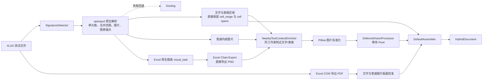
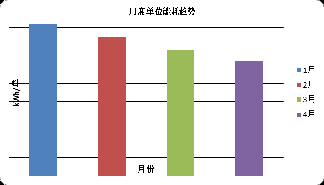

# Excel 实际识别结果：云帆仓配中心能效台账

[返回总览](./输入结果总览_20260814.md)

## 结果摘要

| 项目 | 结果 |
|---|---:|
| 解析器 | openpyxl-subprocess |
| 文字块 | 3 |
| 表格块 | 3 |
| 图片块 | 2 |
| 坐标完整 | 8/8 |
| 警告 | 0 |

## 本次测试实际方法流程

## 实际单元格与表格识别结果

### 工作表：项目概览

识别标题：**云帆仓配中心 2025 能效台账**

| 项目代号 | 青岚 |
|---|---|
| 园区位置 | 无锡新吴区 |
| 能效负责人 | 唐薇 |
| 基准电价 | 0.82 元/千瓦时 |
| 年度节电目标 | 18% |

| 说明 | 内容 |
|---|---|
| 运行说明 | 夜间低谷时段为 22:00–06:00；冷链机组优先在低谷时段预冷。 |

### 工作表：月度能耗

| 月份 | 订单量 | 耗电量(kWh) | 单位能耗(kWh/单) | 峰值需量(kW) |
|---|---:|---:|---:|---:|
| 1月 | 1000 | 8200 | 8.2 | 310 |
| 2月 | 1200 | 9000 | 7.5 | 325 |
| 3月 | 1500 | 10200 | 6.8 | 340 |
| 4月 | 1800 | 11160 | 6.2 | 355 |

图表标题“月度单位能耗趋势”保留在 Excel 原生图表导出的 PNG 中。

### 工作表：现场图片

识别标题：**仓库现场图像识别页**

识别说明：请从图片本身识别机器人、货箱、人员动作和绿色标志。

## 实际图片提取与渲染结果

### 月度单位能耗趋势图

- `block_id`: `6463ec510d14b6d2:000004`
- 工作表：`月度能耗`
- 单元格范围：`G2:O17`
- 逻辑 `bbox`: `[0.857143, 0.200000, 1.000000, 0.400000]`
- Excel 点坐标：`[501.600006, 16.200001, 898.450409, 242.971653]`
- 渲染方式：Excel COM `Chart.Export` 直接导出 PNG。
- 图片状态：已渲染并标准化；PixelRAG 视觉描述与向量待处理。

### 现场图片

- `block_id`: `6463ec510d14b6d2:000007`
- 工作表：`现场图片`
- 页码：5
- `bbox`: `[0.090726, 0.173200, 0.850806, 0.600855]`
- 图片状态：已直接提取并标准化；PixelRAG 视觉描述与向量待处理。

## 说明

本次重测已将 XLSX 默认解析器从 Docling 改为 openpyxl。文字和数值直接读取原始单元格，合并单元格只保存一次，
并以 `merged_range`、`row_span` 和 `column_span` 表示结构；图表和普通图片仍沿用原有独立视觉通道。

<!-- GENERATED_ARTIFACTS_START -->

## 完整识别结果（由最终 HybridDocument 生成）

> 以下内容按 `reading_order` 逐块打印；表格正文就是解析器实际输出的 Markdown，不是人工重写。

- 最终解析器：`openpyxl-subprocess`
- 内容块总数：8
- 警告数：0

### 内容块 1：文字（worksheet_text）

- `block_id`：`6463ec510d14b6d2:000000`
- `reading_order`：0
- 页码：1；幻灯片：—；工作表：`项目概览`
- 单元格范围：`A1:F2`
- `bbox`：`[0.386778, 0.086282, 0.826756, 0.117529]`
- `locator`：`sheet:项目概览/range:A1:F2|page:1`

#### 实际文字输出

云帆仓配中心 2025 能效台账

### 内容块 2：表格（worksheet_region）

- `block_id`：`6463ec510d14b6d2:000001`
- `reading_order`：1
- 页码：1；幻灯片：—；工作表：`项目概览`
- 单元格范围：`A4:B8`
- `bbox`：`[0.095363, 0.137223, 0.390415, 0.232002]`
- `locator`：`sheet:项目概览/range:A4:B8|page:1`
- 表格规模：5 行 × 2 列
- 结构来源：`native`
- 合并跨度可靠性：`exact`

#### 实际表格输出

| 项目代号 | 青岚 |
| --- | --- |
| 园区位置 | 无锡新吴区 |
| 能效负责人 | 唐薇 |
| 基准电价 | 0.82 元/千瓦时 |
| 年度节电目标 | 18% |

### 内容块 3：表格（worksheet_region）

- `block_id`：`6463ec510d14b6d2:000002`
- `reading_order`：2
- 页码：1；幻灯片：—；工作表：`项目概览`
- 单元格范围：`A10:B10`
- `bbox`：`[0.095363, 0.251442, 0.785266, 0.268673]`
- `locator`：`sheet:项目概览/range:A10:B10|page:1`
- 表格规模：1 行 × 2 列
- 结构来源：`native`
- 合并跨度可靠性：`exact`

#### 实际表格输出

| 说明 | 夜间低谷时段为 22:00–06:00；冷链机组优先在低谷时段预冷。 |
| --- | --- |

### 内容块 4：表格（worksheet_region）

- `block_id`：`6463ec510d14b6d2:000003`
- `reading_order`：3
- 页码：3；幻灯片：—；工作表：`月度能耗`
- 单元格范围：`A1:E5`
- `bbox`：`[0.130645, 0.085477, 0.863099, 0.178260]`
- `locator`：`sheet:月度能耗/range:A1:E5|page:3`
- 表格规模：5 行 × 5 列
- 结构来源：`native`
- 合并跨度可靠性：`exact`

#### 实际表格输出

| 月份 | 订单量 | 耗电量(kWh) | 单位能耗(kWh/单) | 峰值需量(kW) |
| --- | --- | --- | --- | --- |
| 1月 | 1000 | 8200 | 8.2 | 310 |
| 2月 | 1200 | 9000 | 7.5 | 325 |
| 3月 | 1500 | 10200 | 6.8 | 340 |
| 4月 | 1800 | 11160 | 6.2 | 355 |

### 内容块 5：图片（excel_chart）

- `block_id`：`6463ec510d14b6d2:000004`
- `reading_order`：4
- 页码：2；幻灯片：—；工作表：`月度能耗`
- 单元格范围：`G2:O17`
- `bbox`：`[0.857143, 0.200000, 1.000000, 0.400000]`
- `locator`：`sheet:月度能耗/range:G2:G2`

- 图片上下文：| 月份 | 订单量 | 耗电量(kWh) | 单位能耗(kWh/单) | 峰值需量(kW) | | --- | --- | --- | --- | --- | | 1月 | 1000 | 8200 | 8.2 | 310 | | 2月 | 1200 | 9000 | 7.5 | 325 | | 3月 | 1500 | 10200 | 6.8 | 340 | | 4月 | 1800 | 11160 | 6.2 | 355 |

- 图片文件：`C:\Users\XEE8SZH\Desktop\多模态输入\input-acceptance-20260817\03_云帆仓配中心能效台账-6463ec510d14\images\6463ec510d14b6d2-000004.png`
- SHA-256：`85dea4a20a3595ed393a4ac7bae88f739f58c7aa307b5aad0443ca904ac5b1aa`
- 视觉处理：provider=`deferred`，status=`pending`，vector=无

### 内容块 6：文字（worksheet_text）

- `block_id`：`6463ec510d14b6d2:000005`
- `reading_order`：5
- 页码：5；幻灯片：—；工作表：`现场图片`
- 单元格范围：`A1:H2`
- `bbox`：`[0.277856, 0.086282, 0.580921, 0.117529]`
- `locator`：`sheet:现场图片/range:A1:H2|page:5`

#### 实际文字输出

仓库现场图像识别页

### 内容块 7：文字（worksheet_text）

- `block_id`：`6463ec510d14b6d2:000006`
- `reading_order`：6
- 页码：5；幻灯片：—；工作表：`现场图片`
- 单元格范围：`A4`
- `bbox`：`[0.093594, 0.137365, 0.565466, 0.154596]`
- `locator`：`sheet:现场图片/range:A4|page:5`

#### 实际文字输出

请从图片本身识别机器人、货箱、人员动作和绿色标志。

### 内容块 8：图片（embedded_image）

- `block_id`：`6463ec510d14b6d2:000007`
- `reading_order`：7
- 页码：5；幻灯片：—；工作表：`现场图片`
- 单元格范围：`A6:A6`
- `bbox`：`[0.090726, 0.173200, 0.850806, 0.600855]`
- `locator`：`sheet:现场图片/range:A6:A6|page:5`

- 图片上下文：请从图片本身识别机器人、货箱、人员动作和绿色标志。

- 图片文件：`C:\Users\XEE8SZH\Desktop\多模态输入\input-acceptance-20260817\03_云帆仓配中心能效台账-6463ec510d14\images\6463ec510d14b6d2-000007.png`
- SHA-256：`65fd444d34710b2e8857ce97c7c7560136d8ed6c9da466fea2c321005cb05694`
- 视觉处理：provider=`deferred`，status=`pending`，vector=无

<!-- GENERATED_ARTIFACTS_END -->
