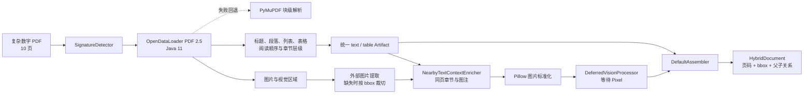

# PDF 实际识别结果：天枢冷链中心多模态运营分析报告

[返回总览](./输入结果总览_20260814.md)

## 结果摘要

| 项目 | 结果 |
|---|---:|
| 页数 | 10 |
| 解析器 | opendataloader-pdf |
| 内容块 | 50 |
| 文字类内容块 | 35 |
| 标题 | 15 |
| 段落 | 9 |
| 列表 | 4 |
| 表格 | 7 |
| 图片 | 8 |
| 坐标完整 | 50/50 |
| 具有章节父级 | 49/50 |
| 遗留 visual_task | 0 |
| 警告 | 0 |

## 本次测试实际方法流程



## 结构识别抽查

首页标题被识别为一级标题：

```json
{
  "kind": "text",
  "semantic_type": "heading",
  "heading_level": 1,
  "page": 1,
  "text": "天枢冷链中心 2025 多模态运营分析报告"
}
```

表格保留行数、列数、单元格内容和页面 bbox；列表保留为独立语义类型；标题层级用于建立 `parent_block_id`。

## 图片处理结果

OpenDataLoader 共定位并提取 8 张图片。抽查首页“冷链智能巡检现场”图片，机器人、人员、货箱、警告标志和绿色车辆均完整，
图片文件已标准化并形成 8 个待处理视觉任务。当前视觉处理器仍为 `deferred`，因此尚未生成 PixelRAG 描述或向量。

## 回退说明

- OpenDataLoader 是当前 PDF 默认结构解析器。
- 本机复用 PDFsam 自带的 Java 11，不新增安装。
- 若 OpenDataLoader、Java 或结构转换失败，自动回退 PyMuPDF。
- PyMuPDF 回退能保留文本块、图片、页码和 bbox，但不保证标题、列表和表格语义结构。

## 结论

本次 PDF 已从原来的“PyMuPDF 块级提取”升级为“OpenDataLoader 结构解析 + PyMuPDF 回退”。文字、表格和图片均进入统一契约，
复杂视觉对象已经准备好交给 Pixel，但视觉向量化和索引仍未开始。

<!-- GENERATED_ARTIFACTS_START -->

## 完整识别结果（由最终 HybridDocument 生成）

> 以下内容按 `reading_order` 逐块打印；表格正文就是解析器实际输出的 Markdown，不是人工重写。

- 最终解析器：`opendataloader-pdf`
- 内容块总数：50
- 警告数：0

### 内容块 1：文字（heading）

- `block_id`：`6f6021ed4f7573fa:000000`
- `reading_order`：0
- 页码：1；幻灯片：—；工作表：`—`
- 单元格范围：`—`
- `bbox`：`[0.311012, 0.094865, 0.688988, 0.168924]`
- `bbox_original`：`[185.138000, 79.865771, 410.138000, 142.215771]`
- `locator`：`opendataloader:21`

#### 实际文字输出

天枢冷链中心 2025 多模态运营分析报告


### 内容块 2：文字（paragraph）

- `block_id`：`6f6021ed4f7573fa:000001`
- `reading_order`：1
- 页码：1；幻灯片：—；工作表：`—`
- 单元格范围：`—`
- `bbox`：`[0.336357, 0.207882, 0.663644, 0.220678]`
- `bbox_original`：`[200.225000, 175.013771, 395.051000, 185.786771]`
- `locator`：`opendataloader:22`
- 父级：`6f6021ed4f7573fa:000000`

#### 实际文字输出

复杂 PDF 输入基准｜版本 1.0｜2026 年 1 月发布


### 内容块 3：图片（image）

- `block_id`：`6f6021ed4f7573fa:000002`
- `reading_order`：2
- 页码：1；幻灯片：—；工作表：`—`
- 单元格范围：`—`
- `bbox`：`[0.085715, 0.251281, 0.914286, 0.602796]`
- `bbox_original`：`[51.024000, 211.550771, 544.252000, 507.487771]`
- `locator`：`opendataloader:23`
- 父级：`6f6021ed4f7573fa:000000`

- 图片上下文：复杂 PDF 输入基准｜版本 1.0｜2026 年 1 月发布
| 文档编号 | 保密级别 | 报告负责人 | | --- | --- | --- | | NEBULA-PDF-RICH-2025-05 | 内部测试 | 苏衡 |


- 图片文件：`C:\Users\XEE8SZH\Desktop\多模态输入\input-acceptance-20260817\05_天枢冷链中心多模态运营分析报告-6f6021ed4f75\images\6f6021ed4f7573fa-000002.png`
- SHA-256：`181da2c9cd129948cdf5d69c0603e9b50c8a7983c6942ff3473d6c26db9a1120`
- 视觉处理：provider=`deferred`，status=`pending`，vector=无

### 内容块 4：表格（table）

- `block_id`：`6f6021ed4f7573fa:000003`
- `reading_order`：3
- 页码：1；幻灯片：—；工作表：`—`
- 单元格范围：`—`
- `bbox`：`[0.085337, 0.619365, 0.914664, 0.676914]`
- `bbox_original`：`[50.799000, 521.436771, 544.477000, 569.886771]`
- `locator`：`opendataloader:24`
- 父级：`6f6021ed4f7573fa:000000`
- 表格规模：2 行 × 3 列
- 结构来源：`visual_inference`
- 合并跨度可靠性：`inferred`

#### 实际表格输出

| 文档编号 | 保密级别 | 报告负责人 |
| --- | --- | --- |
| NEBULA-PDF-RICH-2025-05 | 内部测试 | 苏衡 |


### 内容块 5：文字（heading）

- `block_id`：`6f6021ed4f7573fa:000004`
- `reading_order`：4
- 页码：1；幻灯片：—；工作表：`—`
- 单元格范围：`—`
- `bbox`：`[0.095794, 0.702105, 0.713155, 0.716248]`
- `bbox_original`：`[57.024000, 591.094771, 424.524000, 603.001771]`
- `locator`：`opendataloader:25`
- 父级：`6f6021ed4f7573fa:000000`

#### 实际文字输出

报告范围：运营质量、能耗效率、异常分布、冷库温控、应急流程与空间布局。


### 内容块 6：文字（heading）

- `block_id`：`6f6021ed4f7573fa:000005`
- `reading_order`：5
- 页码：2；幻灯片：—；工作表：`—`
- 单元格范围：`—`
- `bbox`：`[0.095794, 0.060198, 0.395363, 0.084443]`
- `bbox_original`：`[57.024000, 50.679771, 235.350000, 71.091771]`
- `locator`：`opendataloader:27`
- 父级：`6f6021ed4f7573fa:000000`

#### 实际文字输出

1. 执行摘要与关键指标


### 内容块 7：文字（paragraph）

- `block_id`：`6f6021ed4f7573fa:000006`
- `reading_order`：6
- 页码：2；幻灯片：—；工作表：`—`
- 单元格范围：`—`
- `bbox`：`[0.095794, 0.098326, 0.889544, 0.132662]`
- `bbox_original`：`[57.024000, 82.779771, 529.524000, 111.686771]`
- `locator`：`opendataloader:28`
- 父级：`6f6021ed4f7573fa:000005`

#### 实际文字输出

天枢冷链中心位于南京江宁区，项目代号“北斗”。中心于 2025 年 2 月 17 日投入正式运营，运营负责人为苏衡，冷链质量负责人为叶岚。年度核心目标包括：准时交付率不低于


### 内容块 8：文字（list）

- `block_id`：`6f6021ed4f7573fa:000007`
- `reading_order`：7
- 页码：2；幻灯片：—；工作表：`—`
- 单元格范围：`—`
- `bbox`：`[0.095794, 0.138711, 0.524702, 0.152855]`
- `bbox_original`：`[57.024000, 116.779771, 312.342000, 128.686771]`
- `locator`：`opendataloader:29`
- 父级：`6f6021ed4f7573fa:000005`

#### 实际文字输出

- 98.0%，单位能耗低于 6.5 kWh/单，重大安全事故为零。


### 内容块 9：表格（table）

- `block_id`：`6f6021ed4f7573fa:000008`
- `reading_order`：8
- 页码：2；幻灯片：—；工作表：`—`
- 单元格范围：`—`
- `bbox`：`[0.085337, 0.170608, 0.914664, 0.342186]`
- `bbox_original`：`[50.799000, 143.632771, 544.477000, 288.082771]`
- `locator`：`opendataloader:30`
- 父级：`6f6021ed4f7573fa:000005`
- 表格规模：6 行 × 5 列
- 结构来源：`visual_inference`
- 合并跨度可靠性：`inferred`

#### 实际表格输出

| 指标 | 2024基线 | 2025结果 | 目标 | 结论 |
| --- | --- | --- | --- | --- |
| 全年订单量 | 162万单 | 212万单 | ≥200万单 | 达标 |
| 准时交付率 | 96.9% | 99.6% | ≥98.0% | 达标 |
| 单位能耗 | 8.7 kWh/单 | 6.2 kWh/单 | <6.5 kWh/单 | 达标 |
| 冷链合规率 | 97.8% | 99.4% | ≥98.0% | 达标 |
| 重大安全事故 | 1起 | 0起 | 0起 | 达标 |


### 内容块 10：文字（heading）

- `block_id`：`6f6021ed4f7573fa:000009`
- `reading_order`：9
- 页码：2；幻灯片：—；工作表：`—`
- 单元格范围：`—`
- `bbox`：`[0.095794, 0.374861, 0.183149, 0.392372]`
- `bbox_original`：`[57.024000, 315.591771, 109.024000, 330.333771]`
- `locator`：`opendataloader:31`
- 父级：`6f6021ed4f7573fa:000005`

#### 实际文字输出

关键解释


### 内容块 11：文字（paragraph）

- `block_id`：`6f6021ed4f7573fa:000010`
- `reading_order`：10
- 页码：2；幻灯片：—；工作表：`—`
- 单元格范围：`—`
- `bbox`：`[0.095794, 0.404200, 0.699291, 0.438536]`
- `bbox_original`：`[57.024000, 340.291771, 416.271000, 369.198771]`
- `locator`：`opendataloader:32`
- 父级：`6f6021ed4f7573fa:000009`

#### 实际文字输出

订单量增长主要来自医药冷链业务；4 月冷链合规率短暂跌至 96.8%，原因是 C 区除霜控制器参数漂移。修复于 4 月 19 日完成，后续月份恢复到目标线以上。


### 内容块 12：文字（paragraph）

- `block_id`：`6f6021ed4f7573fa:000011`
- `reading_order`：11
- 页码：2；幻灯片：—；工作表：`—`
- 单元格范围：`—`
- `bbox`：`[0.095794, 0.465179, 0.585608, 0.479323]`
- `bbox_original`：`[57.024000, 391.629771, 348.598000, 403.536771]`
- `locator`：`opendataloader:33`
- 父级：`6f6021ed4f7573fa:000009`

#### 实际文字输出

下一次经营复盘安排在 2026 年 1 月 16 日 14:00，地点为玄武厅。


### 内容块 13：文字（heading）

- `block_id`：`6f6021ed4f7573fa:000012`
- `reading_order`：12
- 页码：3；幻灯片：—；工作表：`—`
- 单元格范围：`—`
- `bbox`：`[0.095794, 0.060198, 0.304649, 0.084443]`
- `bbox_original`：`[57.024000, 50.679771, 181.350000, 71.091771]`
- `locator`：`opendataloader:35`
- 父级：`6f6021ed4f7573fa:000000`

#### 实际文字输出

2. 现场视觉巡检


### 内容块 14：文字（caption）

- `block_id`：`6f6021ed4f7573fa:000014`
- `reading_order`：14
- 页码：3；幻灯片：—；工作表：`—`
- 单元格范围：`—`
- `bbox`：`[0.261605, 0.456826, 0.738396, 0.469622]`
- `bbox_original`：`[155.727000, 384.596771, 439.549000, 395.369771]`
- `locator`：`opendataloader:37`
- 父级：`6f6021ed4f7573fa:000012`

#### 实际文字输出

图 1 冷链智能巡检现场。答案应基于图片本身，而非附近文字推测。


### 内容块 15：文字（heading）

- `block_id`：`6f6021ed4f7573fa:000015`
- `reading_order`：15
- 页码：3；幻灯片：—；工作表：`—`
- 单元格范围：`—`
- `bbox`：`[0.095794, 0.506230, 0.204987, 0.523741]`
- `bbox_original`：`[57.024000, 426.189771, 122.024000, 440.931771]`
- `locator`：`opendataloader:38`
- 父级：`6f6021ed4f7573fa:000012`

#### 实际文字输出

视觉检查项


### 内容块 16：表格（table）

- `block_id`：`6f6021ed4f7573fa:000016`
- `reading_order`：16
- 页码：3；幻灯片：—；工作表：`—`
- 单元格范围：`—`
- `bbox`：`[0.085337, 0.532617, 0.914664, 0.675688]`
- `bbox_original`：`[50.799000, 448.404771, 544.477000, 568.854771]`
- `locator`：`opendataloader:39`
- 父级：`6f6021ed4f7573fa:000015`
- 表格规模：5 行 × 2 列
- 结构来源：`visual_inference`
- 合并跨度可靠性：`inferred`

#### 实际表格输出

| 检查对象 | 规则 |
| --- | --- |
| 个人防护 | 进入设备区必须佩戴安全帽与反光背心 |
| 消防设施 | 灭火器不得被货物遮挡 |
| 机器人通道 | 移动机器人前方保持 1.2 米净空 |
| 保温货箱 | 外壳破损面积不得超过 10 cm |


### 内容块 17：文字（heading）

- `block_id`：`6f6021ed4f7573fa:000017`
- `reading_order`：17
- 页码：4；幻灯片：—；工作表：`—`
- 单元格范围：`—`
- `bbox`：`[0.095794, 0.060198, 0.365125, 0.084443]`
- `bbox_original`：`[57.024000, 50.679771, 217.350000, 71.091771]`
- `locator`：`opendataloader:41`
- 父级：`6f6021ed4f7573fa:000000`

#### 实际文字输出

3. 服务质量月度趋势


### 内容块 18：图片（image）

- `block_id`：`6f6021ed4f7573fa:000018`
- `reading_order`：18
- 页码：4；幻灯片：—；工作表：`—`
- 单元格范围：`—`
- `bbox`：`[0.085715, 0.096830, 0.914286, 0.439927]`
- `bbox_original`：`[51.024000, 81.519771, 544.252000, 370.369771]`
- `locator`：`opendataloader:42`
- 父级：`6f6021ed4f7573fa:000017`

- 图片上下文：3. 服务质量月度趋势
- 图 2 多系列折线图：准时交付率、设备可用率和冷链合规率。


- 图片文件：`C:\Users\XEE8SZH\Desktop\多模态输入\input-acceptance-20260817\05_天枢冷链中心多模态运营分析报告-6f6021ed4f75\images\6f6021ed4f7573fa-000018.png`
- SHA-256：`df7710136e4aa8d63d7ff4e14a317852bfb9df0ef1879bf1745b6f01364da1b9`
- 视觉处理：provider=`deferred`，status=`pending`，vector=无

### 内容块 19：文字（list）

- `block_id`：`6f6021ed4f7573fa:000019`
- `reading_order`：19
- 页码：4；幻灯片：—；工作表：`—`
- 单元格范围：`—`
- `bbox`：`[0.285543, 0.448408, 0.714457, 0.461204]`
- `bbox_original`：`[169.977000, 377.509771, 425.299000, 388.282771]`
- `locator`：`opendataloader:43`
- 父级：`6f6021ed4f7573fa:000017`

#### 实际文字输出

- 图 2 多系列折线图：准时交付率、设备可用率和冷链合规率。


### 内容块 20：文字（paragraph）

- `block_id`：`6f6021ed4f7573fa:000020`
- `reading_order`：20
- 页码：4；幻灯片：—；工作表：`—`
- 单元格范围：`—`
- `bbox`：`[0.095794, 0.486963, 0.878855, 0.501106]`
- `bbox_original`：`[57.024000, 409.968771, 523.161000, 421.875771]`
- `locator`：`opendataloader:44`
- 父级：`6f6021ed4f7573fa:000017`

#### 实际文字输出

解读：4 月仅冷链合规率低于 98.0% 目标线；11 月设备可用率达到全年峰值 99.6%；12 月准时交付率为


### 内容块 21：文字（list）

- `block_id`：`6f6021ed4f7573fa:000021`
- `reading_order`：21
- 页码：4；幻灯片：—；工作表：`—`
- 单元格范围：`—`
- `bbox`：`[0.095794, 0.507155, 0.156136, 0.521298]`
- `bbox_original`：`[57.024000, 426.968771, 92.944000, 438.875771]`
- `locator`：`opendataloader:45`
- 父级：`6f6021ed4f7573fa:000017`

#### 实际文字输出

- 99.6%。


### 内容块 22：文字（heading）

- `block_id`：`6f6021ed4f7573fa:000022`
- `reading_order`：22
- 页码：5；幻灯片：—；工作表：`—`
- 单元格范围：`—`
- `bbox`：`[0.095794, 0.060198, 0.334887, 0.084443]`
- `bbox_original`：`[57.024000, 50.679771, 199.350000, 71.091771]`
- `locator`：`opendataloader:47`
- 父级：`6f6021ed4f7573fa:000000`

#### 实际文字输出

4. 订单规模与能效


### 内容块 23：图片（image）

- `block_id`：`6f6021ed4f7573fa:000023`
- `reading_order`：23
- 页码：5；幻灯片：—；工作表：`—`
- 单元格范围：`—`
- `bbox`：`[0.085715, 0.096830, 0.914286, 0.439927]`
- `bbox_original`：`[51.024000, 81.519771, 544.252000, 370.369771]`
- `locator`：`opendataloader:48`
- 父级：`6f6021ed4f7573fa:000022`

- 图片上下文：4. 订单规模与能效
- 图 3 双轴组合图：订单量逐月增加，单位能耗逐月下降。


- 图片文件：`C:\Users\XEE8SZH\Desktop\多模态输入\input-acceptance-20260817\05_天枢冷链中心多模态运营分析报告-6f6021ed4f75\images\6f6021ed4f7573fa-000023.png`
- SHA-256：`eb05614d4f7f04ff451810c1cb6f96604e0af38b7b3693d94487df7e1ed839f8`
- 视觉处理：provider=`deferred`，status=`pending`，vector=无

### 内容块 24：文字（list）

- `block_id`：`6f6021ed4f7573fa:000024`
- `reading_order`：24
- 页码：5；幻灯片：—；工作表：`—`
- 单元格范围：`—`
- `bbox`：`[0.301502, 0.448408, 0.698498, 0.461204]`
- `bbox_original`：`[179.477000, 377.509771, 415.799000, 388.282771]`
- `locator`：`opendataloader:49`
- 父级：`6f6021ed4f7573fa:000022`

#### 实际文字输出

- 图 3 双轴组合图：订单量逐月增加，单位能耗逐月下降。


### 内容块 25：表格（table）

- `block_id`：`6f6021ed4f7573fa:000025`
- `reading_order`：25
- 页码：5；幻灯片：—；工作表：`—`
- 单元格范围：`—`
- `bbox`：`[0.085337, 0.478072, 0.914664, 0.621143]`
- `bbox_original`：`[50.799000, 402.483771, 544.477000, 522.933771]`
- `locator`：`opendataloader:50`
- 父级：`6f6021ed4f7573fa:000022`
- 表格规模：5 行 × 4 列
- 结构来源：`visual_inference`
- 合并跨度可靠性：`inferred`

#### 实际表格输出

| 月份 | 订单量（千单） | 单位能耗（kWh/单） | 能效状态 |
| --- | --- | --- | --- |
| 1月 | 120 | 8.4 | 基线 |
| 6月 | 176 | 7.5 | 改善中 |
| 9月 | 198 | 6.9 | 接近目标 |
| 12月 | 225 | 6.2 | 达标 |


### 内容块 26：文字（heading）

- `block_id`：`6f6021ed4f7573fa:000026`
- `reading_order`：26
- 页码：6；幻灯片：—；工作表：`—`
- 单元格范围：`—`
- `bbox`：`[0.095794, 0.060198, 0.395363, 0.084443]`
- `bbox_original`：`[57.024000, 50.679771, 235.350000, 71.091771]`
- `locator`：`opendataloader:52`
- 父级：`6f6021ed4f7573fa:000000`

#### 实际文字输出

5. 异常分布与停机原因


### 内容块 27：图片（image）

- `block_id`：`6f6021ed4f7573fa:000027`
- `reading_order`：27
- 页码：6；幻灯片：—；工作表：`—`
- 单元格范围：`—`
- `bbox`：`[0.085715, 0.096830, 0.914286, 0.399860]`
- `bbox_original`：`[51.024000, 81.519771, 544.252000, 336.637771]`
- `locator`：`opendataloader:53`
- 父级：`6f6021ed4f7573fa:000026`

- 图片上下文：5. 异常分布与停机原因
图 4 各作业区异常类型构成。


- 图片文件：`C:\Users\XEE8SZH\Desktop\多模态输入\input-acceptance-20260817\05_天枢冷链中心多模态运营分析报告-6f6021ed4f75\images\6f6021ed4f7573fa-000027.png`
- SHA-256：`805a3ec253679a53a05db7d8d1f896438cb0b9ba5463c37b265a208657305c93`
- 视觉处理：provider=`deferred`，status=`pending`，vector=无

### 内容块 28：文字（caption）

- `block_id`：`6f6021ed4f7573fa:000028`
- `reading_order`：28
- 页码：6；幻灯片：—；工作表：`—`
- 单元格范围：`—`
- `bbox`：`[0.397256, 0.408341, 0.602744, 0.421137]`
- `bbox_original`：`[236.477000, 343.777771, 358.799000, 354.550771]`
- `locator`：`opendataloader:54`
- 父级：`6f6021ed4f7573fa:000026`

#### 实际文字输出

图 4 各作业区异常类型构成。


### 内容块 29：图片（image）

- `block_id`：`6f6021ed4f7573fa:000029`
- `reading_order`：29
- 页码：6；幻灯片：—；工作表：`—`
- 单元格范围：`—`
- `bbox`：`[0.085715, 0.431537, 0.914286, 0.734567]`
- `bbox_original`：`[51.024000, 363.306771, 544.252000, 618.424771]`
- `locator`：`opendataloader:55`
- 父级：`6f6021ed4f7573fa:000026`

- 图片上下文：图 4 各作业区异常类型构成。
图 5 全年 400 小时停机的原因占比。


- 图片文件：`C:\Users\XEE8SZH\Desktop\多模态输入\input-acceptance-20260817\05_天枢冷链中心多模态运营分析报告-6f6021ed4f75\images\6f6021ed4f7573fa-000029.png`
- SHA-256：`b8c3e5adcce47923072b4759855262d995428a2cd741a3b84ccd5b11ef6ad80a`
- 视觉处理：provider=`deferred`，status=`pending`，vector=无

### 内容块 30：文字（caption）

- `block_id`：`6f6021ed4f7573fa:000030`
- `reading_order`：30
- 页码：6；幻灯片：—；工作表：`—`
- 单元格范围：`—`
- `bbox`：`[0.374914, 0.743048, 0.625087, 0.755845]`
- `bbox_original`：`[223.177000, 625.564771, 372.099000, 636.337771]`
- `locator`：`opendataloader:56`
- 父级：`6f6021ed4f7573fa:000026`

#### 实际文字输出

图 5 全年 400 小时停机的原因占比。


### 内容块 31：文字（heading）

- `block_id`：`6f6021ed4f7573fa:000031`
- `reading_order`：31
- 页码：7；幻灯片：—；工作表：`—`
- 单元格范围：`—`
- `bbox`：`[0.095794, 0.060198, 0.304649, 0.084443]`
- `bbox_original`：`[57.024000, 50.679771, 181.350000, 71.091771]`
- `locator`：`opendataloader:58`
- 父级：`6f6021ed4f7573fa:000000`

#### 实际文字输出

6. 分区运营明细


### 内容块 32：文字（heading）

- `block_id`：`6f6021ed4f7573fa:000032`
- `reading_order`：32
- 页码：7；幻灯片：—；工作表：`—`
- 单元格范围：`—`
- `bbox`：`[0.095794, 0.098326, 0.710968, 0.112469]`
- `bbox_original`：`[57.024000, 82.779771, 423.222000, 94.686771]`
- `locator`：`opendataloader:59`
- 父级：`6f6021ed4f7573fa:000031`

#### 实际文字输出

表 2 同时包含数量、比率、阈值状态与责任人，适合测试表头关联和行列定位。


### 内容块 33：表格（table）

- `block_id`：`6f6021ed4f7573fa:000033`
- `reading_order`：33
- 页码：7；幻灯片：—；工作表：`—`
- 单元格范围：`—`
- `bbox`：`[0.097241, 0.130222, 0.902758, 0.330308]`
- `bbox_original`：`[57.885000, 109.632771, 537.390000, 278.082771]`
- `locator`：`opendataloader:60`
- 父级：`6f6021ed4f7573fa:000032`
- 表格规模：7 行 × 8 列
- 结构来源：`visual_inference`
- 合并跨度可靠性：`inferred`

#### 实际表格输出

| 区域 | 功能 | 订单量(千单) | 平均温度 | 异常数 | 准时率 | 负责人 | 风险级别 |
| --- | --- | --- | --- | --- | --- | --- | --- |
| A区 | 收货 | 310 | 5.2°C | 23 | 98.8% | 孟川 | 低 |
| B区 | 冷藏 | 420 | 2.6°C | 27 | 99.1% | 叶岚 | 中 |
| C区 | 冷冻 | 385 | -18.4°C | 29 | 98.6% | 沈溪 | 高 |
| D区 | 分拣 | 460 | 16.8°C | 13 | 99.4% | 顾言 | 低 |
| E区 | 包装 | 295 | 18.5°C | 22 | 99.0% | 唐薇 | 中 |
| F区 | 发货 | 250 | 12.2°C | 8 | 99.6% | 陆远 | 低 |


### 内容块 34：文字（paragraph）

- `block_id`：`6f6021ed4f7573fa:000034`
- `reading_order`：34
- 页码：7；幻灯片：—；工作表：`—`
- 单元格范围：`—`
- `bbox`：`[0.095794, 0.355243, 0.898191, 0.382403]`
- `bbox_original`：`[57.024000, 299.075771, 534.671000, 321.940771]`
- `locator`：`opendataloader:61`
- 父级：`6f6021ed4f7573fa:000032`

#### 实际文字输出

表下注释：C 区风险级别为“高”，并不代表其全年平均温度超标；风险评级还综合考虑设备老化、货值和故障恢复时间。异 常数最多的也是 C 区，共 29 起。


### 内容块 35：文字（heading）

- `block_id`：`6f6021ed4f7573fa:000035`
- `reading_order`：35
- 页码：7；幻灯片：—；工作表：`—`
- 单元格范围：`—`
- `bbox`：`[0.095794, 0.421195, 0.226826, 0.438706]`
- `bbox_original`：`[57.024000, 354.599771, 135.024000, 369.341771]`
- `locator`：`opendataloader:62`
- 父级：`6f6021ed4f7573fa:000031`

#### 实际文字输出

跨表计算提示


### 内容块 36：文字（paragraph）

- `block_id`：`6f6021ed4f7573fa:000036`
- `reading_order`：36
- 页码：7；幻灯片：—；工作表：`—`
- 单元格范围：`—`
- `bbox`：`[0.095794, 0.450534, 0.675919, 0.464677]`
- `bbox_original`：`[57.024000, 379.299771, 402.358000, 391.206771]`
- `locator`：`opendataloader:63`
- 父级：`6f6021ed4f7573fa:000035`

#### 实际文字输出

六个区域订单量合计 2,120 千单。D 区比 F 区多 210 千单；F 区准时率最高。


### 内容块 37：文字（heading）

- `block_id`：`6f6021ed4f7573fa:000037`
- `reading_order`：37
- 页码：8；幻灯片：—；工作表：`—`
- 单元格范围：`—`
- `bbox`：`[0.095794, 0.060198, 0.395363, 0.084443]`
- `bbox_original`：`[57.024000, 50.679771, 235.350000, 71.091771]`
- `locator`：`opendataloader:65`
- 父级：`6f6021ed4f7573fa:000000`

#### 实际文字输出

7. 温控热力与空间布局


### 内容块 38：图片（image）

- `block_id`：`6f6021ed4f7573fa:000038`
- `reading_order`：38
- 页码：8；幻灯片：—；工作表：`—`
- 单元格范围：`—`
- `bbox`：`[0.085715, 0.096830, 0.914286, 0.386391]`
- `bbox_original`：`[51.024000, 81.519771, 544.252000, 325.298771]`
- `locator`：`opendataloader:66`
- 父级：`6f6021ed4f7573fa:000037`

- 图片上下文：7. 温控热力与空间布局
图 6 传感器热力图；E5 为最高温热点 -14.2°C，超过安全阈值。


- 图片文件：`C:\Users\XEE8SZH\Desktop\多模态输入\input-acceptance-20260817\05_天枢冷链中心多模态运营分析报告-6f6021ed4f75\images\6f6021ed4f7573fa-000038.png`
- SHA-256：`0c88f9e51a324aa796245fd4efe5377787fa8daf87b3afe9facf868f59a19279`
- 视觉处理：provider=`deferred`，status=`pending`，vector=无

### 内容块 39：文字（caption）

- `block_id`：`6f6021ed4f7573fa:000039`
- `reading_order`：39
- 页码：8；幻灯片：—；工作表：`—`
- 单元格范围：`—`
- `bbox`：`[0.276502, 0.394872, 0.723499, 0.407668]`
- `bbox_original`：`[164.595000, 332.438771, 430.681000, 343.211771]`
- `locator`：`opendataloader:67`
- 父级：`6f6021ed4f7573fa:000037`

#### 实际文字输出

图 6 传感器热力图；E5 为最高温热点 -14.2°C，超过安全阈值。


### 内容块 40：图片（image）

- `block_id`：`6f6021ed4f7573fa:000040`
- `reading_order`：40
- 页码：8；幻灯片：—；工作表：`—`
- 单元格范围：`—`
- `bbox`：`[0.085715, 0.418070, 0.914286, 0.707632]`
- `bbox_original`：`[51.024000, 351.968771, 544.252000, 595.747771]`
- `locator`：`opendataloader:68`
- 父级：`6f6021ed4f7573fa:000037`

- 图片上下文：图 6 传感器热力图；E5 为最高温热点 -14.2°C，超过安全阈值。
图 7 平面示意图；夜间补货路线从 A/B 通道穿过，终点靠近 C/F 之间。


- 图片文件：`C:\Users\XEE8SZH\Desktop\多模态输入\input-acceptance-20260817\05_天枢冷链中心多模态运营分析报告-6f6021ed4f75\images\6f6021ed4f7573fa-000040.png`
- SHA-256：`e6377196cdd46863dc33eacb164443a2425987ee09bcee23d8a45ce5c6a3cc1f`
- 视觉处理：provider=`deferred`，status=`pending`，vector=无

### 内容块 41：文字（caption）

- `block_id`：`6f6021ed4f7573fa:000041`
- `reading_order`：41
- 页码：8；幻灯片：—；工作表：`—`
- 单元格范围：`—`
- `bbox`：`[0.254055, 0.716112, 0.745944, 0.728909]`
- `bbox_original`：`[151.233000, 602.887771, 444.042000, 613.660771]`
- `locator`：`opendataloader:69`
- 父级：`6f6021ed4f7573fa:000037`

#### 实际文字输出

图 7 平面示意图；夜间补货路线从 A/B 通道穿过，终点靠近 C/F 之间。


### 内容块 42：文字（heading）

- `block_id`：`6f6021ed4f7573fa:000042`
- `reading_order`：42
- 页码：9；幻灯片：—；工作表：`—`
- 单元格范围：`—`
- `bbox`：`[0.095794, 0.060198, 0.455839, 0.084443]`
- `bbox_original`：`[57.024000, 50.679771, 271.350000, 71.091771]`
- `locator`：`opendataloader:71`
- 父级：`6f6021ed4f7573fa:000000`

#### 实际文字输出

8. 应急响应流程与风险矩阵


### 内容块 43：图片（image）

- `block_id`：`6f6021ed4f7573fa:000043`
- `reading_order`：43
- 页码：9；幻灯片：—；工作表：`—`
- 单元格范围：`—`
- `bbox`：`[0.085715, 0.096830, 0.914286, 0.440264]`
- `bbox_original`：`[51.024000, 81.519771, 544.252000, 370.653771]`
- `locator`：`opendataloader:72`
- 父级：`6f6021ed4f7573fa:000042`

- 图片上下文：8. 应急响应流程与风险矩阵
图 8 一级事件响应流程。


- 图片文件：`C:\Users\XEE8SZH\Desktop\多模态输入\input-acceptance-20260817\05_天枢冷链中心多模态运营分析报告-6f6021ed4f75\images\6f6021ed4f7573fa-000043.png`
- SHA-256：`a3fecfba6a9f3c45c229c36c07021e732ca9e40a23045a410aa06b0af595fbbf`
- 视觉处理：provider=`deferred`，status=`pending`，vector=无

### 内容块 44：文字（caption）

- `block_id`：`6f6021ed4f7573fa:000044`
- `reading_order`：44
- 页码：9；幻灯片：—；工作表：`—`
- 单元格范围：`—`
- `bbox`：`[0.413215, 0.448745, 0.586785, 0.461541]`
- `bbox_original`：`[245.977000, 377.793771, 349.299000, 388.566771]`
- `locator`：`opendataloader:73`
- 父级：`6f6021ed4f7573fa:000042`

#### 实际文字输出

图 8 一级事件响应流程。


### 内容块 45：表格（table）

- `block_id`：`6f6021ed4f7573fa:000045`
- `reading_order`：45
- 页码：9；幻灯片：—；工作表：`—`
- 单元格范围：`—`
- `bbox`：`[0.092480, 0.475042, 0.907521, 0.618113]`
- `bbox_original`：`[55.051000, 399.932771, 540.225000, 520.382771]`
- `locator`：`opendataloader:74`
- 父级：`6f6021ed4f7573fa:000042`
- 表格规模：5 行 × 6 列
- 结构来源：`visual_inference`
- 合并跨度可靠性：`inferred`

#### 实际表格输出

| 风险事件 | 概率 | 影响 | 风险分 | 应对措施 | 责任人 |
| --- | --- | --- | --- | --- | --- |
| 冷机停机 | 中 | 高 | 12 | 切换备用机组 | 叶岚 |
| 全场断电 | 低 | 极高 | 10 | 启动柴油发电机 | 陆远 |
| 网络中断 | 中 | 中 | 9 | 切换 5G 专网 | 顾言 |
| 温控漂移 | 高 | 中 | 15 | 校准传感器并复测 | 沈溪 |


### 内容块 46：文字（heading）

- `block_id`：`6f6021ed4f7573fa:000046`
- `reading_order`：46
- 页码：10；幻灯片：—；工作表：`—`
- 单元格范围：`—`
- `bbox`：`[0.095794, 0.060198, 0.334887, 0.084443]`
- `bbox_original`：`[57.024000, 50.679771, 199.350000, 71.091771]`
- `locator`：`opendataloader:76`
- 父级：`6f6021ed4f7573fa:000000`

#### 实际文字输出

9. 结论与行动计划


### 内容块 47：文字（caption）

- `block_id`：`6f6021ed4f7573fa:000047`
- `reading_order`：47
- 页码：10；幻灯片：—；工作表：`—`
- 单元格范围：`—`
- `bbox`：`[0.095794, 0.098326, 0.640871, 0.132662]`
- `bbox_original`：`[57.024000, 82.779771, 381.495000, 111.686771]`
- `locator`：`opendataloader:77`
- 父级：`6f6021ed4f7573fa:000046`

#### 实际文字输出

总体结论：天枢冷链中心已完成规模增长与能效优化的双重目标，但 C 区温控和设备老化仍是首要风险。


### 内容块 48：表格（table）

- `block_id`：`6f6021ed4f7573fa:000048`
- `reading_order`：48
- 页码：10；幻灯片：—；工作表：`—`
- 单元格范围：`—`
- `bbox`：`[0.075812, 0.153782, 0.924187, 0.296853]`
- `bbox_original`：`[45.129000, 129.467771, 550.146000, 249.917771]`
- `locator`：`opendataloader:78`
- 父级：`6f6021ed4f7573fa:000046`
- 表格规模：5 行 × 5 列
- 结构来源：`visual_inference`
- 合并跨度可靠性：`inferred`

#### 实际表格输出

| 优先级 | 行动项 | 截止日期 | 验收标准 | 负责人 |
| --- | --- | --- | --- | --- |
| P0 | 更换 C 区除霜控制器 | 2026-01-10 | 连续30天无温控漂移 | 沈溪 |
| P1 | 部署机械故障预测模型 | 2026-02-28 | 机械停机时长下降20% | 顾言 |
| P1 | 优化夜间补货路线 | 2026-03-15 | 平均路径缩短12% | 孟川 |
| P2 | 升级培训与演练平台 | 2026-04-30 | 覆盖率达到100% | 唐薇 |


### 内容块 49：文字（paragraph）

- `block_id`：`6f6021ed4f7573fa:000049`
- `reading_order`：49
- 页码：10；幻灯片：—；工作表：`—`
- 单元格范围：`—`
- `bbox`：`[0.095794, 0.325412, 0.572291, 0.339555]`
- `bbox_original`：`[57.024000, 273.960771, 340.671000, 285.867771]`
- `locator`：`opendataloader:79`
- 父级：`6f6021ed4f7573fa:000046`

#### 实际文字输出

最终审批人为运营副总裁程越。批准日期为 2026 年 1 月 5 日。


### 内容块 50：文字（paragraph）

- `block_id`：`6f6021ed4f7573fa:000050`
- `reading_order`：50
- 页码：10；幻灯片：—；工作表：`—`
- 单元格范围：`—`
- `bbox`：`[0.095794, 0.369309, 0.592707, 0.381028]`
- `bbox_original`：`[57.024000, 310.917771, 352.824000, 320.783771]`
- `locator`：`opendataloader:80`
- 父级：`6f6021ed4f7573fa:000046`

#### 实际文字输出

附录：图表数据均为为测试而构造的合成数据，不对应任何真实企业或园区。


<!-- GENERATED_ARTIFACTS_END -->
