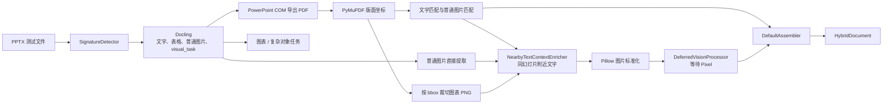
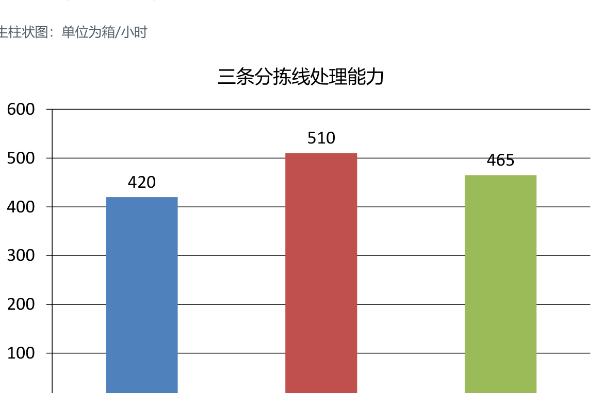

# PowerPoint 实际识别结果：北辰物流中心扩容方案

[返回总览](./输入结果总览_20260814.md)

## 结果摘要

| 项目 | 结果 |
|---|---:|
| 文字块 | 13 |
| 表格块 | 1 |
| 图片块 | 2 |
| 坐标完整 | 16/16 |
| 警告 | 0 |

## 本次测试实际方法流程

## 实际文字与表格识别结果

### 幻灯片 1

**北辰物流中心扩容方案**

多模态 RAG 测试演示｜文档编号 NEBULA-PPTX-2025-02

- 扩容代号：极光
- 计划启用：2025 年 9 月 8 日
- 新增作业区：B3 区
- 安全负责人：陈曦
- 高温预警阈值：38°C

### 幻灯片 2

**设备上线计划**

表格中的日期和责任人用于结构化检索测试。

| 阶段 | 日期 | 设备数 | 责任人 | 状态 |
|---|---|---:|---|---|
| 联调 | 2025-08-12 | 8 | 顾言 | 完成 |
| 试运行 | 2025-08-25 | 16 | 陈曦 | 进行中 |
| 正式启用 | 2025-09-08 | 24 | 许舟 | 待启动 |

### 幻灯片 3

**每小时处理能力**

原生柱状图：单位为箱/小时

三条分拣线处理能力

结论 B 线能力最高。异常联系人陈曦，分机 6027。

## 实际图片提取与渲染结果

### 幻灯片 1 普通内嵌图片

- `block_id`: `516b8d89aad9f396:000002`
- 幻灯片：1
- `bbox`: `[0.052500, 0.220000, 0.532500, 0.707611]`
- 图片状态：已直接提取并标准化；PixelRAG 视觉描述与向量待处理。

### 幻灯片 3 原生柱状图

- `block_id`: `516b8d89aad9f396:000013`
- 幻灯片：3
- `bbox`: `[0.075002, 0.100000, 0.682517, 0.806667]`
- 渲染方式：PowerPoint 导出 PDF 后按对象坐标裁切。
- 图片状态：已渲染并标准化；PixelRAG 视觉描述与向量待处理。

## 说明

原生图表最初作为 `visual_task`，最终已转换为普通图片块；结果中没有遗留视觉任务。

<!-- GENERATED_ARTIFACTS_START -->

## 完整识别结果（由最终 HybridDocument 生成）

> 以下内容按 `reading_order` 逐块打印；表格正文就是解析器实际输出的 Markdown，不是人工重写。

- 最终解析器：`docling-subprocess`
- 内容块总数：16
- 警告数：0

### 内容块 1：文字

- `block_id`：`516b8d89aad9f396:000000`
- `reading_order`：0
- 页码：1；幻灯片：1；工作表：`—`
- 单元格范围：`—`
- `bbox`：`[0.052500, 0.038950, 0.343775, 0.106889]`
- `locator`：`#/texts/0|page:1`

#### 实际文字输出

北辰物流中心扩容方案

### 内容块 2：文字

- `block_id`：`516b8d89aad9f396:000001`
- `reading_order`：1
- 页码：1；幻灯片：1；工作表：`—`
- 单元格范围：`—`
- `bbox`：`[0.056250, 0.140423, 0.410838, 0.171887]`
- `locator`：`#/texts/1|page:1`

#### 实际文字输出

多模态 RAG 测试演示｜文档编号 NEBULA-PPTX-2025-02

### 内容块 3：图片

- `block_id`：`516b8d89aad9f396:000002`
- `reading_order`：2
- 页码：1；幻灯片：1；工作表：`—`
- 单元格范围：`—`
- `bbox`：`[0.052500, 0.220000, 0.532500, 0.707611]`
- `locator`：`#/pictures/0|page:1`

- 图片上下文：多模态 RAG 测试演示｜文档编号 NEBULA-PPTX-2025-02
扩容代号：极光

- 图片文件：`C:\Users\XEE8SZH\Desktop\多模态输入\input-acceptance-20260817\02_北辰物流中心扩容方案-516b8d89aad9\images\516b8d89aad9f396-000002.png`
- SHA-256：`65fd444d34710b2e8857ce97c7c7560136d8ed6c9da466fea2c321005cb05694`
- 视觉处理：provider=`deferred`，status=`pending`，vector=无

### 内容块 4：文字

- `block_id`：`516b8d89aad9f396:000003`
- `reading_order`：3
- 页码：1；幻灯片：1；工作表：`—`
- 单元格范围：`—`
- `bbox`：`[0.566323, 0.222893, 0.719448, 0.273876]`
- `locator`：`#/texts/2|page:1`

#### 实际文字输出

扩容代号：极光

### 内容块 5：文字

- `block_id`：`516b8d89aad9f396:000004`
- `reading_order`：4
- 页码：1；幻灯片：1；工作表：`—`
- 单元格范围：`—`
- `bbox`：`[0.566323, 0.295615, 0.851229, 0.346598]`
- `locator`：`#/texts/3|page:1`

#### 实际文字输出

计划启用：2025 年 9 月 8 日

### 内容块 6：文字

- `block_id`：`516b8d89aad9f396:000005`
- `reading_order`：5
- 页码：1；幻灯片：1；工作表：`—`
- 单元格范围：`—`
- `bbox`：`[0.566323, 0.368281, 0.752604, 0.419265]`
- `locator`：`#/texts/4|page:1`

#### 实际文字输出

新增作业区：B3 区

### 内容块 7：文字

- `block_id`：`516b8d89aad9f396:000006`
- `reading_order`：6
- 页码：1；幻灯片：1；工作表：`—`
- 单元格范围：`—`
- `bbox`：`[0.566323, 0.440726, 0.741323, 0.491709]`
- `locator`：`#/texts/5|page:1`

#### 实际文字输出

安全负责人：陈曦

### 内容块 8：文字

- `block_id`：`516b8d89aad9f396:000007`
- `reading_order`：7
- 页码：1；幻灯片：1；工作表：`—`
- 单元格范围：`—`
- `bbox`：`[0.566323, 0.513346, 0.768755, 0.564387]`
- `locator`：`#/texts/6|page:1`

#### 实际文字输出

高温预警阈值：38°C

### 内容块 9：文字

- `block_id`：`516b8d89aad9f396:000008`
- `reading_order`：8
- 页码：2；幻灯片：2；工作表：`—`
- 单元格范围：`—`
- `bbox`：`[0.052500, 0.038950, 0.227275, 0.106889]`
- `locator`：`#/texts/7|page:2`

#### 实际文字输出

设备上线计划

### 内容块 10：文字

- `block_id`：`516b8d89aad9f396:000009`
- `reading_order`：9
- 页码：2；幻灯片：2；工作表：`—`
- 单元格范围：`—`
- `bbox`：`[0.056250, 0.140423, 0.312858, 0.171887]`
- `locator`：`#/texts/8|page:2`

#### 实际文字输出

表格中的日期和责任人用于结构化检索测试

### 内容块 11：表格

- `block_id`：`516b8d89aad9f396:000010`
- `reading_order`：10
- 页码：2；幻灯片：2；工作表：`—`
- 单元格范围：`—`
- `bbox`：`[0.109271, 0.223878, 0.827500, 0.652718]`
- `locator`：`#/tables/0|page:2`
- 结构来源：`document_converter`
- 合并跨度可靠性：`parser_dependent`

#### 实际表格输出

| 阶段   | 日期         |   设备数 | 责任人   | 状态   |
|------|------------|-------|-------|------|
| 联调   | 2025-08-12 |     8 | 顾言    | 完成   |
| 试运行  | 2025-08-25 |    16 | 陈曦    | 进行中  |
| 正式启用 | 2025-09-08 |    24 | 许舟    | 待启动  |

### 内容块 12：文字

- `block_id`：`516b8d89aad9f396:000011`
- `reading_order`：11
- 页码：3；幻灯片：3；工作表：`—`
- 单元格范围：`—`
- `bbox`：`[0.052500, 0.038950, 0.256400, 0.106889]`
- `locator`：`#/texts/9|page:3`

#### 实际文字输出

每小时处理能力

### 内容块 13：文字

- `block_id`：`516b8d89aad9f396:000012`
- `reading_order`：12
- 页码：3；幻灯片：3；工作表：`—`
- 单元格范围：`—`
- `bbox`：`[0.056250, 0.140423, 0.224021, 0.171887]`
- `locator`：`#/texts/10|page:3`

#### 实际文字输出

原生柱状图：单位为箱/小时

### 内容块 14：图片

- `block_id`：`516b8d89aad9f396:000013`
- `reading_order`：13
- 页码：3；幻灯片：3；工作表：`—`
- 单元格范围：`—`
- `bbox`：`[0.075002, 0.100000, 0.682517, 0.806667]`
- `locator`：`#/pictures/1`

- 图片上下文：三条分拣线处理能力

- 图片文件：`C:\Users\XEE8SZH\Desktop\多模态输入\input-acceptance-20260817\02_北辰物流中心扩容方案-516b8d89aad9\images\516b8d89aad9f396-000013.png`
- SHA-256：`0b3cb7ce4872fd5e765899a28d4141e534ea8dc5c380e06c0c9265ea39cad8b0`
- 视觉处理：provider=`deferred`，status=`pending`，vector=无

### 内容块 15：文字

- `block_id`：`516b8d89aad9f396:000014`
- `reading_order`：14
- 页码：3；幻灯片：3；工作表：`—`
- 单元格范围：`—`
- `bbox`：`[0.081775, 0.242996, 0.875587, 0.469482]`
- `locator`：`#/texts/12|page:3`

#### 实际文字输出

结论 B 线能力最高。  异常联系人 陈曦，分机 6027

### 内容块 16：文字

- `block_id`：`516b8d89aad9f396:000015`
- `reading_order`：15
- 页码：3；幻灯片：—；工作表：`—`
- 单元格范围：`—`
- `bbox`：`[0.294427, 0.213807, 0.463177, 0.257507]`
- `locator`：`#/texts/11|page:3`

#### 实际文字输出

三条分拣线处理能力

<!-- GENERATED_ARTIFACTS_END -->
