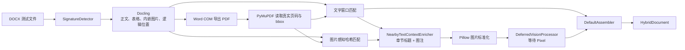
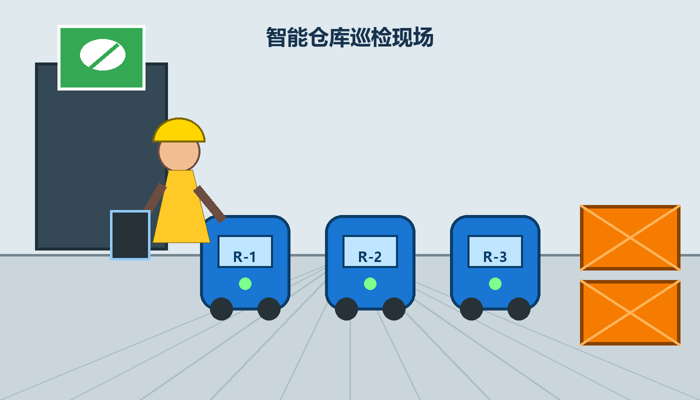
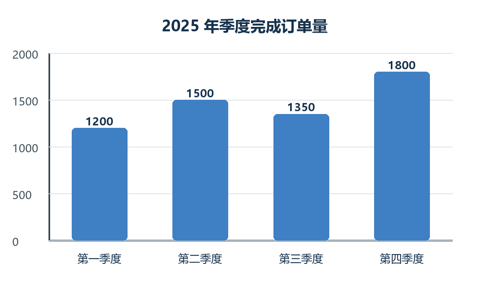

# Word 实际识别结果：星云智能仓库运营报告

[返回总览](./输入结果总览_20260814.md)

## 结果摘要

| 项目 | 结果 |
|---|---:|
| 文字块 | 13 |
| 表格块 | 1 |
| 图片块 | 2 |
| 坐标完整 | 16/16 |
| 警告 | 0 |

## 本次测试实际方法流程

## 实际文字识别结果

### 第 1 页

**星云智能仓库 2025 年运营报告**

文档编号：NEBULA-DOCX-2025-01｜版本：1.0

#### 1. 项目概况

“苍穹”试点位于苏州昆山，于 2025 年 3 月 18 日正式上线。项目负责人是林澈，年度目标是将单位订单能耗降低 12%，并把关键设备综合可用率维持在 98% 以上。

#### 2. 巡检现场

图 1 智能仓库巡检现场（答案需基于图像对象识别）

现场图用于验证模型是否能从图片中识别对象数量、颜色、人员动作及标志，而不是只读取附近正文。

#### 3. 关键设备清单

| 设备编号 | 设备类型 | 数量（台） | 可用率 | 负责人 |
|---|---|---:|---:|---|
| R-01 | 搬运机器人 | 12 | 99.2% | 林澈 |
| V-02 | 视觉检测站 | 4 | 98.5% | 周宁 |
| C-03 | 充电桩 | 6 | 97.8% | 韩梅 |

### 第 3 页

#### 4. 季度订单趋势

图 2 2025 年季度完成订单量（单）

图表显示全年合计 5,850 单；第四季度达到峰值。复盘会决定将第四季度的排班策略用于下一年度。

#### 5. 结论

试点进入稳定运行阶段。下一次正式复盘日期为 2026 年 1 月 12 日，会议室为海棠厅。

## 实际图片提取结果

### 巡检现场图片

- `block_id`: `1756628c427a6bab:000005`
- 页码：1
- `bbox`: `[0.147059, 0.349457, 0.946993, 0.702677]`
- 图片状态：已提取并标准化；PixelRAG 视觉描述与向量待处理。

### 季度订单趋势图

- `block_id`: `1756628c427a6bab:000011`
- 页码：3
- `bbox`: `[0.147059, 0.093965, 0.958824, 0.459874]`
- 图片状态：已提取并标准化；PixelRAG 视觉描述与向量待处理。

## 说明

以上内容来自最终 `HybridDocument`，按 `reading_order` 展示。Word 的文字、表格和图片均已与 Office 渲染页面完成坐标对齐。

<!-- GENERATED_ARTIFACTS_START -->

## 完整识别结果（由最终 HybridDocument 生成）

> 以下内容按 `reading_order` 逐块打印；表格正文就是解析器实际输出的 Markdown，不是人工重写。

- 最终解析器：`docling-subprocess`
- 内容块总数：16
- 警告数：0

### 内容块 1：文字

- `block_id`：`1756628c427a6bab:000000`
- `reading_order`：0
- 页码：1；幻灯片：—；工作表：`—`
- 单元格范围：`—`
- `bbox`：`[0.210229, 0.065517, 0.799583, 0.108621]`
- `bbox_original`：`[128.660004, 51.889683, 489.345032, 86.028122]`
- `locator`：`#/texts/0|page:1`

#### 实际文字输出

星云智能仓库 2025 年运营报告

### 内容块 2：文字

- `block_id`：`1756628c427a6bab:000001`
- `reading_order`：1
- 页码：1；幻灯片：—；工作表：`—`
- 单元格范围：`—`
- `bbox`：`[0.310621, 0.143191, 0.694634, 0.160671]`
- `bbox_original`：`[190.100006, 113.407539, 425.115753, 127.251694]`
- `locator`：`#/texts/1|page:1`

#### 实际文字输出

文档编号：NEBULA-DOCX-2025-01｜版本：1.0

### 内容块 3：文字

- `block_id`：`1756628c427a6bab:000002`
- `reading_order`：2
- 页码：1；幻灯片：—；工作表：`—`
- 单元格范围：`—`
- `bbox`：`[0.147098, 0.200664, 0.266982, 0.223904]`
- `bbox_original`：`[90.024002, 158.925705, 163.393036, 177.332153]`
- `locator`：`#/texts/2|page:1`

#### 实际文字输出

1. 项目概况

### 内容块 4：文字

- `block_id`：`1756628c427a6bab:000003`
- `reading_order`：3
- 页码：1；幻灯片：—；工作表：`—`
- 单元格范围：`—`
- `bbox`：`[0.147098, 0.234555, 0.848987, 0.278247]`
- `bbox_original`：`[90.024002, 185.767517, 519.580017, 199.611679]`
- `locator`：`#/texts/3|page:1`

#### 实际文字输出

“苍穹”试点位于苏州昆山，于 2025 年 3 月 18 日正式上线。项目负责人是林澈，年度目标是将单位订单能耗降低 12%，并把关键设备综合可用率维持在 98% 以上。

### 内容块 5：文字

- `block_id`：`1756628c427a6bab:000004`
- `reading_order`：4
- 页码：1；幻灯片：—；工作表：`—`
- 单元格范围：`—`
- `bbox`：`[0.147098, 0.318277, 0.266786, 0.341518]`
- `bbox_original`：`[90.024002, 252.075668, 163.273041, 270.482117]`
- `locator`：`#/texts/4|page:1`

#### 实际文字输出

2. 巡检现场

### 内容块 6：图片

- `block_id`：`1756628c427a6bab:000005`
- `reading_order`：5
- 页码：1；幻灯片：—；工作表：`—`
- 单元格范围：`—`
- `bbox`：`[0.147059, 0.349457, 0.946993, 0.702677]`
- `bbox_original`：`[90.000000, 276.770020, 579.559998, 556.520020]`
- `locator`：`#/pictures/0|page:1`

- 图片上下文：2. 巡检现场
图 1 智能仓库巡检现场（答案需基于图像对象识别）

- 图片文件：`C:\Users\XEE8SZH\Desktop\多模态输入\input-acceptance-20260817\01_星云智能仓库运营报告-1756628c427a\images\1756628c427a6bab-000005.png`
- SHA-256：`65fd444d34710b2e8857ce97c7c7560136d8ed6c9da466fea2c321005cb05694`
- 视觉处理：provider=`deferred`，status=`pending`，vector=无

### 内容块 7：文字

- `block_id`：`1756628c427a6bab:000006`
- `reading_order`：6
- 页码：1；幻灯片：—；工作表：`—`
- 单元格范围：`—`
- `bbox`：`[0.298464, 0.721436, 0.706594, 0.738916]`
- `bbox_original`：`[182.660004, 571.377502, 432.435760, 585.221680]`
- `locator`：`#/texts/5|page:1`

#### 实际文字输出

图 1  智能仓库巡检现场（答案需基于图像对象识别）

### 内容块 8：文字

- `block_id`：`1756628c427a6bab:000007`
- `reading_order`：7
- 页码：1；幻灯片：—；工作表：`—`
- 单元格范围：`—`
- `bbox`：`[0.147098, 0.760110, 0.851144, 0.800621]`
- `bbox_original`：`[90.024002, 602.007507, 520.900024, 615.851685]`
- `locator`：`#/texts/6|page:1`

#### 实际文字输出

现场图用于验证模型是否能从图片中识别对象数量、颜色、人员动作及标志，而不是只读取附近正文。

### 内容块 9：文字

- `block_id`：`1756628c427a6bab:000008`
- `reading_order`：8
- 页码：1；幻灯片：—；工作表：`—`
- 单元格范围：`—`
- `bbox`：`[0.147098, 0.837431, 0.312668, 0.860672]`
- `bbox_original`：`[90.024002, 663.245667, 191.353027, 681.652100]`
- `locator`：`#/texts/7|page:1`

#### 实际文字输出

3. 关键设备清单

### 内容块 10：表格

- `block_id`：`1756628c427a6bab:000009`
- `reading_order`：9
- 页码：1；幻灯片：—；工作表：`—`
- 单元格范围：`—`
- `bbox`：`[0.147098, 0.869196, 0.768639, 0.936828]`
- `bbox_original`：`[90.024002, 688.403503, 470.406891, 704.887695]`
- `locator`：`#/tables/0|page:1`
- 结构来源：`document_converter`
- 合并跨度可靠性：`parser_dependent`

#### 实际表格输出

| 设备编号   | 设备类型   |   数量（台） | 可用率   | 负责人   |
|--------|--------|---------|-------|-------|
| R-01   | 搬运机器人  |      12 | 99.2% | 林澈    |
| V-02   | 视觉检测站  |       4 | 98.5% | 周宁    |
| C-03   | 充电桩    |       6 | 97.8% | 韩梅    |

### 内容块 11：文字

- `block_id`：`1756628c427a6bab:000010`
- `reading_order`：10
- 页码：3；幻灯片：—；工作表：`—`
- 单元格范围：`—`
- `bbox`：`[0.147098, 0.062608, 0.312668, 0.085849]`
- `bbox_original`：`[90.024002, 49.585682, 191.353027, 67.992119]`
- `locator`：`#/texts/9|page:3`

#### 实际文字输出

4. 季度订单趋势

### 内容块 12：图片

- `block_id`：`1756628c427a6bab:000011`
- `reading_order`：11
- 页码：3；幻灯片：—；工作表：`—`
- 单元格范围：`—`
- `bbox`：`[0.147059, 0.093965, 0.958824, 0.459874]`
- `bbox_original`：`[90.000000, 74.420044, 586.799988, 364.220001]`
- `locator`：`#/pictures/1|page:3`

- 图片上下文：4. 季度订单趋势
图 2 2025 年季度完成订单量（单）

- 图片文件：`C:\Users\XEE8SZH\Desktop\多模态输入\input-acceptance-20260817\01_星云智能仓库运营报告-1756628c427a\images\1756628c427a6bab-000011.png`
- SHA-256：`c4be61b8312422c0faeabc277e04c5f3c69215e1f28ade4fa705a8fdb65310b5`
- 视觉处理：provider=`deferred`，status=`pending`，vector=无

### 内容块 13：文字

- `block_id`：`1756628c427a6bab:000012`
- `reading_order`：12
- 页码：3；幻灯片：—；工作表：`—`
- 单元格范围：`—`
- `bbox`：`[0.361650, 0.478532, 0.643457, 0.496012]`
- `bbox_original`：`[221.330002, 378.997528, 393.795776, 392.841705]`
- `locator`：`#/texts/10|page:3`

#### 实际文字输出

图 2  2025 年季度完成订单量（单）

### 内容块 14：文字

- `block_id`：`1756628c427a6bab:000013`
- `reading_order`：13
- 页码：3；幻灯片：—；工作表：`—`
- 单元格范围：`—`
- `bbox`：`[0.147098, 0.517320, 0.837021, 0.557856]`
- `bbox_original`：`[90.024002, 409.717529, 512.256897, 423.561707]`
- `locator`：`#/texts/11|page:3`

#### 实际文字输出

图表显示全年合计 5,850 单；第四季度达到峰值。复盘会决定将第四季度的排班策略用于下一年度。

### 内容块 15：文字

- `block_id`：`1756628c427a6bab:000014`
- `reading_order`：14
- 页码：3；幻灯片：—；工作表：`—`
- 单元格范围：`—`
- `bbox`：`[0.147098, 0.594515, 0.220904, 0.617755]`
- `bbox_original`：`[90.024002, 470.855682, 135.193039, 489.262115]`
- `locator`：`#/texts/12|page:3`

#### 实际文字输出

5. 结论

### 内容块 16：文字

- `block_id`：`1756628c427a6bab:000015`
- `reading_order`：15
- 页码：3；幻灯片：—；工作表：`—`
- 单元格范围：`—`
- `bbox`：`[0.147098, 0.628406, 0.819781, 0.645886]`
- `bbox_original`：`[90.024002, 497.697510, 501.705750, 511.541687]`
- `locator`：`#/texts/13|page:3`

#### 实际文字输出

试点进入稳定运行阶段。下一次正式复盘日期为 2026 年 1 月 12 日，会议室为海棠厅。

<!-- GENERATED_ARTIFACTS_END -->
