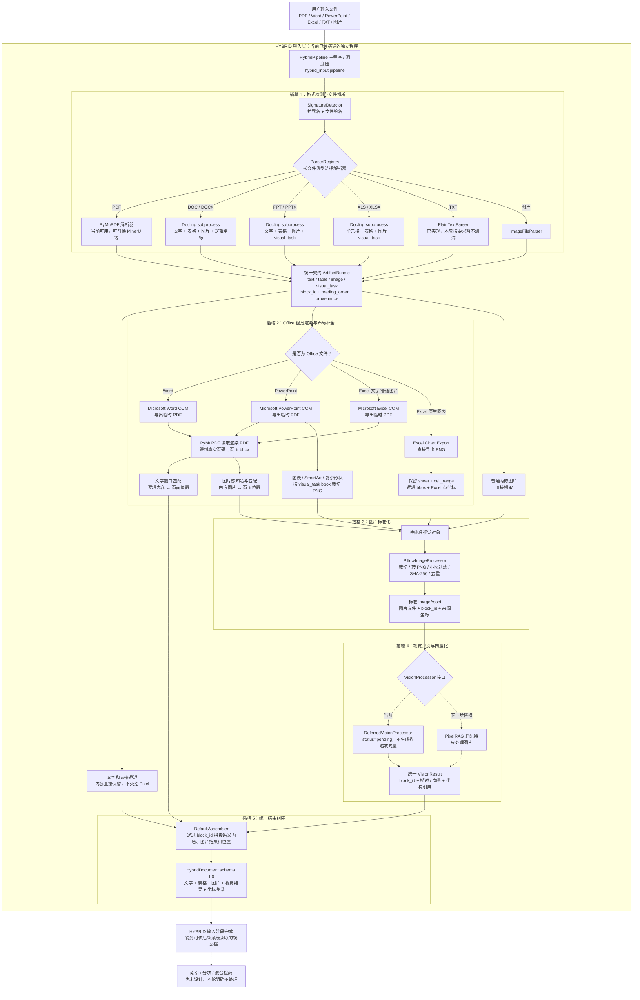

# 多模态 Office 输入结果总览（2026-08-14）

本文记录 2026-08-14 完成的 Word、PowerPoint、Excel 混合输入流程与真实文件验证结果。
本轮目标是验证文件解析、视觉对象提取、图片标准化、坐标保留和统一组装是否可用，
不是基于 ground truth 的识别准确率评分。TXT 按当前决定暂不处理；PixelRAG 向量化与索引留待后续接入。

## 当前输入流程

各模块只通过版本化 JSON 契约和图片文件交换数据。解析器、Office 渲染器、图片处理器、
视觉模型和组装器均可单独调用或替换，不要求修改其他步骤。

## 总体验证结果

| 文件 | 实际识别结果 | 类型 | 内容块 | 文字块 | 表格块 | 图片块 | 坐标完整 | 遗留视觉任务 | 警告 |
|---|---|---|---:|---:|---:|---:|---:|---:|---:|
| 01_星云智能仓库运营报告.docx | [查看](./Word识别结果_20260814.md) | Word | 16 | 13 | 1 | 2 | 16/16 | 0 | 0 |
| 02_北辰物流中心扩容方案.pptx | [查看](./PowerPoint识别结果_20260814.md) | PowerPoint | 16 | 13 | 1 | 2 | 16/16 | 0 | 0 |
| 03_云帆仓配中心能效台账.xlsx | [查看](./Excel识别结果_20260814.md) | Excel | 9 | 1 | 6 | 2 | 9/9 | 0 | 0 |
| CTCC_2026-2027_Bosch_Partner_Benefits_EN_and_CN.xlsx | [查看](./CTCC_Bosch_Partner_Benefits识别结果_20260814.md) | Excel（用户称PDF，实际为XLSX） | 6 | 2 | 4 | 0 | 6/6 | 0 | 0 |
| **合计** |  |  | **47** | **29** | **12** | **6** | **47/47** | **0** | **0** |

全部 6 张图片已形成视觉处理任务，但视觉处理器当前为 `deferred`：只记录 `pending` 和图片路径，
尚未调用 PixelRAG，也没有生成向量或建立检索索引。

## 逐文件结果

### Word：01_星云智能仓库运营报告.docx

- Docling 直接提取正文、表格和 2 张内嵌图片。
- Word COM 导出临时 PDF，用于将逻辑位置对齐到真实页码与页面坐标。
- 16 个内容块全部获得页码和归一化 bbox。
- 两张图片与 PDF 页面内图片的感知哈希距离均为 0，版面匹配成功。
- 最终无警告、无未处理视觉任务。

### PowerPoint：02_北辰物流中心扩容方案.pptx

- Docling 直接提取 13 个文字块、1 个表格和普通内嵌图片。
- PowerPoint 原生图表先作为 `visual_task`，再由 Office 渲染结果裁切为图片。
- 修正了 PowerPoint COM 的 `Close()` 调用兼容问题。
- 对图表内部标题增加全局文字匹配回退，避免幻灯片内部读取顺序不同导致坐标错配。
- 16 个内容块全部获得坐标；原生图表已转成图片，最终无警告。

### Excel：03_云帆仓配中心能效台账.xlsx

- 直接提取 6 个表格、1 段文字和 1 张普通内嵌图片。
- Excel 打印 PDF 的坐标与工作表对象坐标不同，按 PDF bbox 裁切原生图表会得到白图。
- 修正后由独立 Excel COM 渲染器调用 `Chart.Export` 直接导出图表 PNG。
- 图表保留工作表 `月度能耗`、单元格范围 `G2:O17`、逻辑 bbox 和 Excel 点坐标。
- 图表“月度单位能耗趋势”已人工查看，内容正常，不再是白图。
- 9 个内容块全部获得坐标；最终无警告、无未处理视觉任务。

### Excel：CTCC_2026-2027_Bosch_Partner_Benefits_EN_and_CN.xlsx

- 用户称上传对象为PDF，但桌面程序实际保存和检测到的文件类型为XLSX。
- 文件包含中文 `合作伙伴权益` 和英文 `Partnership Rights and Benefits` 两个工作表。
- 实际提取2个标题文字块和4个表格块，覆盖32项中英文合作伙伴权益、总价、优惠价及页尾备注。
- 6个内容块全部保留工作表、页码和归一化bbox，最终无警告。
- 文件没有内嵌图片或原生图表，因此没有生成视觉任务。
- [查看完整中英文实际识别内容](./CTCC_Bosch_Partner_Benefits识别结果_20260814.md)。

## 坐标说明

`bbox` 使用 `[left, top, right, bottom]`，坐标原点位于左上角，并归一化到 0～1。
例如 `[0.10, 0.20, 0.60, 0.50]` 表示对象从页面宽度 10%、高度 20% 的位置开始，
延伸到页面宽度 60%、高度 50% 的位置。

`bbox_original` 保留来源工具的原始坐标；Office 文件还可通过 `page`、`slide`、`sheet`、
`cell_range`、`locator` 和 `layout_segments` 追溯到原文位置。Excel 图表另外保留 `excel_bounds_points`。

## 已完成模块

| 插槽 | 当前实现 | 状态 |
|---|---|---|
| 格式检测 | 扩展名与文件签名检测 | 已完成 |
| 文件解析 | TXT/图片/PyMuPDF/Docling subprocess 解析器注册表 | Office 已验证；TXT 暂不测试 |
| 视觉对象渲染 | Microsoft Office PDF 渲染、Excel 图表直接导出 | 已验证 |
| 布局补全 | 文字窗口匹配、图片感知哈希匹配、bbox 对齐 | 已验证 |
| 图片处理 | Pillow 转 PNG、尺寸过滤、SHA-256、去重 | 已验证 |
| 视觉处理 | `DeferredVisionProcessor` | 接口已完成，PixelRAG 未接入 |
| 结果组装 | `HybridDocument` schema 1.0 | 已完成 |
| 索引与检索 | 尚未开始 | 后续处理 |

## 必要测试

自动化烟雾测试共 4 项，全部通过：

1. 数据契约往返与文件签名验证。
2. 图片输入标准化及延迟视觉处理。
3. 逻辑位置与物理页面坐标同时保留。
4. 文本输入生成版本化 `HybridDocument`。

此外，四份 Office 文件均完成真实端到端验证。测试文件、生成图片、PDF 中间文件、模型缓存、
Conda/虚拟环境和应用运行数据不属于源码发布范围，不应上传到 GitHub。

## 下一步

1. 将标准 `ImageAsset` 接入 PixelRAG，返回统一 `VisionResult`。
2. 决定图片描述、视觉向量或两者同时使用的策略。
3. 通过 `block_id`、图片坐标和附近文字完成最终内容拼接。
4. 在输入链路稳定后，再设计分块、向量索引和混合检索。
