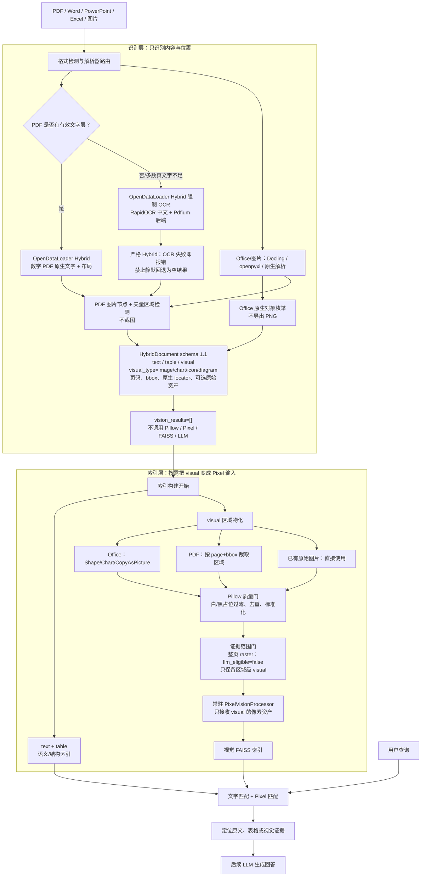

# 多模态输入结果总览（更新至 2026-08-25）

本页只保留一张当前有效流程图。识别层与索引层已经解耦：识别层只输出 `text / table / visual`，Pixel 只在索引阶段接收被物化的视觉区域。

## 当前最新输入流程

识别层的 `visual` 只是“这里存在一个视觉对象”的结构化事实，不要求当场生成图片。表格继续保留行列结构；后续查询某年利润时，检索层先定位表格证据，再交给 LLM。Word、PowerPoint、Excel 和 PDF 遵循同一契约。

## 实现边界与迁移记录（2026-08-18）

旧的“识别时导出 Office 图片并立即调用 Pixel”流程已经删除。Office 识别现在只枚举对象类型、顺序、页/幻灯片/工作表、边界和原生 locator；`CopyAsPicture`、`Shape.Export`、`Chart.Export` 仅在索引阶段执行。

实现边界：

- 不再针对 SVG、SmartArt、图表、图标等内部格式逐一编写 Pixel 适配逻辑；只要 Office 能显示，就优先导出可见对象图片。
- 不截图整页送入 Pixel。程序先枚举视觉对象，再只导出或裁剪该对象区域，因此普通正文和表格不会进入 Pixel。
- Word 使用对象截图；PowerPoint 使用 `Shape.Export`；Excel 使用 `Chart.Export` 或 `Shape.CopyPicture`。
- 原生导出失败不会中断文档：程序自动回退到页面渲染区域裁剪。
- 带 Alpha 的 Office 截图先合成白底，避免透明背景在 RGB 转换后变成黑底并遮没黑色线框图标。
- 纯白、纯黑、尺寸异常和重复图片在 Pixel 前被拦截；对象替代文字仍可进入语义索引。

### 本次识别/索引边界验收（2026-08-18）

| 验收项 | 当前结果 |
|---|---|
| 统一识别契约 | schema 1.1；`text / table / visual` |
| visual 子类型 | `image / chart / icon / diagram / background` |
| Office 识别 | 只枚举对象与位置，不导出图片 |
| PDF 识别 | OpenDataLoader Hybrid + 矢量区域识别，不为区域截图 |
| 整页背景 | 标记 `indexable=false`，不进入 Pixel |
| 识别阶段 Pixel 结果 | `vision_results=[]` |
| 索引阶段 | 视觉区域物化 → Pillow 质量门 → 常驻 Pixel → FAISS |
| 自动化测试 | 95/95 PASS |
| 真实 PDF | 即使指定 `--vision-processor pixelrag`，识别阶段也未加载模型，PASS |

当前 `测试pdf.pdf` 的矢量区域验证无需截图即识别出 6 个 visual：第 1 页图标、第 3 页电池图标与示意图、第 4 页折线图与飞机图标、第 5 页图标。其中折线图为 `visual_type=chart`，区域为第 4 页 `[72.0, 371.6, 504.0, 623.6]`；这些区域到索引阶段才会被裁为 Pixel 输入。

Word 后台 COM 原生导出可能返回空路径或因 Windows 登录会话不可用而直接失败。索引物化器现会捕获两种情况，复用识别阶段的版面 PDF，严格按已识别对象的 page+bbox 裁取后备区域。当前 `测试word.docx` 实测 11 个 visual 全部通过质量门并形成 11 个有效 Pixel 输入（包括第 4 页折线图/飞机所在区域），不再产生“识别到 visual 但视觉索引为 0”的情况。

### 扫描 PDF OCR 与整页证据修复（2026-08-25）

- 程序会先检查 PDF 的可选择文字层；数字 PDF 走原生文字与布局，扫描 PDF 自动切到 OpenDataLoader Hybrid `force-ocr`。
- 扫描件使用 Hybrid 支持的 RapidOCR 中文模型；模型与 Hugging Face 缓存统一写入 `PixelRAG-Studio-Data/models`，同一 Studio 进程复用常驻服务。
- Windows 中文路径下，Hybrid 服务使用 Docling 的 Pdfium 后端，避开 `docling-parse` 原生资源路径问题；同时关闭 `torch.compile`，不要求安装 Visual C++ 编译器。
- 扫描 OCR 使用严格模式：Hybrid/OCR 失败直接中止该文档构建，不再静默回退成“只有整页图片、没有文字”的假成功结果。
- 整页 raster 被标记为页级粗粒度内容，`llm_eligible=false`；存在 OCR 文字/表格时直接作为 `background` 且 `indexable=false`。旧索引中的近整页 PDF visual 也会在检索阶段被兼容过滤。

真实 `打印机pdf.pdf`（6 页、原生可选择文字为 0）验证结果：解析器为 `opendataloader-pdf`，警告 0，输出 89 个 text、1 个 table、28 个区域级 visual。“墨盒检修区域”在第 2 页结构表和第 3 页标题/操作步骤中均被识别；本轮没有整页 visual 进入证据集合。

### 最近输入文件详细结果（2026-08-20 更新）

| 文件 | 详细报告 | 识别结果 | 索引结果 | 警告 |
|---|---|---|---|---:|
| `测试word.docx` | [测试 Word](./测试Word识别结果_20260820.md) | 1 个表格、11 个 visual | 11/11 个 2048 维 Pixel 向量 | 0 |
| `测试pdf.pdf` | [测试 PDF](./测试PDF识别结果_20260820.md) | 2 个文字块、1 个表格、14 个 visual | 本轮仅保留识别结果；9 个 visual 可进入索引 | 0 |

`测试pdf.pdf` 的原始文件当前不在 Studio `source` 目录，但完整解析 JSON 与图片缓存仍在，因此本次报告无需重新上传即可恢复；若以后需要重新运行解析，再重新上传源文件即可。

## Studio 接入状态

Studio 构建 worker 现在按上方唯一流程执行：先得到无 Pixel 结果的识别文档，再在索引阶段物化 `visual`、调用常驻 Pixel，并分别写入语义索引和视觉 FAISS。

当前关键边界：

- 原始 Office 文件不会在流程起点整体转成 PDF 后送入 Pixel。
- Office 临时 PDF 仅用于识别层的页码与 bbox 对齐，不在识别层裁切视觉图片。
- `kind=text` 和 `kind=table` 直接进入语义与结构化索引，进入 Pixel 的数量必须为 0。
- 只有索引阶段从 `kind=visual` 物化并通过质量门的像素资产会进入 `PixelRAGVisionProcessor`。
- Studio 最终对文字/表格索引和图片向量索引进行混合召回，而不是把整份文档当作页面图片建立单一路径索引。

Studio 的索引产物仍为 `semantic-index.json`、`image-index.faiss`、`image-metadata.json` 和 `hybrid-index.json`；索引清单中的 `pixel_input_kinds` 已更新为 `["visual"]`。

所有解析器、渲染器、图片处理器、视觉处理器和组装器只通过统一接口与 JSON 契约连接，可以独立替换。

## 历史识别基线（迁移前，保留数据对照）

| 文件 | 单独报告 | 默认解析器 | 内容块 | 文字 | 表格 | 图片 | 坐标完整 | visual_task | 警告 |
|---|---|---|---:|---:|---:|---:|---:|---:|---:|
| 01_星云智能仓库运营报告.docx | [Word](./Word识别结果_20260814.md) | Docling | 16 | 13 | 1 | 2 | 16/16 | 0 | 0 |
| 02_北辰物流中心扩容方案.pptx | [PowerPoint](./PowerPoint识别结果_20260814.md) | Docling | 16 | 13 | 1 | 2 | 16/16 | 0 | 0 |
| 03_云帆仓配中心能效台账.xlsx | [Excel](./Excel识别结果_20260814.md) | openpyxl | 8 | 3 | 3 | 2 | 8/8 | 0 | 0 |
| CTCC_2026-2027_Bosch_Partner_Benefits_EN_and_CN.xlsx | [CTCC Excel](./CTCC_Bosch_Partner_Benefits识别结果_20260814.md) | openpyxl | 6 | 4 | 2 | 0 | 6/6 | 0 | 0 |
| 2026-2027赛季CTCC中国汽车场地职业联赛 合作伙伴权益 - 博世 - 0812.pdf | [CTCC PDF](./CTCC_PDF识别结果_20260817.md) | OpenDataLoader PDF | 6 | 5 | 1 | 0 | 6/6 | 0 | 0 |
| 05_天枢冷链中心多模态运营分析报告.pdf | [PDF](./PDF识别结果_20260817.md) | OpenDataLoader PDF | 50 | 35 | 7 | 8 | 50/50 | 0 | 0 |
| **合计** |  |  | **102** | **73** | **15** | **14** | **102/102** | **0** | **0** |

下表是 schema 1.0 时期的统计，仅作为历史数据对照；当前 schema 1.1 将“图片”和 `visual_task` 统一为 `visual`，识别阶段不再生成视觉向量。

## PixelRAG 图片向量化验收

完整报告：[PixelRAG 混合文档输入验收](../pixelrag-mixed-acceptance-20260817/pixelrag-acceptance-report.md)

| 验收项 | 结果 |
|---|---:|
| 真实混合文档 | Word、PowerPoint、Excel、PDF 共 4 份 |
| 图片块 | 14 |
| 成功生成 PixelRAG 向量 | 14/14 |
| 向量维度 | 2048 |
| 文字块 | 64，进入 PixelRAG 0 |
| 表格块 | 12，进入 PixelRAG 0 |
| 非图片误入 | 0 |
| CPU 批量推理 | 6 分 22 秒，平均约 27.3 秒/图 |
| 总体结论 | **PASS** |

另使用两张真实图片验证模型常驻：第一次调用包含模型初始化共 116.71 秒，第二次复用同一模型为
27.59 秒；两次调用后的 `model_load_count` 均为 1，证明同一个长期运行的 `HybridPipeline`
连续处理多份文档时不会重复加载约 4GB 权重。处理结束后可调用 `close()` 主动释放模型内存。

## 关键修正记录

### PDF

- 默认解析器由 PyMuPDF 升级为 OpenDataLoader PDF。
- 可以识别标题层级、段落、列表、表格、图片和阅读顺序。
- 数字 PDF 的 OpenDataLoader 失败时可回退 PyMuPDF；扫描 PDF 的 OCR 失败时严格报错，禁止产生空文字索引。
- 扫描 PDF 自动使用 OpenDataLoader Hybrid 强制 OCR、RapidOCR 中文与 Pdfium 后端。
- 整页 raster 不作为最终检索或 LLM 证据；只允许区域级 visual 进入标准视觉召回。
- 本机复用 PDFsam 自带 Java 11，不新增下载。
- 新增CTCC单页复杂表格验证：恢复为1个36行×8列表格，另保留5个页尾文字块，6/6坐标完整且无警告。
- 表格结构标记为 structure_origin=visual_inference、span_reliability=inferred，避免下游把PDF视觉推断当成源文件级精确结构。

### XLSX

- 默认解析器由 Docling 改为 openpyxl；`.xls` 暂时仍使用 Docling。
- 原生读取单元格、公式、工作表、合并范围和对象锚点。
- 合并内容只保存一次，通过 `merged_range`、`row_span`、`column_span` 表示。
- 普通图片直接提取；Excel 原生图表继续通过 `Chart.Export` 导出。
- openpyxl 失败时自动回退 Docling。
- openpyxl表格标记为 structure_origin=native、span_reliability=exact。

### Word 与 PowerPoint

- Docling 负责语义内容。
- Microsoft Office COM 和 PyMuPDF 负责真实页面坐标补全。
- PPT 图表、SmartArt 和复杂形状可转为独立视觉图片。
- Docling表格标记为 structure_origin=document_converter、span_reliability=parser_dependent。

### 图片上下文

- 新增独立 ContextEnricher 接口，默认实现为 NearbyTextContextEnricher。
- 解析器已有图片标题时原样保留；没有标题时，关联同页、同幻灯片或同工作表中前后的文字/表格块。
- 上下文补全与解析器、图片处理器、Pixel视觉处理器完全分离，可单独替换或关闭。

### PixelRAG 视觉处理

- 新增可替换的 `PixelRAGVisionProcessor`，实现 `VisionProcessor` 统一接口。
- 逻辑上只接收 `kind=visual`；索引物化器生成的临时 `kind=image` 仅是 Pixel 调用载体，文字和表格不会进入 PixelRAG。
- 直接生成 2048 维归一化视觉向量，并按 `block_id` 写入 `HybridDocument.vision_results`。
- 新增 `PixelRAGEmbeddingSession`：首次图片请求时懒加载模型，后续文档复用同一模型。
- 支持 `auto`、`cpu`、`mps`、`cuda` 设备选择以及本地模型自动发现。

## 坐标说明

`bbox` 采用 `[left, top, right, bottom]`，原点位于左上角，并归一化至 0～1。

- PDF：同时保留页码、归一化 bbox、原始点坐标和结构层级。
- Word/PPT：保留逻辑位置，并通过 Office 渲染 PDF 对齐真实页码和 bbox。
- Excel：保留 `sheet`、`cell_range`、逻辑 bbox；图表另保留 `excel_bounds_points`。
- 合并单元格：保留主单元格、合并范围及行列跨度。

## 已完成模块

| 插槽 | 当前实现 | 状态 |
|---|---|---|
| 格式检测 | 扩展名和文件签名 | 已完成 |
| PDF 结构解析 | 数字 PDF：OpenDataLoader + PyMuPDF 回退；扫描 PDF：Hybrid 强制 OCR 严格模式 | 已验证 |
| Word/PPT/XLS 解析 | Docling subprocess | 已验证 |
| XLSX 原生解析 | openpyxl + Docling 回退 | 已验证 |
| Office 视觉识别 | Word/PPT/Excel COM 元数据枚举，不导图 | 已验证 |
| 坐标补全 | 文字窗口匹配、bbox 对齐 | 已验证 |
| 索引期视觉物化 | Office 原生导出 / PDF bbox 裁取 | 已完成 |
| 索引期图片质量门 | Pillow、SHA-256、去重 | 已验证 |
| 图片上下文 | NearbyTextContextEnricher | Word/PPT/Excel/PDF 实际验收通过 |
| 视觉处理 | DeferredVisionProcessor / PixelRAGVisionProcessor | 真实模型与图片专用分流验收通过 |
| 结果组装 | HybridDocument schema 1.1（text/table/visual） | 已完成 |
| 索引与检索 | 文字/表格结构化索引 + 图片 FAISS + Studio 混合召回 | 已接入；真实索引构建通过，真实查询待扩展验收 |

## 必要测试

当前全套自动化测试共 95 项，全部通过。下列 25 项为早期输入层核心清单；本次另新增扫描/数字 PDF 路由、RapidOCR 启动参数、扫描 OCR 失败禁止回退、近整页 visual 分类和检索证据过滤测试：

1. 数据契约往返与文件签名验证。
2. 图片输入只生成 visual 识别产物，vision_results 为空。
3. 逻辑位置和物理页面坐标同时保留。
4. 结构化 PDF 失败时自动回退 PyMuPDF。
5. 默认路由使用 OpenDataLoader PDF 和 openpyxl XLSX。
6. 文本输入生成版本化 HybridDocument。
7. 图片上下文关联及原生标题保留。
8. Excel 工作表级上下文优先级。
9. OpenDataLoader 表格空列保持。
10. PixelRAG 只处理实际存在的图片资产。
11. Pipeline 可替换选择 PixelRAG 处理器。
12. 同一 PixelRAG 常驻会话跨调用复用，模型只加载一次。
13. 文字/表格块与 visual FAISS 的索引隔离。
14. 非 visual VisionResult 进入 Pixel 索引时强制失败，并验证语义、视觉混合召回。
15. Word 原生对象截图优先于空白 PDF 区域裁剪。
16. Word 视觉对象没有自身文字时不会错误借用相邻对象文字。
17. Word SmartArt 文字从通用 diagram XML 提取。
18. 纯白与纯黑占位图在 Pixel 前过滤，同时保留有效纯色图片。
19. 透明背景黑色线框图标正确合成白底。
20. PowerPoint 原生 Shape 导出结果进入图片通道。
21. Excel 原生图表/图片/SmartArt/组合对象导出结果进入图片通道。
22. PDF 矢量图表和图标只生成 visual 区域及类型，识别阶段不栅格化。
23. PDF visual 在识别结果中没有图片时，只在索引阶段按 bbox 物化，原识别契约仍保持 `kind=visual`。
24. 索引期单个临时视觉资产暂时缺失或不可读时会重试并安全过滤，不再中断整份文档。
25. Office 原生视觉导出为空或失败时，索引阶段按已识别 page+bbox 使用版面 PDF 区域后备。

真实文件输入端到端测试共 6 份，全部完成；另完成 4 份混合文档、14 张图片的真实 PixelRAG
向量化验收，所有图片均生成向量，文字与表格误入数为 0。

## 下一步

1. 扩展多文档真实查询集，评估文字/表格与图片混合排序质量。
2. 根据真实查询结果调整两类通道的归一化和融合权重。
3. 如需人类可读的图片说明，另接视觉理解/描述模型；PixelRAG 本身负责检索向量。
