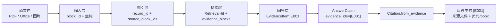

# 引用层数据契约与输出

## EvidenceItem

```json
{
  "evidence_id": "E001",
  "record_id": "sales-table",
  "document_id": "annual-report",
  "modality": "table",
  "role": "core",
  "content": {"markdown": "| 指标 | 2025实际 | 年度目标 | ..."},
  "context": "2025年度经营指标完成情况",
  "provenance": {"page": 3, "bbox": [0.1, 0.2, 0.9, 0.6]},
  "source_path": "年度报告.pdf",
  "document_type": "pdf",
  "source_block_ids": ["table-page-3"],
  "retrieval_rank": 1,
  "raw_score": 0.88,
  "fusion_score": 0.061,
  "relation": "",
  "asset_path": null
}
```

`EvidenceItem` 是引用链的核心。`E001` 便于模型引用，其他字段负责追溯原始文档。

## EvidenceDecision

```json
{
  "evidence_id": "E001",
  "relevant": true,
  "support_level": "direct",
  "score": 1.0,
  "rationale": "问题主体和焦点短语均与证据精确匹配"
}
```

分数必须在 0–1 之间，支持等级只能是 `direct/context/weak/conflict/none`。

## AnswerClaim

```json
{
  "text": "2025 年销售额为 100 万元",
  "evidence_ids": ["E001"]
}
```

`text` 中不允许手写引用标记；引用只放在 `evidence_ids`。

## Citation

```json
{
  "evidence_id": "E001",
  "record_id": "sales-table",
  "modality": "table",
  "source_path": "年度报告.pdf",
  "document_type": "pdf",
  "provenance": {"page": 3, "bbox": [0.1, 0.2, 0.9, 0.6]},
  "source_block_ids": ["table-page-3"]
}
```

Citation 不复制模型生成的说明，而是从已经存在的 `EvidenceItem` 构造，防止模型伪造来源文件或坐标。

## AnswerResponse

```json
{
  "query_text": "2025年销售额是多少，是否达到年度目标？",
  "snapshot_build_id": "ollama-answering-acceptance",
  "status": "answered",
  "answer_text": "2025年销售额为100万元。[E001]",
  "claims": ["AnswerClaim..."],
  "citations": ["Citation..."],
  "selected_evidence": ["EvidenceItem..."],
  "decisions": ["EvidenceDecision..."],
  "limitations": [],
  "warnings": [],
  "elapsed_ms": 96000
}
```

状态只有：

| 状态 | 含义 |
|---|---|
| `answered` | 至少一个主张通过引用约束 |
| `insufficient_evidence` | 没有足够直接证据，未生成推断性答案 |
| `failed` | 模型调用或引用修复失败，安全停止 |

## 完整追溯链



`snapshot_build_id` 用于锁定索引版本；`record_id` 用于锁定索引记录；`source_block_ids` 和 `provenance` 用于回到原始内容位置。

## 防御性复制与校验

证据内容、坐标、引用列表等嵌套值会复制后保存，避免调用方后续修改原对象影响已经生成的响应。已回答状态必须至少包含一个主张；分数、页码和必填字符串均经过类型与范围检查。
