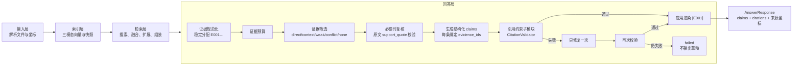
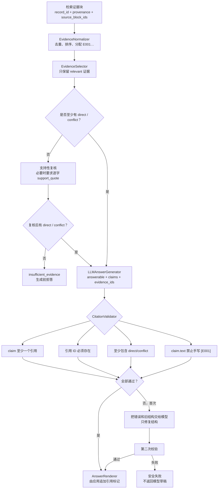

# 引用层方法与测试总览

## 一句话结论

当前程序已经实现回答层内部的引用约束模块：检索证据先被规范化为稳定的 `E001`、`E002` 编号，经过预算和相关性筛选后，回答模型只能为结构化事实主张绑定这些证据编号；程序再检查未知编号、漏引、仅引用背景证据和模型手写引用标记。校验失败只允许修复一次，仍失败则安全停止，不展示未经验证的模型草稿。

“引用层”在架构上是**回答层内部的可替换子模块**，不是与输入层、索引层、检索层、回答层平级的新层。

## 文件导航

- [引用层当前方法](./引用层当前方法_20260831.md)
- [引用层数据契约与输出](./引用层数据契约与输出_20260831.md)
- [引用层自动化测试结果](./引用层自动化测试结果_20260831.md)
- [引用层真实验收结果](./引用层真实验收结果_20260831.md)
- [回答层原始方法报告](../回答层测试结果/回答层方法与测试总览_20260828.md)

## 在完整系统中的位置

## 引用层内部流程

## 解耦情况

| 插槽 | 当前实现 | 可替换项 | 需要保持的契约 |
|---|---|---|---|
| 证据编号 | `EvidenceNormalizer` | 其他去重、排序、编号策略 | 输出唯一 `EvidenceItem.evidence_id` |
| 证据筛选 | `LLMEvidenceSelector` + Ollama | 规则、reranker、其他模型 | 输出 `EvidenceDecision` |
| 主张生成 | `LLMAnswerGenerator` + Ollama | 其他结构化生成器 | 输出 `AnswerDraft` 与 `AnswerClaim` |
| 引用校验 | `CitationValidator` | 更严格的蕴含校验器 | 返回错误列表，不直接改写答案 |
| 引用渲染 | `AnswerRenderer` | Markdown、HTML、脚注格式 | 只使用已经校验的证据 ID |
| 引用来源 | `Citation.from_evidence` | API 或数据库引用对象 | 保留 record、文件、坐标、block ID |

## 测试结果总表

| 测试范围 | 结果 | 结论 |
|---|---:|---|
| 全项目自动化测试 | **132/132 PASS** | 输入、索引、检索、回答和引用链路通过 |
| 回答/引用核心测试 | **18/18 PASS** | 契约、编号、筛选、修复、拒答与引用生成通过 |
| Studio 回答/引用显示 | **2/2 PASS** | 引用标签、来源、位置、模态和限制可显示 |
| 真实 Ollama 固定验收 | **PASS** | `qwen3:8b` 生成 3 条主张，均引用 E001 |
| 真实 CTCC 项目验收 | **PASS** | 两个跨分块表格证据分别映射 E001/E002 |

## 当前最重要的边界

1. 引用编号由程序分配，模型不能创造编号。
2. 最终 `[E001]` 由应用渲染，不直接信任模型手写文本。
3. 每条主张至少需要一条被筛选器判为 `direct` 或 `conflict` 的证据。
4. 当前校验器验证的是引用结构、ID 合法性和支持等级，不执行逐句自然语言蕴含判断。
5. 因此“引用校验通过”表示答案受到有效证据约束，不等同于已经数学证明每个词都被证据蕴含。
