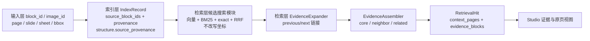

# 检索层数据契约与证据组装

## RetrievalHit 新增字段

```json
{
  "rank": 1,
  "record_id": "core-record-id",
  "document_id": "document-id",
  "modality": "table",
  "raw_score": 0.61,
  "fusion_score": 0.057,
  "content": {"headers": [], "rows": []},
  "provenance": {"page": 7, "bbox": [0.1, 0.2, 0.8, 0.5]},
  "source_block_ids": ["block-7"],
  "adjacent_context": ["前后文字记录"],
  "context_pages": [6, 7, 8],
  "evidence_blocks": ["core / neighbor / related 块"],
  "asset_path": null
}
```

`adjacent_context`、`context_pages` 和 `evidence_blocks` 均做防御性复制。页码必须是去重排序后的正整数。

## Evidence block

```json
{
  "record_id": "record-id",
  "modality": "visual",
  "role": "related",
  "relation": "",
  "content": "原始视觉内容或结构",
  "context": "附近文字",
  "provenance": {"page": 7, "bbox": [0.5, 0.2, 0.9, 0.6]},
  "source_block_ids": ["visual-block"],
  "asset_path": "快照内图片路径",
  "regions": ["一个或多个 source_provenance 区域"]
}
```

`regions` 优先读取 `structure.source_provenance`，可以表达一个分块跨越多个原始区域或页面；没有该字段时回退为当前 `provenance`。

## 坐标链路



## 公共响应

`RetrievalResponse` 继续包含：

- `query_text`
- `snapshot_build_id`
- `hits`
- `searched_modalities`
- `elapsed_ms`
- `warnings`

`snapshot_build_id` 使每次结果能够追溯到具体不可变索引版本。

## 检索层内部候选字段

候选搜索模块内部还保留 `modality_rank`、`keyword_rank`、`keyword_score` 和 `exact_match`。这些字段用于融合排序，不改变对外的 `RetrievalRequest` 和 `RetrievalResponse` 契约。

## 安全规则

- 模型身份、向量维度、有限值和范数必须有效；
- 索引条数与 metadata 条数必须一致；
- 视觉最终证据必须通过资格门；
- 视觉路径禁止绝对路径、`..` 和快照目录越界；
- 相邻链接不得跨文档，循环或不存在的链接会停止扩展；
- 扩展和组装都有硬上限，避免一个命中无限扩大证据。
