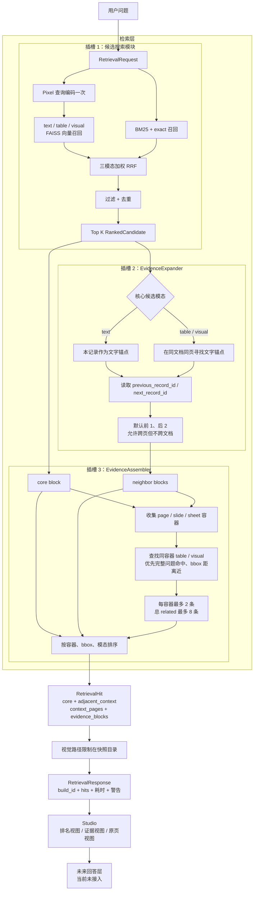

# 检索层方法与测试总览

## 当前结论

当前检索层包含完整的候选搜索与证据组装流程：先对问题进行查询编码，在文字、表格、视觉三个索引中执行向量、BM25 和精确短语召回，通过加权 RRF 融合得到 Top K；再为每个核心候选附加有界的前后文字上下文，并依据页码、幻灯片或工作表容器，把附近表格和视觉对象组装为有顺序、带坐标的 `evidence_blocks`，最后返回 `RetrievalResponse`。

当前仍然是**证据检索与展示层**，不调用 LLM 生成答案。

## 文件导航

- [检索层当前方法](./检索层当前方法_20260826.md)
- [检索层数据契约与证据组装](./检索层数据契约与证据组装_20260826.md)
- [检索层测试结果与验收状态](./检索层测试结果与验收状态_20260826.md)

## 完整流程图



## 正确的层级关系

```text
输入层 → 索引层 → 检索层 → 回答层
                      ├─ 查询编码
                      ├─ 候选搜索（向量 / BM25 / exact）
                      ├─ 融合排序与去重
                      ├─ 上下文扩展
                      └─ 证据组装
```

“搜索”是检索层内部的一个可替换模块，不再作为与检索层平级的系统层。检索层不负责重新解析文件、重建索引或生成最终答案。

## 当前验证状态

- 全项目：**103/103 PASS**。
- 检索层相关：**52/52 PASS**。
- 历史真实验收结果保留在三个 20260824 子目录。
- 当前混合搜索和证据扩展版本尚未重新跑正式真实模型验收，旧 Recall/MRR 不作为当前版本成绩。
