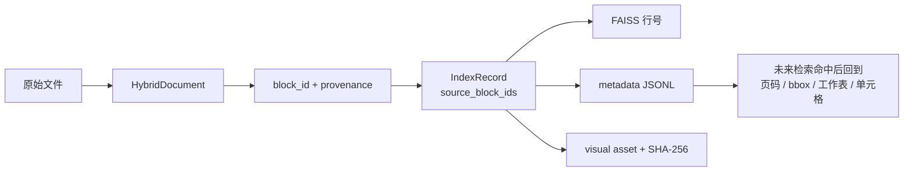

# 索引层数据契约与产物

## IndexRecord

文字、表格和视觉最终都转换为统一的 `IndexRecord`。相同字段让后续检索层可以统一处理记录，同时通过 `modality` 保持三路索引隔离。

| 字段 | 含义 |
|---|---|
| `record_id` | 文档、模态、来源块、序号和内容哈希共同生成的稳定 ID |
| `document_id` | 来源 `HybridDocument` ID |
| `modality` | `text`、`table` 或 `visual` |
| `source_block_ids` | 对应输入层一个或多个 `block_id` |
| `embedding_text` | 实际送入文本 embedding 接口的内容；视觉记录保存上下文 |
| `original_content` | 未丢失的原始正文、表格结构或图片 SHA-256 |
| `context` | 标题路径、表格标题或图片附近文字 |
| `structure` | 标题层级、表格矩阵、公式、合并范围或视觉 metadata |
| `provenance` | 页、幻灯片、工作表、单元格范围、bbox、locator |
| `content_hash` | 当前记录内容的 SHA-256 |
| `overlap_source_block_ids` | 文字重叠窗口来自哪些上一个块 |
| `asset_path` | 视觉图片在当前快照内的安全相对路径 |
| `visual_type` | `image/chart/icon/diagram` 等视觉类型 |
| `source_path` | 原始文件绝对路径，用于来源追踪与变更检测 |
| `document_type` | PDF、DOCX、PPTX、XLSX 等格式 |

## 快照目录

```text
index/
├── CURRENT
└── snapshots/
    └── <build-id>/
        ├── manifest.json
        ├── build-report.json
        ├── text.faiss
        ├── text-metadata.jsonl
        ├── table.faiss
        ├── table-metadata.jsonl
        ├── visual.faiss
        ├── visual-metadata.jsonl
        └── visual-assets/
            └── <document-id>/
                └── images/*.png
```

即使某种模态为 0 条记录，也会创建有效的空 FAISS 与空 metadata 文件，保证消费者始终看到完整的三路结构。

## manifest.json

正式快照清单包含：

- `schema_version=2.0`；
- 唯一 `build_id`、构建时间和完成状态；
- 模型路径、设备、向量维度、FAISS 类型和归一化标记；
- 分块参数与 Office 视觉策略；
- 每个源文件的路径、大小、修改时间和 SHA-256；
- 输入 artifact 数和三种 IndexRecord 数；
- 唯一视觉 embedding 数与质量门过滤数；
- 每个索引文件、metadata 文件和构建报告的 SHA-256；
- 所有非致命警告。

## build-report.json

构建报告记录：

- 开始与结束时间；
- 总耗时；
- 文档、原始 artifact、三类记录和过滤数量；
- 解析、物化或质量门产生的警告。

## 发布前校验

程序在发布 `CURRENT` 前执行以下检查：

1. 三个 `.faiss` 和三个 metadata 文件全部存在；
2. 每个 FAISS 的 `ntotal` 等于对应 JSONL 行数；
3. 三个索引维度均为 2048；
4. 向量必须有限、非零且 L2 范数为 1；
5. 每条记录必须有 `record_id`、`document_id`、来源块、来源路径和 provenance；
6. 全快照 `record_id` 不得重复；
7. 视觉资产路径必须是快照内的安全相对路径，不得包含绝对路径或 `..`；
8. 视觉资产必须存在，且图片内容 SHA-256 与 metadata 一致；
9. `manifest.json` 中列出的每个文件 SHA-256 必须匹配；
10. 当前源文件大小、修改时间或哈希变化后，快照校验必须拒绝继续使用；
11. Office visual 快照必须声明严格 COM/native 策略。

## 可追溯关系



向量本身只负责相似度；真正用于展示证据的是与同一行对齐的 metadata。这样以后更换 FAISS 或模型时，只要保留 `IndexRecord` 契约，就不会影响坐标回链。

## 版本兼容性

| 输入/索引 | 当前处理 |
|---|---|
| `HybridDocument schema 1.1` | 支持构建 schema 2.0 |
| 其他 HybridDocument 版本 | 构建时拒绝 |
| schema 2.0 当前快照 | 校验通过后可读取 |
| schema 1.x 旧索引 | 明确提示重新构建 |
| Office visual 非严格策略快照 | 当前读取时拒绝，要求重建 |
