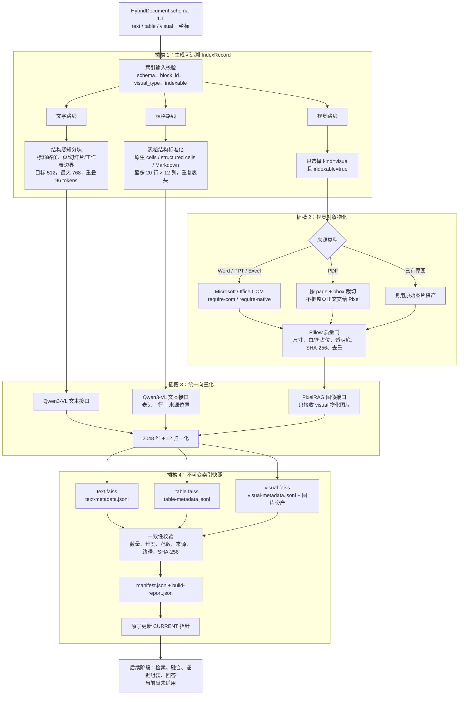

# 索引层方法与测试总览

## 一句话结论

当前程序已经完成独立的 schema 2.0 索引层：它读取输入层输出的 `HybridDocument schema 1.1`，分别生成文字、表格、视觉三种 `IndexRecord`，统一使用 Qwen3-VL-Embedding-2B 生成 2048 维归一化向量，再写入三个相互隔离的 FAISS 索引。索引通过不可变快照与 `CURRENT` 指针发布，构建失败不会破坏上一份有效索引。

当前交付边界到“索引构建与验证”为止；检索、跨模态融合、证据组装和回答尚未接入 schema 2.0。

## 本文件夹导航

- [索引层当前方法](./索引层当前方法_20260821.md)
- [索引层数据契约与产物](./索引层数据契约与产物_20260821.md)
- [索引层自动化测试结果](./索引层自动化测试结果_20260821.md)
- [索引层真实文件测试结果](./索引层真实文件测试结果_20260821.md)

## 当前完整流程

## 各部分是否完全解耦

| 插槽 | 当前实现 | 可以替换什么 | 对其他模块的影响 |
|---|---|---|---|
| 输入契约 | `HybridDocument schema 1.1` | 任何能输出相同契约的解析器 | 无需修改索引逻辑 |
| 文字分块 | `build_text_records` | 分块长度、标题策略、重叠策略 | 不影响表格和视觉 |
| 表格分块 | `build_table_records` | 原生表格解析或其他切分策略 | 不影响文字和视觉 |
| 视觉物化 | Office COM、PDF bbox、原图复用 | LibreOffice、其他渲染器或外部服务 | 不影响文字和表格 |
| 图片质量门 | Pillow | 其他过滤、去重、标准化实现 | 不改变 IndexRecord 契约 |
| 向量模型 | Qwen3-VL-Embedding-2B / PixelRAG session | 其他满足维度与批处理接口的模型 | 重建快照即可 |
| 向量存储 | `faiss.IndexFlatIP` | 其他向量数据库或 FAISS 类型 | 保持 metadata 对齐即可 |
| 发布方式 | staging + immutable snapshot + `CURRENT` | 对象存储版本、数据库事务 | 不影响分块和向量化 |

## 测试结果总表

| 测试层级 | 结果 | 结论 |
|---|---:|---|
| 自动化测试 | **45/45 PASS** | 分块、物化、Pixel 契约、快照完整性和失败保护均通过 |
| `测试pdf.pdf` schema 2.0 实测 | **PASS** | 2 text、1 table、9 visual，零警告 |
| `20260818_CheryTF_V1_中文.pptx` 严格 COM 实测 | **PASS** | 77 text、26 visual；3 个无效视觉被质量门过滤 |
| Word + Excel 首次后台构建 | **PARTIAL** | 文字和表格成功；后台 Windows 登录会话缺失导致 9 个 Word visual 未物化 |
| Word 交互式 COM 诊断 | **PASS（诊断）** | 枚举 11 个视觉对象；4 个直接 CopyAsPicture，其余有页面裁切后备信息 |
| PPT 去重验证 | **PASS** | 中间快照 27 条 visual record 只调用 26 次唯一图片向量 |

## 当前最重要的判断

1. **索引层主体已可用。** PDF 与 PPT 的真实 schema 2.0 快照已经成功构建并发布。
2. **三种模态确实隔离。** 文字、表格不会进入 Pixel 图像接口；视觉对象不会写入文字索引。
3. **坐标和原文没有丢失。** 每条记录保留 `source_block_ids`、`provenance`、原始内容和结构信息。
4. **失败不会覆盖旧索引。** 所有文件先写入 staging，校验通过后才发布新 `CURRENT`。
5. **Office 后台 COM 仍是环境边界。** 无交互 Windows 会话时 Word/Excel 原生视觉导出可能失败；严格模式会拒绝不合格的 Office 视觉快照，而不是静默写入错误图片。
6. **检索尚未开始。** 现在可以可靠地产生索引，但还不能据此宣称混合检索排序和回答质量已经完成。

## 下一步

1. 让 Studio 构建任务固定运行在可用的交互式 Office 会话，或替换为稳定的独立 Office 渲染服务。
2. 用 Word、Excel、PPT 各完成一次严格 `require-com` 的正式 schema 2.0 快照验收。
3. 接入查询编码、三路召回、分数归一化、融合排序和证据回链。
4. 建立包含文字问题、表格问题、图片问题和跨模态问题的真实查询集。
