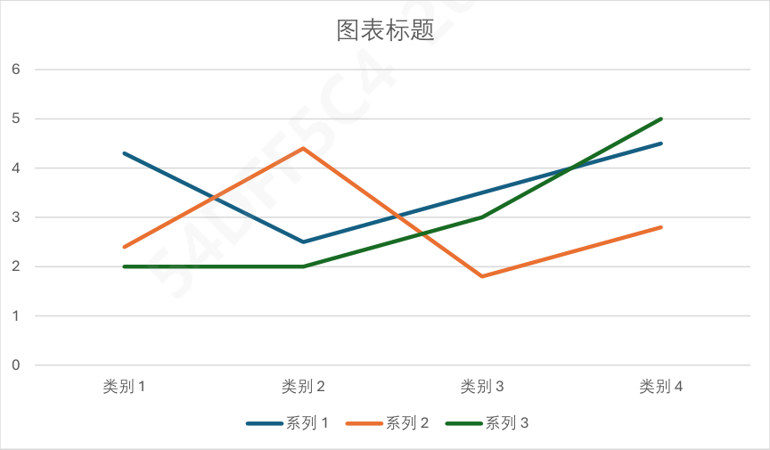
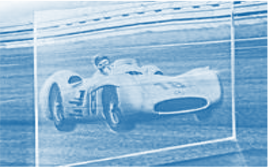
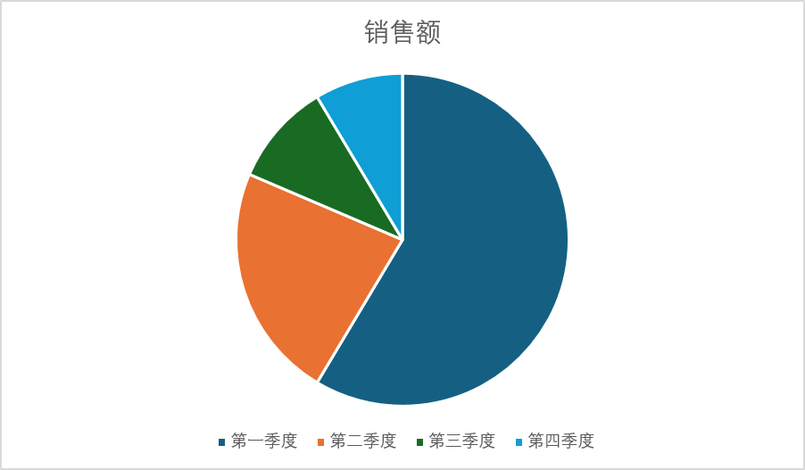

# 索引层真实文件测试结果

## 总表

| 测试 | schema 2.0 结果 | text records | table records | visual records | 过滤 | 状态 |
|---|---|---:|---:|---:|---:|---|
| `测试pdf.pdf` | 当前快照 `861d7c73` | 2 | 1 | 9 | 0 | **PASS** |
| `20260818_CheryTF_V1_中文.pptx` | 当前严格 COM 快照 `825ddc8d` | 77 | 0 | 26 | 3 | **PASS** |
| `测试word.docx` + CTCC Excel | 后台 Office 快照 `eb381fc4` | 2 | 13 | 0 | 9 | **PARTIAL** |

所有成功写入的向量均为 Qwen3-VL-Embedding-2B 生成的 2048 维 L2 归一化向量，FAISS 类型为 `IndexFlatIP`。

## 1. PDF：完整通过

### 来源与快照

| 项目 | 结果 |
|---|---|
| 文件 | `visual_index_sourse/测试pdf.pdf` |
| 文件大小 | 366,435 bytes |
| 文件 SHA-256 | `987ef3888476962eba960076be2bd0525e6cd22c4c2cad8c39aef8ae198344fc` |
| build ID | `20260821T034822893959Z-861d7c73` |
| 构建耗时 | 191.088 秒，CPU |
| 警告 | 0 |
| `CURRENT` | 已指向该快照 |

### 从输入块到索引记录

| 类型 | 输入 artifact | 索引记录 |
|---|---:|---:|
| 文字 | 2 | 2 |
| 表格 | 1 | 1 |
| visual | 14 | 9 |

14 个 visual 中包含 5 个明确标记为 `indexable=false` 的整页背景，它们不属于视觉检索目标；其余 9 个对象全部完成区域裁切、质量检查与 Pixel 向量化，`filtered_visuals=0`、`unique_visual_embeddings=9`。

### 实际 Pixel 输入示例

普通内嵌图片：

PDF 中识别出的折线图区域：

PDF 中识别出的矢量图标区域：

### PDF 结论

PDF 已完整证明当前设计：识别阶段只保留 visual 区域和坐标，索引阶段才按 bbox 生成 Pixel 输入；文字、表格和图片分别写入三个索引，且快照零警告发布成功。

## 2. PowerPoint：严格 COM 通过

### 来源与快照

| 项目 | 结果 |
|---|---|
| 文件 | `visual_index_sourse/20260818_CheryTF_V1_中文.pptx` |
| 文件大小 | 39,608,730 bytes |
| build ID | `20260821T075147482380Z-825ddc8d` |
| 构建策略 | `office_visual_policy=require-com` |
| 构建耗时 | 403.206 秒，CPU |
| `CURRENT` | 已指向该严格快照 |

### 从输入块到索引记录

| 类型 | 输入 artifact | 索引记录 |
|---|---:|---:|
| 文字 | 105 | 77 |
| 表格 | 0 | 0 |
| visual | 29 | 26 |

29 个 visual 中 26 个成功通过 `PowerPoint Shape.Export` 和质量门进入视觉索引；3 个被合理过滤：2 个尺寸低于阈值，1 个为纯白占位图。快照仍为 `status=complete`。

识别阶段的后台版面补全曾记录一次 Windows 登录会话不存在的警告，但严格索引阶段取得了有效的 COM Shape 导出；快照的 `office_visual_policy=require-com`，读取端也会重新核验这一策略。

### 实际 COM / Pixel 输入示例

独立 Shape 导出：

复杂组合视觉对象经质量门后的 Pixel 输入：

### 去重补充测试

上一份中间快照 `20260821T061420918424Z-9b833c02` 产生 27 条 visual record，但只有 26 个唯一图片 embedding，证明相同图片只计算一次向量，同时仍保留各自的来源记录。当前严格快照进一步过滤了无效占位图，最终为 26 条 visual record / 26 个唯一 embedding。

### PowerPoint 结论

PowerPoint 已完成严格 COM 的真实 schema 2.0 验收。复杂 Shape 可以按对象导出，无需把整页幻灯片交给 Pixel；无效对象由质量门过滤并写入警告，不会污染视觉索引。

## 3. Word + Excel：部分通过与真实限制

### 后台快照结果

| 项目 | 结果 |
|---|---|
| 文件 | `测试word.docx` + `CTCC_2026-2027_Bosch_Partner_Benefits_EN_and_CN.xlsx` |
| build ID | `20260821T040540526712Z-eb381fc4` |
| 文档数 | 2 |
| text records | 2 |
| table records | 13 |
| visual records | 0 |
| 被过滤 visual | 9 |
| 构建耗时 | 260.902 秒 |
| 快照状态 | `complete`，但视觉验收为 **PARTIAL** |

后台 worker 调用 Word/Excel `DispatchEx` 时，Windows 返回“指定的登录会话不存在或已经终止”。因此文字和表格索引正常生成，9 个 Word visual 因 `missing-asset-path` 未进入视觉索引。程序没有伪造图片或静默把整页送入 Pixel，而是保留警告并发布只有文字/表格的有效快照。

### 后续交互式 COM 诊断

在可用的交互式 Office 会话中，Word 已枚举 11 个视觉对象：前 4 个获得直接 `word-copy-as-picture` 文件，其余对象记录了页面区域后备信息。示例：

Excel 诊断文件未枚举出视觉对象，这与该 CTCC 表格文件主要由单元格数据构成相符；其 13 个表格记录已正常进入 table 索引。

### Word / Excel 结论

这次测试证明失败保护和模态隔离有效，但尚不能宣称 Word 视觉 schema 2.0 正式验收完成。下一次应在稳定交互式 Office 会话中，用 `require-com` 重建 Word 快照，并确认 `visual.faiss` 的记录数、图片 SHA-256 和 `CURRENT` 发布全部通过。

## 4. 综合结论

| 能力 | 当前判断 |
|---|---|
| 文字结构分块与索引 | 已通过自动化和真实文件测试 |
| 表格结构分块与索引 | 已通过自动化和真实 Excel/PDF 测试 |
| PDF visual 延迟裁切与 Pixel | 已正式通过 |
| PPT Shape 严格 COM 与 Pixel | 已正式通过 |
| Word 后台 visual | 环境受限；交互式诊断通过，正式快照待补 |
| Excel 无视觉表格 | 已通过；带图表 Excel 仍应增加正式严格测试 |
| 快照校验与失败保护 | 已通过自动化测试和真实发布 |
| 检索与融合质量 | 尚未测试，属于下一阶段 |
