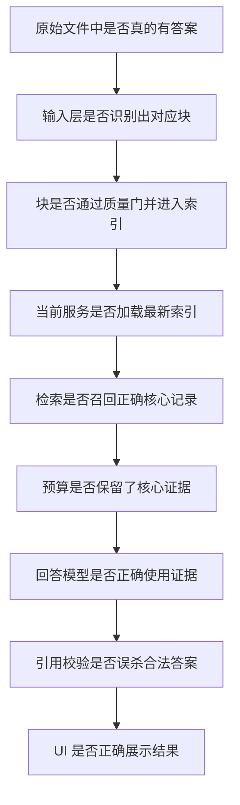

# 多模态 RAG 项目聊天记录复盘与问题解决总结

> 汇总范围：Codex 项目“多模态输入”中可检索到的相关历史聊天，时间跨度约为 2026 年 8 月 14 日至 9 月 29 日。  
> 整理方法：不逐字复制聊天，而是按“问题 → 尝试 → 结果 → 最终做法 → 思考”还原项目演进。  
> 注意：测试数量在不同阶段从 24 项逐步增长到 174 项，文中数字用于说明当时阶段的验收状态，不代表所有旧方案都保留到最终版本。

## 1. 项目目标与最终形成的主线

项目最初关注“如何让 RAG 识别 PDF、Word、PowerPoint、Excel 和图片中的文字、表格、图片、图表”，后来逐步扩展为一套完整的多模态 RAG：


最终形成的基本原则是：

- 输入层只负责识别，不调用 Pixel、FAISS 或 LLM。
- 所有格式统一输出 `HybridDocument`，内容分为 `text / table / visual`。
- 文本、表格和视觉对象分别索引，避免把所有内容粗暴混成一种记录。
- 搜索只是检索层内部的候选召回模块；检索层还要负责融合、扩展和证据组装。
- 回答必须基于证据，证据不足时宁可拒答或部分回答。
- 视觉检索和视觉回答是两件事：能召回图片不等于文本模型能读懂图片。
- GitHub 正式交付入口是 `main`，接收人可以从源码安装并运行，不强制依赖 EXE。

## 2. 阶段演进概览

| 阶段 | 主要目标 | 关键产出 | 主要转折 |
| --- | --- | --- | --- |
| 测试集与 Pixel 原型 | 验证页面级视觉检索是否可行 | 多格式测试集、丰富 PDF、PixelRAG Studio 原型 | 发现整页召回只能做粗检索，不能直接作为最终证据 |
| 输入层 | 统一识别 PDF、Office、图片和文本文件 | `HybridDocument schema 1.1`、解析器注册表、版面与对象定位 | 从“按格式写死流程”转向可插拔解析器和统一契约 |
| 扫描 PDF 修复 | 支持无文字层 PDF | OpenDataLoader Hybrid + RapidOCR、区域级证据 | 纠正“Hybrid 自动就会 OCR”的错误假设，真正启用强制 OCR |
| 索引层 | 建立可复用的三模态索引 | Text/Table/Visual 三路 FAISS、快照与 `CURRENT` | 从验证索引升级为正式索引，并增加原子发布和失败保旧快照 |
| 检索层 | 找到并重组可核验的证据 | BM25、向量、精确匹配、RRF、邻接扩展、证据包 | 认识到 Top-K 记录不是最终上下文，必须恢复原始结构 |
| 回答与引用层 | 让 LLM 基于证据回答 | 百炼/Ollama 接入、结构化输出、引用约束 | 多次证明“正确证据已召回但被筛选/预算丢掉”是核心失败模式 |
| 视觉与原页展示 | 让用户核验证据 | PDF/Word/PPT/Excel 原页视图、红/橙框 | 检索正确与坐标可视化正确需要分别验收 |
| 性能与交付 | 支持持续使用和他人接手 | 增量解析、增量索引、README、交接文档、安装脚本 | 从“本机能跑”转向“全新克隆可复现” |

## 3. 测试集与早期 PixelRAG 原型

### 3.1 缺少可控、可验真的多模态测试材料

**问题**

早期没有统一测试集，难以判断失败发生在解析、视觉检索还是回答阶段。普通文件也缺少明确标准答案。

**尝试**

- 先计划生成 PDF、PPT，随后扩展到 DOCX、PPTX、XLSX、PDF 四类文件。
- 在线图片生成两次失败，改用本地确定性绘图。
- 为每个问题记录格式、位置、模态、标准答案和评分关键词。
- 后续又生成 10 页丰富 PDF，加入折线图、双轴图、堆叠图、热力图、流程图、复杂表格和跨页问题。

**结果与修正**

- 形成 22 道基础标准题和 30 道丰富 PDF 标准题。
- 校验时发现标准答案本身有错误，例如双轴图首次低于阈值的月份写错，随后修正。
- 得出重要经验：基准集也必须验证，不能默认 ground truth 正确。

**思考**

可重复、可自动评分的合成测试集适合定位系统问题；真实公开文档则适合检验泛化。两者不能互相替代。

### 3.2 PixelRAG 构建与 Windows 兼容问题

**遇到的问题**

- Poppler 可执行文件缺少 DLL，PDF 渲染失败。
- Windows FAISS 无法稳定读写中文路径。
- Studio 不停打印 `/status 200 OK`，用户误以为搜索仍在运行。
- 后端已经返回结果，但 Tkinter 后台线程直接更新 UI，界面不显示。
- 查询“折线图”返回错误页面。

**尝试与解决**

- PDF 渲染改用 PyMuPDF，移除对故障 Poppler 的依赖。
- FAISS 在英文临时目录中读写，再同步回中文项目目录。
- 健康检查从高频轮询改为服务就绪后停止连续检查。
- UI 更新改用线程安全队列。
- 对“折线图”问题检查了原 PDF、页码、向量得分和索引时间，最终发现服务加载的是旧 3 页索引，而新报告有 10 页；第 4 页根本没有向量。
- 增加索引新鲜度检查：源文件比索引新、或构建仍在进行时，禁止启动旧搜索服务。

**思考**

“模型检索错了”经常只是表象。排查顺序应先确认：

1. 文件是否进入当前项目；
2. 索引是否包含该文件和对应页；
3. 服务是否加载最新快照；
4. UI 是否正确展示后端结果；
5. 最后才评估模型语义能力。

## 4. 输入层：从多工具拼接到统一契约

### 4.1 不同格式如何统一处理

**问题**

PDF、Word、PPT、Excel、图片和文本的解析方式完全不同，如果后续代码直接依赖每种工具的原始输出，系统会迅速失控。

**方案演进**

- 建立检测器、解析器、渲染器、图片处理器、视觉处理器和组装器接口。
- 通过注册表按文件类型选择解析器。
- PDF 使用 OpenDataLoader/PyMuPDF；Office 使用 Docling、openpyxl 和 Office COM；图片使用 Pillow；TXT/Markdown/HTML 使用文本解析。
- 所有结果统一组装为 `HybridDocument schema 1.1`。

**统一契约保存的信息**

- `text / table / visual` 类型；
- 标题、正文、列表、结构化表格；
- `visual_type=image/chart/icon/diagram/background`；
- 页码、幻灯片、工作表、bbox、阅读顺序；
- 原生对象定位信息与可选原始资产；
- 使用过的解析器、警告和来源关系。

**关键边界**

输入层结束时 `vision_results=[]`。它只声明“这里有视觉对象”，不做 Pixel 向量化，不建立 FAISS，也不调用 LLM。

### 4.2 为什么 Docling、Office COM 和版面 PDF 都需要

聊天中反复讨论了“为什么不只用 Office COM”。最终认识是三者职责不同：

- Docling/openpyxl：回答“内容是什么、结构是什么”，提供标题、段落、表格、阅读顺序。
- Office COM：回答“原生对象是什么、实际在哪里”，枚举 Shape、Chart、InlineShape，并导出真实版面 PDF。
- 版面 PDF + PyMuPDF：提供稳定分页和物理坐标，使语义内容与页面位置对齐。

只用 COM 意味着要分别自研 Word、PPT、Excel 三套完整语义解析器；只用 Docling 又无法可靠获得所有原生对象和真实版面。因此最终采用互补而非替代关系。

### 4.3 扫描 PDF 被当作整页图片

**问题表现**

搜索打印机手册时返回一整页 `visual`。整页能粗略命中“墨盒检修区域”，但直接交给 LLM 会导致上下文过大、干扰严重、引用不精确。

**初始误判**

一度认为 OpenDataLoader Hybrid 会自动完成扫描 PDF OCR。真实检查发现：客户端使用了 Hybrid 模式，但服务端没有启用 `--force-ocr` 和中文 OCR，实际结果是 0 个文本块、空表格和接近整页的图片。

**解决**

- 无可靠文字层的 PDF 自动路由到强制 OCR。
- 使用 OpenDataLoader Hybrid 的版面能力，并把 OCR 后端配置为本地可用的 RapidOCR 中文模型。
- 修复 Windows 中文路径和运行时编译问题。
- OCR 失败时明确报错，不再静默退化成“只有整页图片”。
- 近整页图片标记为 `page_visual`，只允许做粗召回，不能直接作为 LLM 最终证据。
- 区域级图片、图表和正文分别形成 `region_visual`、text、table。

**真实验收**

打印机扫描 PDF 最终识别出 89 个文本区域、1 个表格、28 个区域级视觉对象，且没有整页视觉对象进入最终证据集合。

**思考**

Pixel 是视觉检索模型，不应替代 OCR。扫描页合理流程是：

```text
扫描页 → OCR/版面分析 → 文字、表格、区域视觉对象
                         ↓
                整页仅用于粗召回
```

### 4.4 Office 视觉对象与 COM 可靠性

**问题**

- 后台隔离会话无法启动 Word/PowerPoint/Excel COM。
- Word 11 个对象只有 4 个能原生导出。
- PowerPoint 某个极窄装饰 Shape 调用 `shape.Export` 会长时间阻塞。
- Word SVG/图标页面裁切坐标错误，香蕉图标被裁成纯白图。

**策略争论与最终规则**

最初设置为“所有 Office 对象必须原生导出，否则建库失败”。后来结合真实情况调整为更合理的 `require-com`：

- COM 无法启动：阻断建库，不能偷偷降级。
- COM 成功启动：能原生导出的优先原生导出。
- 个别对象无法原生导出：允许从 Office 生成的页面中按 bbox 裁切。
- 过小、无意义、危险的装饰对象：直接过滤。
- 整个导出过程超时：阻断并保留旧快照。

**具体修复**

- PowerPoint 阻塞定位到 slide 8、shape 5，一个约 10.2 × 485.9 points 的极窄对象；跳过危险导出并由质量门过滤。
- Word 行内图标按实际基线修正页面坐标，香蕉对象从错误的 `y=72` 校正到约 `y=217.8`，随后成功检索。

**思考**

质量策略不应简单等同于“原生导出率 100%”。更重要的是：降级必须可观察、可审计、有质量门，且不能在 COM 根本不可用时伪装成功。

## 5. 索引层：从临时验证到正式三模态快照

### 5.1 早期临时索引的局限

早期 Studio 中：

- visual 使用真实 Pixel/Qwen3-VL-Embedding 和 FAISS；
- text 主要依赖关键词、中文字符和二元词片段重叠；
- table 只是结构化文本记录；
- 混合排序、查询路由、分数校准和回答层尚未完成。

这套实现足以验证识别链路，但不是完整生产级 RAG。

### 5.2 正式索引层完成

后续升级为：

- 文本分块与 2048 维文本向量；
- 表格结构化分块与独立索引；
- visual 物化与 Pixel 视觉向量；
- Text/Table/Visual 三路独立 FAISS `IndexFlatIP`；
- 向量归一化、维度和行数一致性校验；
- 元数据、内容哈希和来源追踪；
- 不可变快照、`CURRENT` 原子切换；
- 构建失败保留旧快照；
- 旧 schema 检测与强制重建。

### 5.3 分块过大，索引记录接近整页

**问题**

输入层已经产生细粒度段落，但索引层又把同页内容合并到目标 token 数。一页未超过阈值时，最后近似“一页一个块”，导致前后扩展过大。

**修复**

- 文本目标长度 512 → 256 tokens；
- 硬上限 768 → 384 tokens；
- 重叠 96 → 48 tokens；
- 保留标题、段落、列表和步骤边界；
- 页面间不合并，但建立 `previous_record_id / next_record_id`；
- 发布时校验邻接 ID 必须存在。

### 5.4 临时视觉文件竞争与空视觉索引

**问题**

- PDF 区域 PNG 刚写出即被 Pillow 打开，偶发 `FileNotFoundError`。
- Word 已识别出 11 个 visual，但 Office 导出失败，最终索引显示 `0 Pixel image vectors`。

**解决**

- 每次构建使用独立临时目录。
- 临时图片读取增加短暂重试。
- 单张坏图片安全过滤，不让整份文档失败。
- 禁止“输入解析”和“索引构建”并发运行。
- Office 原生导出异常时，在 COM 已成功的前提下复用识别阶段版面 PDF，按页码和 bbox 裁取。

### 5.5 全量重建太慢

**问题**

新增一个文件也会重新处理全部文件，扫描 PDF OCR、Office COM 和 CPU 视觉 Embedding 使构建耗时很长。

**解决**

- 使用文件 SHA-256 判断新增、修改、删除和未变化文件。
- 未变化文件复用 `HybridDocument`、元数据、向量和视觉资源。
- 新增/修改文件只处理自身；删除文件只从新快照中移除。
- 模型、分块规则或索引版本变化时自动全量重建。
- 视觉资源优先硬链接，失败再复制。
- 保留“强制完全重建”作为显式操作。

之后又把同样思路应用到独立的 Hybrid 输入解析：新增 1 个文件时只解析 1 个，旧文件显示 `REUSED`，避免在“输入解析”按钮阶段重新 OCR 整个知识库。

**思考**

增量处理不是单纯的性能优化，它也降低了长任务失败概率，并减少 Office、OCR 和模型状态波动造成的不确定性。

## 6. 检索层：从 Top-K 到结构化证据包

### 6.1 “搜索层”和“检索层”的概念混乱

早期把搜索层和检索层并列。后来统一为：

```text
输入层 → 索引层 → 检索层 → 回答层
```

其中“搜索”只是检索层内部模块：

```text
查询编码 → 候选搜索 → 融合排序 → 上下文扩展 → 证据组装
```

### 6.2 多通道召回与融合

检索层 V1 最终包含：

- Text/Table/Visual 三通道向量召回；
- BM25 关键词召回；
- 完整短语、数字、型号和专有词精确命中；
- 加权 RRF 融合与去重；
- 显式前后文本块扩展；
- 跨页邻接连接；
- 同页表格和视觉对象关联；
- 文档、页码、bbox、记录 ID 完整溯源。

### 6.3 为什么不能把检索记录直接交给 LLM

Top-K 只说明哪些记录相关，不等于完整证据。最终增加 Evidence Assembler：

- 核心命中记录标记为 `core`；
- 前后文本标记为 `neighbor`；
- 同页表格和图片标记为 `related`；
- 关联块不改变核心检索分数；
- 按原阅读顺序组装文字、Markdown 表格和图片。

这使后续回答层收到的是可解释的证据包，而不是一串彼此割裂的向量命中。

### 6.4 “香蕉搜不到”说明了什么

香蕉图标确实存在，也被 COM 枚举到，但页面裁切得到纯白图片，被质量门过滤，因此没有视觉向量。降低相似度阈值没有意义。

这件事说明：

- 搜不到不一定是召回阈值问题；
- 必须沿着“对象发现 → 资产导出 → 质量门 → 向量 → 检索”逐段检查；
- 没进入索引的数据，任何检索算法都无法找回。

## 7. 回答与引用层：正确证据为何仍然答不出来

### 7.1 本地 8B 模型的能力与稳定性问题

使用本地 `qwen3:8b` 时出现：

- 生成耗时长，最初 180 秒超时被误报成服务不可达；
- 证据筛选只返回 18 条候选中的 1 条判定；
- 把“电视机与两个传感器共同工作温度”误解成压力范围问题；
- 正确证据存在，却被标为 `context` 或直接删除。

**尝试**

- 增大或取消超时；
- 压缩候选数量和单条长度；
- 要求筛选器只返回相关证据及原文片段；
- 后来认识到更根本的问题是模型能力和架构中重复筛选。

### 7.2 改为“本地检索 + API 回答”

最终接入阿里云百炼，保留本地解析、索引和检索，只把去重后的少量证据发送给 API。这样：

- 文档不必整篇上传；
- API 负责跨文档综合、区间计算和结构化回答；
- 本地继续验证引用 ID、摘录和格式；
- 普通问题不发送视觉原图，只有启用视觉模型时才发送命中图片。

### 7.3 正确证据被证据筛选器一票否决

冷凝水问题中，正确的电视和 PS-AS 证据排名很高，但额外的 LLM 筛选器选中了打印机说明。类似情况反复发生。

**架构修正**

- 默认链路删除额外的 LLM 证据筛选调用。
- 改为：中文查询规划（可选）→ 混合检索 → 本地证据预算 → API 生成回答 → 本地校验。
- 中文问题通常从 3 次 API 调用降为 2 次；英文问题通常只需 1 次。
- 筛选器可以作为可选组件保留，但不应成为正确证据进入回答模型前的一票否决层。

**需要注意的历史遗留**

后续审计曾发现：虽然 `RetrievalEvidenceSelector` 已实现，但某些工厂函数仍可能实例化旧的 `LLMEvidenceSelector`，而测试还断言旧接线。这是典型的“实现写了、默认装配没切换、测试反而固化错误”的问题。最终交付前曾进行 174 项验收，但聊天中没有一条独立记录明确说明此接线缺陷被专门闭环，因此接手人应把当前默认工厂装配作为首项代码复核点。

### 7.4 证据预算挤掉真正答案

CTCC“无形资产使用”问题中，两条答案位于不同表格块，分别排在第 3 和第 7。默认只发送 6 条证据，前面结果的邻接块占满预算，第二条核心记录被挤掉。

**修复**

- 先放所有 `core`，再放 `neighbor` 和 `related`。
- 对“某主体的某分类有哪些”提取主体和分类焦点。
- 只保留匹配分类的表格行，避免把整张 38 行表格交给模型。
- 聚合同一分类在不同表格分块中的记录。
- 简单问题使用较小预算，比较、共同范围、分别回答和列表问题使用更大预算。
- 不同文档交错进入预算，防止单个文档垄断上下文。

这套逻辑按结构和问题类型工作，不为 CTCC 文档写死。

### 7.5 引用校验从“编号存在”升级为“有原文依据”

早期只验证引用编号存在、引用指向 direct 证据，无法确认主张中的数值、对象和参数真的来自该证据。

后续增加：

- 每个引用附带连续原文摘录；
- 本地验证摘录确实出现在对应证据中；
- 计算题要求引用所有必要输入；
- 引用缺失、伪造或不受支持时修复一次，否则安全拒答；
- 支持 `partial_answer`，区分部分可答和完整可答。

### 7.6 结构化输出不稳定

百炼模型有时返回单对象数组 `[{}]`，甚至空数组 `[]`，而程序要求顶层 JSON 对象。

**修复**

- 单对象数组自动解包。
- 空数组、多对象数组等异常先自动重试一次。
- 重试时切换为普通 JSON 对象模式并明确禁止数组。
- 仍异常才停止，避免误解析或无依据输出。
- 错误信息不再错误地称为 Ollama。

### 7.7 回答语言跟随证据而不是问题

中文问题搭配英文证据时，模型输出英文。最终规则改为：

- 回答和限制说明跟随用户问题语言；
- `supporting_quotes` 保留文档原文；
- 产品名、型号、接口和单位保持原样。

### 7.8 模型可以基于证据计算，但引用应表达清楚

KNN 问题中，证据只提供电影特征向量，模型现场计算欧氏距离并投票得到类别。这是允许的：证据提供输入，模型完成推导。

因此 `[E006]` 的含义应理解为“推导所用输入来自 E006”，不是“整段计算原封不动写在 E006 中”。系统需要对直接摘录和基于证据的计算推导做清晰区分。

## 8. 视觉问答与关联图片

### 8.1 能检索图片，不等于回答模型能理解图片

系统早期使用 `Qwen3-VL-Embedding-2B` 做视觉向量检索，但回答模型 `qwen3:8b` 是文本模型。因此：

- 图片可被召回；
- 文本模型只能读图片附近的 OCR、标题和上下文；
- 图表数值、地图位置和照片细节不能可靠回答。

曾讨论过折中方案：LLM 只用文字回答，系统把同页或同容器的视觉对象作为“关联图片”附在答案后。图片不冒充事实证据，只供用户核验。这种做法无需更换文本模型。

### 8.2 超长 JPG 无法召回局部文字

一张 706 × 14494 的政策长图只生成一个整图视觉向量，没有 OCR、没有纵向切片、没有 `embedding_text`。Pixel 正常工作，但一个向量无法同时保留几十个小节和具体数字。

结论是：

- 问“图片大致讲什么”可能命中；
- 问局部任务或精确数字需要 OCR 和区域切片；
- 纯视觉向量不能替代文本索引。

合理后续方案是“长图分区 + OCR 文本块 + 区域视觉向量 + 原图关联”。聊天中完成了诊断，但没有记录这一整套长图方案已经正式实现，因此仍应视为待改进项。

### 8.3 图表数值引用不能强制逐字匹配文本元数据

图 20 的 East 曲线已经被正确召回并发送给视觉模型，但图表元数据只有英文概述，没有曲线数值。旧校验要求 `support_quote` 必须逐字存在于文本，导致正确视觉证据被降为 context。

**修复**

- 图片实际发送给视觉模型时，坐标轴、标签、曲线、数据点和空间关系可以作为 direct 证据。
- 视觉引用允许描述“可见依据”，不强制数值同时存在于文本元数据。
- 文本和表格仍保持逐字摘录规则。
- 未发送图片时绝不放宽视觉证据规则。

## 9. 证据可视化与原页定位

### 9.1 从 PDF 扩展到 Office

最终 Word、PowerPoint、Excel 和 PDF 均支持：

- 证据视图：按原始顺序显示文字、表格和图片；
- 原页视图：复用解析阶段生成的页面缓存，不打开 Office；
- 红框：核心检索证据；
- 橙框：邻接或同页关联证据，不影响排名分数。

TXT、Markdown、HTML 没有固定分页版面，因此暂不提供原页视图。

### 9.2 Excel 表格识别完整，但红框只覆盖前十行

**问题**

Excel 原生解析已识别完整 `A3:G14`，但页面坐标匹配函数最多匹配连续 10 个文本块，bbox 未覆盖最后三行。

**判断**

这是低优先级可视化缺陷，不影响表格内容进入索引和回答，但会影响用户审计、截图和演示。聊天中决定暂不优先修复。

**思考**

数据正确、索引正确、可视化框正确是三个不同验收项。UI 忠实画出错误 bbox，并不代表 UI 绘制代码有错。

## 10. 性能与运行体验

### 10.1 “新增文件后解析很慢”

日志证明并非新文件很大，而是“输入解析”按钮重新串行处理整个 source 目录，包括扫描 PDF OCR 和含 205 个视觉区域的 PPT。随后“构建索引”实际上已经是增量的，只处理新文件，但 CPU 加载视觉模型仍需约两分钟。

最终做法：

- Hybrid 输入解析本身也支持增量复用；
- 新增文件时可直接点击构建索引，构建会解析变化文件；
- 未变化文件不重新启动 Docling、OCR 或 Office；
- UI 日志明确显示 processed/reused/removed 数量。

### 10.2 用户操作路径逐步简化

早期需要手动在 PowerShell 中运行命令、选择环境和启动服务。后来完成：

- VS Code 运行配置；
- Studio 一体化解析、构建、检索和回答；
- `setup.cmd` 创建 `.venv`；
- `start-studio.cmd` 双击启动；
- `verify_environment.py` 环境检查；
- README 统一安装和启动命令。

## 11. 测试问题设计的经验

下载中文公开测试语料后，最初提出“这张图解对应的政策名称是什么”。用户指出该问题没有任何检索锚点，RAG 无法知道“这张图”指什么。

由此形成测试题设计原则：

- 问题必须包含足够的文档、主题、对象或图号锚点。
- 不要把指代消解失败误判为检索失败。
- 视觉题要区分：正文可答、OCR 可答、必须看图才能答。
- 标准答案要注明依据来自正文、表格、图号还是模型计算。
- 测试问题应覆盖标题、正文、表格、精确数字、跨文档综合、纯视觉、计算推导和证据不足。

## 12. GitHub 与交付阶段

### 12.1 最初为什么不能直接交付

初次审计发现：

- 默认 `main` 只有 `.gitignore`，完整代码在功能分支；
- 没有 Release、依赖锁定或可复现环境脚本；
- 本地打包目录约 5.28 GiB，不适合直接提交；
- 构建脚本依赖开发者机器上的 `.build-env`；
- 未在全新克隆环境完成安装和启动验证。

### 12.2 最终整改

- 完整源码进入 `main`，并把 `main` 定义为正式交付入口。
- 新增 `requirements.txt`、`setup.cmd`、`start-studio.cmd`、`verify_environment.py`。
- 统一使用项目 `.venv`，GUI、Hybrid worker 和辅助 Office 脚本不再依赖外部 `.conda-env`。
- README、项目交接文档、架构文档同步更新。
- 从 GitHub 默认分支全新克隆，创建 `.venv`，`pip check` 通过。
- 174 项测试通过，DOCX/XLSX 实际解析成功，Tkinter、Java 11 和 Office 检测通过。

接收人可按以下方式使用：

```powershell
git clone https://github.com/xyf966/RAG-PIXEL.git
cd RAG-PIXEL
.\setup.cmd
.\start-studio.cmd
```

或直接运行：

```powershell
.\.venv\Scripts\python.exe pixelrag_studio.py
```

### 12.3 交付审计仍记录的问题

- `.venv`、模型、业务项目数据和 API Key 均未提交，这是正确做法。
- 仓库仍跟踪部分历史验收报告、图片和测试产物，约 7.66 MiB；它们对理解过程有价值，但与“测试产物不入库”的纯净交付目标不完全一致。
- `.gitignore` 中保留 `.conda-env/` 和 `.build-env/` 只用于防止误提交，不表示运行依赖。
- 首次安装需要下载数 GB 依赖，首次建库还可能下载约 4 GB 模型。
- 需要 64 位 Python 3.12；高质量 Office 视觉处理依赖本机 Microsoft Office；部分 PDF 能力依赖 Java。

## 13. 贯穿项目的排查方法

聊天记录显示，最有效的排查方式不是反复调阈值，而是沿数据链逐层证明：



几个典型反例：

- 折线图搜错：不是模型弱，而是旧索引没有第 4 页。
- 香蕉搜不到：不是阈值高，而是裁切白图被质量门过滤。
- CTCC 答不全：不是文档没答案，而是预算和表格分块丢掉第二条核心证据。
- 温度问题拒答：不是检索没召回，而是 LLM 筛选器误解问题并删除正确证据。
- 图表数值拒答：不是视觉模型没看见，而是文本式引用校验不适用于视觉证据。
- Studio 无结果：不是后端没返回，而是 Tkinter 跨线程更新失败。

## 14. 核心思考与可复用经验

### 14.1 数据契约比单个解析器更重要

工具会变，Office、Docling、OpenDataLoader、OCR 引擎都可能替换；稳定的 `HybridDocument` 和 IndexRecord 契约才是系统可维护的基础。

### 14.2 粗召回和最终证据必须分层

整页图片、长图和大表格适合发现“可能相关的页面”，不适合直接交给 LLM。正式证据应尽量是最小充分区域或最小充分记录。

### 14.3 额外的 LLM 调用不一定提高可靠性

在本项目中，额外证据筛选 LLM 多次删除了正确证据，还增加延迟和费用。确定性预算、结构化排序和本地校验往往比“再问一次同一个模型”更稳定。

### 14.4 拒答机制必须区分真正证据不足与流水线丢证据

“证据不足”可能意味着：知识库没有答案，也可能意味着索引旧、候选没召回、预算挤掉、筛选器误删、结构化输出失败或引用校验误杀。诊断信息必须指出具体层级。

### 14.5 自动化测试通过不等于接线正确

曾出现测试明确断言旧的 `LLMEvidenceSelector`，导致 161 项测试全部通过却没有发现默认装配错误。测试不仅要覆盖组件行为，还要覆盖生产工厂函数和真实端到端路径。

### 14.6 真正的交付标准是可复现，不是开发机能运行

正式交付必须从全新克隆开始验证安装、依赖、环境检查、启动、解析和测试；同时区分源码交付与大型模型、业务数据、缓存和 API Key。

## 15. 当前仍值得继续改进的事项

按聊天记录中的证据，以下事项应保留在后续清单中：

1. 复核当前 `for_bailian` / `for_ollama` 默认工厂是否仍装配旧的 LLM 证据筛选器，并增加生产接线测试。
2. 为超长 PNG/JPG 增加 OCR、纵向/版面切片和区域级视觉索引。
3. 修复 Excel 长表格原页视图 bbox 只覆盖部分行的问题。
4. 清理或迁移 GitHub 中已跟踪的历史测试产物，保留必要总结而非全部中间文件。
5. 在第二台干净 Windows 电脑上完成一次包含模型下载、Office 文档、扫描 PDF、视觉问答和百炼 API 的完整验收。
6. 增加 CI，至少覆盖语法、单元测试、工厂装配和无 Office 的降级检查；Office COM 与真实模型可作为独立 Windows 验收任务。
7. 继续优化 CPU 首次加载与视觉 Embedding 性能，并给长任务提供更明确的阶段进度。
8. 对视觉回答进一步区分“图中直接读数”“近似读图”和“模型计算”，在 UI 中明确标注可信度与依据类型。

## 16. 相关项目文档

- `README.md`：快速安装、启动和基本使用。
- `项目交接文档.md`：交付范围、依赖、使用方式、已知限制和接手清单。
- `RAG系统架构与运行逻辑.md`：当前系统的正式架构与运行时序。
- `多模态输入结果_20260814/`：输入层阶段文档与验收记录。
- `索引层测试结果/`：索引方法、数据契约与验收记录。
- `检索层测试结果/`：混合检索、融合、扩展和证据组装记录。
- `回答层测试结果/`、`引用层测试结果/`：回答生成、引用校验和真实问题验收记录。

## 17. 一句话总结

这个项目最重要的成果不只是“做出了一个能回答问题的 RAG”，而是通过持续真实测试，把一条容易混淆的多模态链路拆成了可验证、可替换、可追踪的输入、索引、检索、回答与展示阶段；每次问题都尽量定位到证据在哪一层丢失，再把修复沉淀为通用规则，而不是为单个测试文件打补丁。
